# Relisten identity, user data, and Sonos architecture

**Status:** Proposed

**Date:** 2026-07-18

**Scope:** `RelistenApi`, `relisten-web`, `relisten-mobile`, `relisten-sonos`, and `relisten-flux`

**Supersedes:** `docs/design/2026-04-11-relisten-playlists-user-accounts-design.md` for identity, service ownership, storage, client authentication, and Sonos integration. That older document may still contain product ideas worth reconsidering, but it is not the implementation contract for accounts.

## Decision

Relisten will add one ASP.NET Core **User Service**. The User Service will serve two public hosts:

- `auth.relisten.net` is the OpenID Connect issuer and login origin.
- `accounts.relisten.net` is the native bearer-token API for user-owned data. It also serves one anonymous public-playlist resource and one explicit, rate-limited collaborator-invitation exchange whose random grant is the only credential.

The two hosts are protocol boundaries, not separate deployments. They route to one application, one codebase, and one set of `identity` and `user_data` PostgreSQL schemas. The User Service also owns the same-origin browser facade under `relisten.net/auth/session/*` and `relisten.net/api/user/v1/*`, plus one public-playlist path and one no-store invitation-exchange path. `api.relisten.net` remains the anonymous music-catalog service. `sonos.relisten.net` remains a stateless Sonos protocol adapter.

Relisten will use OpenIddict inside the User Service. Apple and Google are the initial ways a person proves their identity. Relisten will not offer passwords in the first release. Web, iOS, and Android use standard authorization-code flows. Sonos uses Sonos-specific protocols in addition to Relisten authentication.

All new identity and user-data entities with surrogate identifiers use UUIDv7. All references from user data to the music catalog use the catalog entity's existing UUID. A catalog numeric `id` must never cross into `identity`, `user_data`, an account API, a client database, a queue, or a background job. The only transition exception is the Sonos adapter's inbound decoder for legacy SMAPI `MusicObjectId` values; it maps them to UUIDs immediately and never emits or persists the numeric form.

User data is deliberately richer than a key/value account store. Favorites and collaborative playlists have offline-safe mutation protocols and delta feeds. Playlists use explicit source-run segments, stable occurrence UUIDs, server-assigned fractional ranks, public publishing through a stable `public_code`, following, cloning, and role-based collaboration. Qualified playback history is stored in TimescaleDB from launch. Temporal stores workflow persistence in the `temporal` and `temporal_visibility` logical databases inside Relisten's existing two-instance CloudNativePG cluster. This adds no second CloudNativePG `Cluster` and no PostgreSQL pods. Temporal runs asynchronous work from a transactional outbox without sitting on synchronous account paths.

Sonos control is a mobile-only product surface. The mobile app sends an explicit snapshot of its current queue to the User Service when the listener taps **Play on Sonos**. The service materializes a short-lived Cloud Queue transport snapshot; it does not create a universally synchronized Relisten queue. The first Sonos slice provides handoff and remote control only and records no Sonos-derived listening history. The Sonos adapter may be replaced completely as long as the external SMAPI and Cloud Queue contracts remain compatible.

## Why this document exists

Accounts affect every Relisten client and introduce credentials that cannot be treated like ordinary catalog data. A contributor working in only one repository should still be able to answer these questions:

- Which service authenticates the request?
- Which service owns the data?
- Which identifier is safe to persist?
- Which credential may appear in a browser, mobile app, Sonos player, or log?
- What happens when Google, Apple, Sonos, PostgreSQL, Temporal, a pod, or the catalog service is unavailable?
- How can the system grow without splitting into more services now?

The companion implementation plan is `docs/plans/active/2026-07-18-relisten-identity-user-data-and-sonos-implementation.md`. The [mobile-first account delivery plan](../plans/active/2026-07-18-relisten-mobile-first-account-delivery-plan.md) is the execution source of truth across the API and mobile repositories. This document describes the intended system; it does not require every domain to be built before the first useful TestFlight slice.

## Decisions at a glance

| Question | Decision | Reason |
| --- | --- | --- |
| Identity software | ASP.NET Core with OpenIddict | Fits the existing .NET stack and avoids operating Ory Kratos and Hydra. |
| Login methods | Apple and Google | Covers the existing clients without adding password reset, email delivery, or breach-response work. |
| Public hosts | `auth`, `accounts`, `api`, and existing `sonos` | Each host has one protocol and one cookie/token policy. |
| Deployments | User Service, catalog API, Sonos adapter, web, and self-hosted Temporal/worker components | Auth and user data share one application deployment; background orchestration is isolated from synchronous request handling. |
| Database | Existing `app` database for catalog, identity, and user data; `temporal` and `temporal_visibility` logical databases in the same existing two-instance CloudNativePG cluster | Cross-schema business transactions remain available, Temporal keeps its supported database boundary, and no second PostgreSQL deployment is required. |
| Schemas | New `identity` and `user_data`; existing catalog stays in `public` initially | Moving every catalog table and unqualified query is unrelated risk. |
| Entity IDs | UUIDv7 | Stable across clients and services, with better B-tree insertion locality than random UUIDv4. |
| Catalog references | Existing catalog UUID only | Numeric IDs are private implementation details of the catalog. |
| Web credentials | Opaque, server-side session; host-only HttpOnly cookie | Browser JavaScript never receives Relisten tokens. |
| Mobile credentials | Authorization code with PKCE; access token in memory; refresh token in SecureStore | Follows native-app OAuth guidance and supports revocation. |
| Sonos credentials | Separate credentials by protocol | Control secrets stay in the User Service; Sonos players legitimately hold narrow SMAPI and queue credentials. |
| Favorite sync | Idempotent desired-state mutations plus a bounded library revision feed | Mobile edits must converge after long offline periods without replacing another device's state. |
| Playlist sync | Domain operations, materialized state, per-playlist revisions, delta feed, and snapshot fallback | Multiple collaborators may edit offline; whole-aggregate replacement would lose valid work. |
| Playlist structure | Explicit segments with fractional ranks | A source run is a durable semantic unit for editing and shuffle; grouping by `show_uuid` cannot represent it. |
| Playlist reads | One normalized response: full authored structure for authenticated members, active-only structure for public readers, and a de-duplicated catalog sidecar | The server shares the catalog database and can provide one consistency boundary; client resolver choreography has not earned its cost. |
| Publishing and collaboration | Private by default; stable public playlist URLs, playlist-bound following, and separate one-time collaborator invitations | Public reading needs no secret. The only sharing secret is a one-use invitation that can create collaborator membership. |
| History | One immutable `qualified_listen` after four minutes or 50%; TimescaleDB from launch | Supports honest history, future Wrapped, and positive-signal recommendations without inventing completion or skip data. |
| Background work | Temporal with two logical PostgreSQL databases in the existing cluster, driven by an `app`-database outbox | Synchronous APIs remain available when Temporal is down; workflows can later absorb importers incrementally. |
| Sonos queue | Mobile-created ephemeral Cloud Queue snapshot; handoff/control only | Sonos can continue playing after the phone disconnects without becoming Relisten's cross-device queue source of truth or a history producer in the first slice. |
| Kubernetes boundary | Existing `default` namespace, pod-selected NetworkPolicies, scoped RBAC, and operator-owned sensitive-Secret admission policy | Avoid another namespace while preventing unrelated workload identities from mounting account Secrets; the trusted User Service deployer remains inside the boundary. |
| Account recovery target | Single-snapshot catalog-plus-account bundle and append-only restore records; isolate/sign the ledger only when the public threat model justifies it | The deletion job is required before external TestFlight; full restore rehearsal is required before broad public rollout, when recovery must not resurrect a deletion. |
| Product rollout | Complete API-to-mobile slices, on by default in each build | TestFlight builds provide the rollout boundary; there is no paid remote-flag or percentage-cohort dependency. |

## People and their mental models

The design should match what each person believes Relisten is doing.

### A listener who never creates an account

This listener expects Relisten to remain a free catalog and player. Browsing, searching, and playback continue to work without a login. Anonymous catalog requests do not contact the User Service. An outage of `auth.relisten.net` or `accounts.relisten.net` must not prevent anonymous listening.

### A listener who signs in

This listener expects favorites, playlists, and history to follow them between devices. “Continue with Apple” or “Continue with Google” creates a Relisten account; it does not turn the Apple or Google account into the application database key. The listener's durable identity is a Relisten user UUID. Relisten assigns an available username during the first transaction, then asks the listener to review it without blocking the rest of the app.

If the listener uses both Apple and Google, linking is an explicit account action performed while signed in. Matching email addresses are never enough to merge accounts. Cloud history is on by default with plain disclosure and an off switch; importing pre-account device history is a separate, explicit choice because the old data cannot prove who was listening.

### A mobile listener

The mobile listener expects a familiar system login sheet and a return to the app. On iOS this is `ASWebAuthenticationSession`, reached through Expo's auth-session browser API. Android uses a Custom Tab. The app must not embed the provider page in a `WebView`.

The listener should stay signed in across app restarts, edit favorites and playlists offline, and see collaborators' later work converge without a conflict dialog for routine edits. Downloads are intentionally device-global: signing out or changing account never deletes media. Account switching stops playback, clears every queue, and changes the active account scope before synchronization resumes.

### A web listener

The web listener expects `relisten.net` to remain the site they are using. They should not see access tokens in local storage, URLs, rendered page props, or developer tools. The browser holds one opaque `relisten.net` session cookie. Server-side routes use that session to read and mutate user data.

### A Sonos household owner

This person encounters two different connections:

1. Adding Relisten as a Sonos music service allows Sonos to browse and play Relisten content through SMAPI.
2. Connecting a Sonos account in the mobile app allows mobile to discover rooms, hand off its current queue, and control playback through the Sonos Control API.

The UI must explain the difference. A successful Relisten login does not grant Sonos control, and a Sonos OAuth grant does not sign the person into Relisten. Web may host callback and disconnect pages, but it does not expose group discovery or transport controls.

### A playlist owner, manager, editor, viewer, follower, or public listener

The owner expects a private playlist until they intentionally publish it or invite a collaborator. Editors change content, segments, and playlist metadata. Managers have those editing abilities and may also manage collaborators and publish. Viewers can view and play a private playlist but cannot mutate it. Only the owner archives or unarchives. Anyone may view and play a published, unarchived playlist at its stable public URL. A signed-in listener may follow it or clone the current public projection into an independent private copy.

An offline editor expects accepted work to survive. Operations synchronize when connectivity returns. If access was revoked while the editor was offline, the server rejects the queued operations; after the app explains the loss of access, it stops retrying and discards those unsynchronized edits. A follower expects silent updates, not notifications. A follow is bound to the playlist, not its public URL. Unpublishing makes the followed playlist unavailable; republishing makes the same follow available again at the same URL.

### A contributor

A contributor should not need to understand four identity systems or one magical sync framework. OpenIddict owns OAuth/OIDC protocol records. The User Service owns Relisten users, sessions, user data, domain-specific synchronization, Temporal workflow requests, and Sonos connections. The Sonos adapter translates Sonos protocols. The catalog service owns music and normalized metadata resolution. Dependencies point from user features toward catalog UUIDs, never from the catalog toward accounts.

### An operator

The operator is maintaining a free service. They need reviewed migrations, ordinary Kubernetes Deployments, PostgreSQL and TimescaleDB backups, Temporal health, a few secrets, and useful health signals. They should not have to operate a message broker, a distributed cache cluster, Ory, or separate auth and accounts deployments. If Temporal is unavailable, account mutations continue and committed outbox rows wait.

## Goals and limits

### Goals

- Keep anonymous Relisten fully functional.
- Give web, iOS, Android, and Sonos one Relisten user identity.
- Support favorites, playlists, playback history, and Sonos connections.
- Support private playlists, public publishing at stable URLs, playlist-bound following, cloning, and offline eventual collaboration without adding real-time presence or a discovery/search product.
- Hydrate large playlists without repeating show, artist, venue, source, and recording metadata for every occurrence.
- Keep credentials out of browser JavaScript and source control.
- Survive pod restarts and rolling deployments without losing sessions, pending sync operations, or active Sonos transport snapshots.
- Preserve a clean path to split the User Service later without changing public URLs or UUID contracts.
- Fit a service with roughly 50,000–100,000 users, only some of whom will create accounts.

### Capacity proof target, not a usage forecast

The first production load test should prove 25,000 stored accounts and 500 concurrent authenticated clients. That target is intentionally above likely launch usage but small enough to test on existing infrastructure. Measurements after launch should determine whether to raise it. Nothing in this design requires sharding or a second database at that level.

### Non-goals for the first release

- Passwords, password reset email, magic links, or passkeys.
- Public usernames as login credentials.
- Public profiles, playlist discovery/search, reactions, voting, or social feeds.
- WebSockets, presence, real-time cursors, or CRDT text editing. Launch collaboration is offline eventual convergence through ordered domain operations.
- A generic client sync engine or public event bus. Each domain has a deliberately small protocol.
- User-facing playlist revision restore. The operation/revision data is stored now; restore UI can arrive later.
- Folders, tags, collections, M3U/CSV import, general export UI, or self-service account export.
- Smart or automatic playlists. Add their generation metadata and rule storage only when that product slice is designed; generated results can still materialize through the ordinary playlist model.
- Universally synchronized playback queues across Relisten clients.
- Moving existing catalog tables out of PostgreSQL's `public` schema.
- OpenIddict's device authorization flow solely for Sonos. Sonos account linking uses Sonos's SMAPI link-code protocol.
- Native Apple and Google SDKs in the mobile app. They can be added later without changing the server account model.

## Current system facts

The plan starts from current code, not earlier account prototypes.

- `RelistenApi` is a .NET 10 catalog API using Dapper, Npgsql, and Simple.Migrations. Its customer-facing API has no account system. Its existing ASP.NET Identity configuration is an environment-backed admin login and must remain separate from customer authentication.
- `relisten-web` is a Next.js server application. It can render session state server-side. Its existing catalog client is cached and must not be reused for user-specific `no-store` requests.
- `relisten-mobile` is an Expo/React Native application. It already has `expo-web-browser`, `expo-linking`, `expo-secure-store`, the `relisten` custom URL scheme, and claimed HTTPS links for `relisten.net`. It does not yet have production Relisten authentication.
- `relisten-sonos` exposes anonymous SOAP/SMAPI endpoints. It has no Relisten account linking, Sonos Control client, Cloud Queue server, or persistent state.
- Mobile currently records a listen after either 240 seconds of playback or 50% of the catalog duration. That threshold is the launch history contract. It does not currently record skips, exact listened duration, or completion.
- Mobile's catalog objects already use UUID primary keys. A server-hydrated playlist snapshot can upsert those normalized rows directly rather than inventing a parallel nested playlist cache or a client hydration planner.
- Existing background import work uses Redis-backed Hangfire, but production Redis uses ephemeral storage and importer retries are intentionally constrained. It is not the durability foundation for account deletion, Sonos credential renewal, or history materialization.
- Production currently runs multiple replicas of the catalog API, web app, and Sonos adapter. New durable state cannot live in process memory.
- Production and local development currently use PostgreSQL 17. PostgreSQL 17 can inspect a UUID's version but cannot generate UUIDv7. The .NET 10 service will generate UUIDv7 with `Guid.CreateVersion7()`.
- Production has one CloudNativePG `Cluster`, `relisten-db-target`, with two PostgreSQL instances. It currently contains the `app` database and does not yet contain `temporal` or `temporal_visibility`. CloudNativePG 1.30 is installed and includes the standalone `DatabaseRole` and `Database` APIs needed to add them without another PostgreSQL deployment.
- Current backup Deployments are logical `pg_dump` jobs pointed at `app`. Adding another logical database does not make those jobs include it; Temporal needs explicit logical dumps or coverage by a CloudNativePG physical backup of the whole cluster.
- Production currently runs TimescaleDB 2.28.2. Use the Hypercore/columnstore APIs supported by that pinned extension and rehearse its upgrade/restore path before history launch.

## System architecture

### System context

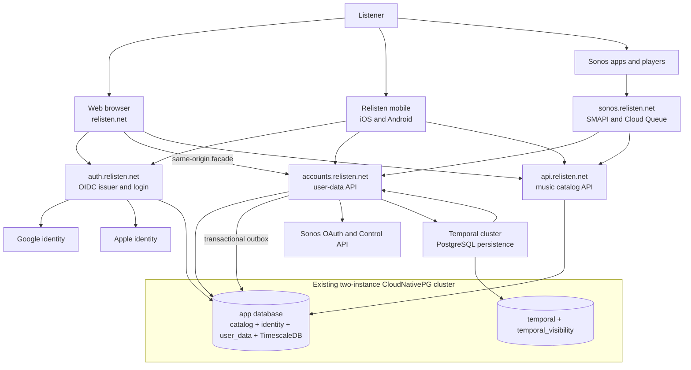

### Public origins and deployables

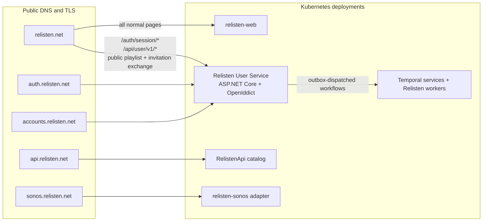

The User Service must enforce host restrictions in both ingress and application routing:

- `auth.relisten.net` serves login UI, provider callbacks, discovery, JWKS, and `/connect/*`.
- `accounts.relisten.net` requires an accounts-audience bearer token on `/v1/*` by default. `GET /v1/public-playlists/{public_code}` is the one anonymous public-resource route. It returns the same `404 playlist_not_found` for a missing, private, archived, or unknown playlist. `POST /v1/playlist-collaborator-invitations/exchange` is the one credential-free capability route and creates only a narrow pending-invitation grant. Adding another exception requires an architecture change and a route-policy test. `POST /v1/playlist-collaborator-invitations/{invitation_uuid}/accept` requires a bearer token and is the only step that creates membership. The accounts host never uses browser session cookies.
- `relisten.net/auth/session/*` and `relisten.net/api/user/v1/*` serve the same-origin web facade.
- The anonymous same-origin routes are `GET /api/public-playlists/{public_code}` and `POST /api/playlist-collaborator-invitations/exchange`. The public route maps to the canonical public projection handler. Invitation exchange maps only to its canonical handler, is `no-store`, and is outside `/api/user`. Authenticated invitation acceptance is `POST /api/user/v1/playlist-collaborator-invitations/{invitation_uuid}/accept`.
- A request for an accounts route on the auth host, or an auth route on the accounts host, returns 404.

This makes a future deployment split possible without changing clients. Until that split is needed, account creation and the first user-data write can share one database transaction.

### Dependency direction

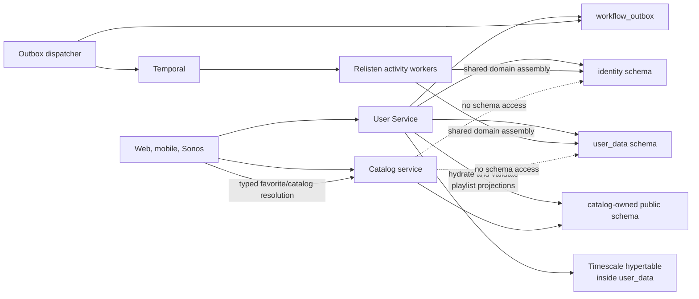

The catalog service must not call the User Service and must not read account tables. A catalog outage does not invalidate sessions. An auth outage does not prevent anonymous catalog playback.

## Authentication and account model

### OpenIddict's job

OpenIddict handles OAuth 2.0 and OpenID Connect protocol behavior:

- discovery and JWKS;
- authorization codes and PKCE;
- access and refresh tokens;
- client registration and redirect URI validation;
- authorization and token revocation records;
- the Relisten issuer's authorization-server and token-validation behavior.

OpenIddict does not define the Relisten user table, authenticate users at Apple or Google by itself, or own favorites, playlists, sessions, or Sonos connections. The User Service supplies a `ClaimsPrincipal` for a Relisten user and persists OpenIddict's records through its maintained EF Core store. Maintained ASP.NET Core remote-authentication handlers or OpenIddict client integrations handle the Apple and Google authorization callbacks; the implementation spike selects and pins those provider-specific packages.

### Relisten membership

Relisten will use a small membership model rather than ASP.NET Core Identity's password, role, claim, and recovery schema. The launch account slice needs these operations:

- find or create a user from an external `(issuer, subject)`;
- establish and revoke browser sessions;
- disable or delete a user;
- create an OIDC principal whose `sub` is the Relisten user UUID.

The external-identity model supports later provider linking and unlinking without changing user IDs. Do not add that UI, its intents, or its endpoints to the first account slice.

The User Service must not implement OAuth/OIDC wire protocols or cryptographic token formats itself. OpenIddict handles Relisten's issuer and token validation, while maintained provider handlers handle Apple and Google. Relisten's custom session code is limited to generating a random validator, storing its hash, and comparing it in constant time.

### Login methods

Apple and Google are authentication methods behind Relisten's issuer. They are not accepted as API tokens. The User Service validates the provider response, maps the provider subject to one Relisten user, and then issues Relisten credentials.

The first release has no password field and no password endpoints. A public `@username` identifies attribution inside Relisten but is never a login identifier. If provider-only login causes measured adoption or recovery problems, passkeys or email one-time codes should be considered before conventional passwords. Clients would still use the same Relisten OIDC issuer.

If a listener loses their only provider identity, Relisten cannot safely reassign the account from an email or support message. Recovery stays with Apple or Google until a future explicit provider-management feature exists. Operators do not bypass this rule manually.

### Account creation and linking

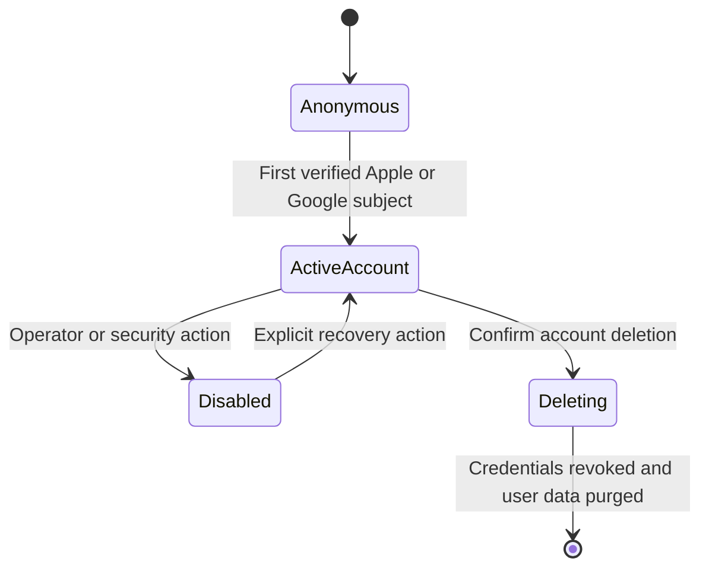

Rules:

- The unique external key is `(issuer, provider_subject)`.
- Store the exact verified OIDC issuer. Do not lowercase, trim, or otherwise normalize an issuer URL. The initial exact values are `https://accounts.google.com` and `https://appleid.apple.com`.
- Provider email is optional, last-observed metadata on the external-identity row. It is nullable, nonunique, and never an account key.
- Relisten never creates, links, merges, or recovers users because email strings match. A provider may omit email, change it, or return an Apple private-relay address that differs from the listener's address at another provider.
- Google and Apple access or refresh tokens are not stored because Relisten does not call their downstream APIs.

Username rules:

- Store the canonical username in lowercase and enforce global case-insensitive uniqueness with a database constraint.
- Accept 3–30 ASCII letters, digits, and underscores. Reject names on a server-owned reserved, system, and abuse denylist.
- Display it publicly as `@username`, but never accept it as a login identifier.
- In the first account-creation transaction, derive a candidate from a sanitized provider-email local part only when it passes the same format and denylist rules as a user edit; otherwise use `listener_` plus ten random lowercase Base32 characters. A collision appends or regenerates a bounded random suffix while keeping the result within 30 characters. The fallback namespace is large enough for the capacity target; a bounded retry failure aborts safely instead of creating an account without a username.
- The first signed-in client shows a review prompt. **Keep** records review of the assigned value; editing uses the normal rename command. Review state is stored, but an unreviewed default never restricts sessions or API capabilities. Keeping or renaming during this first review does not start the rename cooldown.
- After onboarding, a user may rename at most once every 30 days. A voluntarily abandoned username is held for 30 days before another account may claim it.
- Account deletion releases the current username immediately and deletes any hold rows belonging to that account.
- `@username` is the only public account attribution field at launch.
- Public profile pages, username search, and a user directory are outside launch scope.

`GET /v1/me` returns the canonical lowercase username, `username_version`, `username_review_needed`, `username_reviewed_at`, `username_change_available_at`, and an ETag derived from the username version. `PATCH /v1/me` is the one username review and rename command. Its body is exactly `{contract_version, client_command_uuid, expected_username_version, username}`. The UUIDv7 command ID is durable on the client before first send. An exact same-user retry returns the stored result before checking the now-advanced version; reuse with another payload or user returns `409 idempotency_conflict`.

For a new command, the service locks the user row and requires `expected_username_version` to match. A mismatch returns `409 username_version_stale` with the current profile fields and makes no change. Sending the currently assigned username while review is pending records first review; sending another valid username in that same state atomically renames the account and records review. Either first-review path increments `username_version` but leaves `last_username_changed_at` null, so it does not start the 30-day cooldown. After review, sending the current username is a stored no-op and sending another available username enforces the cooldown, creates the 30-day hold for the abandoned name, and increments the version. This prevents a stale second device from turning an old onboarding action into a later voluntary rename. `username_unavailable`, `username_change_too_soon`, and `username_version_stale` are stable RFC 9457 codes.

The unique indexes on `identity.users.username` and `identity.username_holds.username` cannot by themselves enforce uniqueness across both tables. Every allocation, rename, hold expiry, and account-deletion release therefore takes transaction-scoped PostgreSQL advisory locks for the affected normalized names in bytewise sorted order, then checks both tables and removes an expired hold before claiming a name. A rename locks the user row plus old and new names and writes the new current value and old hold atomically. No other code path may write either username column. Concurrency tests race account creation, rename, hold expiry, and deletion release against the same name.

When provider management becomes a product slice, add a UUIDv7 `identity.provider_link_intents` row bound to the current user/session and exact target issuer, with a hashed random validator, protected correlation data, expiry, and consumption time. Linking must use fresh authentication, must never move a provider subject already owned by another user, and unlinking must not remove the last login method. None of this table, API, or UI ships in the initial account slice.

Step-up reauthentication is a separate transaction, not a normal login callback. `identity.reauthentication_intents` binds a ten-minute, single-use intent to the initiating user, exact web or native session, and one issuer already linked to that user. It forces fresh upstream authentication. The callback must return the same exact `(issuer, provider_subject)` already attached to the initiating user; it never creates a user, changes sessions, or links an identity. The service atomically consumes the intent and updates only that session's `authenticated_at`. A callback for user B against user A's intent fails and cannot make A's session recent.

On simultaneous first-login callbacks, the unique `(issuer, provider_subject)` constraint decides the winner. The losing transaction catches PostgreSQL `23505`, rolls back, and re-queries the winning identity. It must not return an error or leave an unreferenced user.

The sign-in screen tells returning listeners to use the same provider they used before. Launch has no **Sign-in methods** screen. A later provider-management slice may add another provider only from an authenticated account flow; two buttons with the same reported email never imply the same Relisten account.

### OIDC clients and grants

| Client | Type | Grant | Redirect | Refresh token |
| --- | --- | --- | --- | --- |
| `relisten-web` | Confidential server client | Authorization code + PKCE | `https://relisten.net/auth/session/callback` | No; web uses a Relisten session |
| `relisten-mobile-ios` | Public native client | Authorization code + PKCE | `net.relisten.mobile:/oauth2redirect/ios` | Yes |
| `relisten-android` | Public native client | Authorization code + PKCE | `https://relisten.net/auth/mobile/android/callback`; `net.relisten.mobile:/oauth2redirect/android` in development | Yes |
| `relisten-sonos-adapter` | Confidential service client | Client credentials for narrow internal endpoints | None | No |

Sonos players are not generic OpenIddict device-flow clients. SMAPI account linking is described later in this document.

The native user-token audience is `https://accounts.relisten.net`. Native user access tokens contain only the claims required by that resource server: `sub`, client ID, native-session UUID in `sid`, `security_version`, audience, and scopes. Provider subjects and email addresses do not belong in access tokens.

Initial scopes are:

- `openid`, `profile`, and `offline_access` where OIDC defines them;
- `user.read`;
- `library.read` and `library.write`;
- `history.read`, `history.write`, and `history.manage`;
- `account.manage`;
- `sonos.control`.

The first-party clients may receive their registered grants without a repetitive consent screen. `sonos.control` is issued to the native clients, not the web client. A web session is not asked to present OAuth scopes on each request; it has one fixed first-party capability matrix: `user.read`, `library.read`, `library.write`, `history.read`, `history.write`, `history.manage`, `account.manage`, and `sonos.settings`. That matrix deliberately excludes `sonos.control`. `sonos.settings` permits only connection status, browser callback completion, and recently reauthenticated disconnect; it cannot list Sonos groups, create a handoff, read a playback handle, or send transport/volume commands. OpenIddict still stores native grants so users can revoke devices and sessions.

### Token and session policy

Use the following launch policy, then tune it from real usage:

- Access tokens expire after 10 minutes.
- Native refresh-token families expire after 180 days and after 90 days of inactivity.
- Every native login creates a distinct native session and OpenIddict authorization. Do not reuse one permanent authorization across devices.
- Every native refresh rotates the refresh token with no redeemed-token reuse window. The first concurrent refresh wins; any later use of that token atomically revokes the native session and authorization and requires a new login.
- Web sessions have a 30-day sliding lifetime and a 180-day absolute lifetime.
- The auth-host SSO session has a 30-day lifetime.
- Logout revokes the current session or token family. “Log out all devices” increments the user's `security_version` and revokes every session and OpenIddict authorization.

OpenIddict token storage remains enabled. A focused token handler enforces the replay contract atomically against the native-session record even if the pinned OpenIddict release has different default leeway. Refresh grants reload the active user and native session instead of trusting old claims.

The User Service has three non-interchangeable authorization policies:

- Native user tokens require the accounts audience plus `sub`, `sid`, and `security_version`. Every request loads the native session and user by `sid`, requires both to be active, and compares the claim with the current user row. This one indexed lookup makes session revocation, account-wide security invalidation, and deletion immediate rather than waiting ten minutes for expiry.
- The confidential web client's code exchange returns an OIDC bootstrap access token with no accounts-resource audience. The server-side callback validates the token response, creates an opaque web session from the verified OIDC identity, and discards the bootstrap access token. No resource endpoint accepts it.
- The Sonos adapter's client-credentials token has no `sub` or `sid`. Its audience is `https://accounts.relisten.net/internal/sonos`; its launch scopes are `sonos.smapi`, `sonos.cloudqueue.read`, `sonos.playback.report`, and `sonos.events.write`, granted per adapter client and route. It is accepted only at `http://relisten-user-service.default.svc.cluster.local/internal/sonos/v1/*`, with the adapter's network identity also required. This one plaintext cluster-only hop is an explicit launch tradeoff: pod-selected NetworkPolicy, a short token lifetime, per-route scopes, and token-entry validation constrain it, but the design does not claim confidentiality from a compromised node or CNI. No Ingress routes `/internal/sonos/*`; `sonos.relisten.net` is the public protocol edge and calls this cluster-local base URL. Every request confirms that the stored token entry remains valid.

Web resource requests perform the same active-user and security-version checks through their opaque session row. An authorization handler rejects a token whose class, audience, claims, or route do not match; it does not try to make one class satisfy another policy.

UUIDv7 values are identifiers, not credentials. Session validators, authorization codes, PKCE verifiers, OAuth `state`, nonces, reference tokens, queue credentials, and Sonos link codes use cryptographically random bytes.

## Web authentication

This section defines the target boundary for the first credentialed web product slice. It is not a prerequisite for the mobile-first rollout. Before then, web work is limited to exact mobile callback routing and the Slice 5 public-playlist fallback; do not build opaque web sessions, CSRF handlers, or `/api/user/v1/*` wrappers until a shipped credentialed web screen consumes them.

The browser talks to the User Service through paths on `relisten.net`. The physical service may live behind another Kubernetes Service; the browser still sees one origin. The User Service, not Next.js, owns every `/auth/session/*` and `/api/user/v1/*` handler.

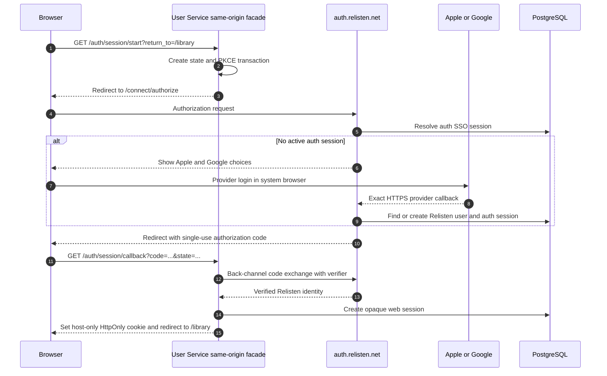

There are two independent host-only authentication/session cookies:

- `__Host-relisten_auth` belongs to `auth.relisten.net` and supports login SSO.
- `__Host-relisten_session` belongs to `relisten.net` and authenticates `/api/user/v1/*`.

Each cookie uses `Secure`, `HttpOnly`, `Path=/`, no `Domain`, and `SameSite=Lax`. A short-lived provider correlation cookie may use `SameSite=None; Secure` when Apple's cross-site `form_post` callback requires it.

The same-origin invitation flow also uses a narrow, short-lived `__Host-relisten_invitation` capability cookie. It uses `Secure`, `HttpOnly`, `SameSite=Lax`, `Path=/`, and no `Domain`; its expiry never exceeds the pending grant's expiry. A new exchange replaces it, and accept, cancel, or terminal unavailability clears it. It is not a login/session cookie and never authenticates another account route. The antiforgery cookie described below is likewise separate from the two authentication/session cookies.

The session cookie value contains a session UUIDv7 and a random 256-bit validator. PostgreSQL stores only the validator's SHA-256 hash. Knowing or guessing the UUID does not authenticate a request.

The standard OpenIddict/ASP.NET client handler protects `state`, PKCE verifier, nonce, and validated `return_to` with the shared Data Protection key ring and one short-lived correlation cookie per challenge. The transaction expires after ten minutes, consumes its correlation cookie on success, supports simultaneous tabs, and never uses process memory or an unsigned state payload. Tests cover callback replay, missing correlation, expiry, and two concurrent login tabs.

The web callback completes through that standard client handler, not a custom token-response parser. The handler validates the Relisten ID token's signature, exact issuer, `aud`, nonce, lifetime, and nonempty `sub` before the User Service resolves the account and creates the opaque web session. Any bootstrap access token, provider access token, or other resource token returned during the exchange is discarded after callback validation; it is never attached to the web session, forwarded to a resource handler, or exposed to browser code.

Cookie-authenticated mutations use ASP.NET Core Antiforgery. `GET /api/user/v1/csrf` sets an HttpOnly `__Host-relisten_csrf` cookie and returns its session-bound request token in a `Cache-Control: private, no-store` response. Browser code sends the token as `X-Relisten-CSRF`; server-rendered forms may use the same value in a hidden field. Login changes invalidate the previous token. The User Service also rejects a missing or unexpected `Origin`.

Additional web rules:

- Redirect `www.relisten.net` to `relisten.net` before accounts launch.
- Accept `return_to` only when it is a relative path on `relisten.net`.
- Never put access or refresh tokens in local storage, React state, rendered props, or URLs.
- Return `Cache-Control: private, no-store` from session, callback, CSRF, `/api/user/v1/*`, and the invitation-exchange response; configure Cloudflare to bypass caching for those paths. Next/browser fetches also use `cache: "no-store"`.
- When the first credentialed web account slice ships, its UI fetches the same-origin facade from the browser. Next renders the surrounding page but does not hairpin session requests through Cloudflare or impersonate a public host internally.
- The first mobile release returns through the collision-resistant `net.relisten.mobile` OAuth scheme and does not require a `relisten.net` callback route. A later universal-link migration adds the claimed HTTPS URI as a second registered redirect, proves its association files and routing on physical devices, then switches the app while retaining the custom scheme for at least one rollback release.
- Normal web sign-out revokes the web session and its associated auth-host SSO session. “Switch account” does the same and starts a new authorization with provider account selection or fresh login instead of silently reusing SSO.

## Mobile authentication

The mobile app uses the system authentication browser. On iOS, Expo's `openAuthSessionAsync` presents `ASWebAuthenticationSession`. Android uses the corresponding browser custom-tab flow.

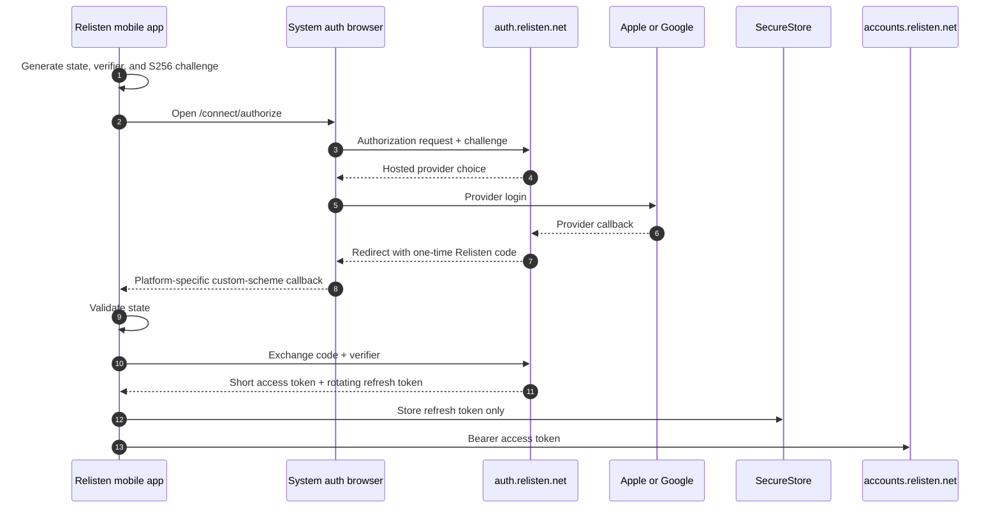

Mobile rules:

- Register iOS and Android as separate public clients with no client secret.
- Use the exact collision-resistant `net.relisten.mobile` OAuth callback in development and the initial production release; keep `relisten://` for ordinary deep links, not OAuth.
- On iOS, call `openAuthSessionAsync` with the custom-scheme callback and prove it on a release-signed physical device. Universal links are a later hardening step, not a launch dependency.
- Validate `state` and PKCE. The app treats authenticated `/v1/me`, not an unvalidated decoded ID token, as its account identity.
- Keep the access token in memory.
- Store the refresh token with `AFTER_FIRST_UNLOCK_THIS_DEVICE_ONLY` on iOS and the Android Keystore-backed equivalent. Exclude it from backup/restore and do not require biometrics, because background refresh must work.
- Serialize concurrent refresh attempts. A failed API call may cause one refresh and one retry, never an unbounded loop.
- Sign-out and account switch freeze the old sync scope, stop playback, and clear local and Sonos-control queues. While the old credential is available, make one bounded attempt to revoke its native session and active Sonos playback handles. Then delete the local credential, clear the active scope, and advance the auth generation even if the User Service is unreachable. Do not retain a usable refresh token solely to retry logout. The server session and unreached handles expire normally; every late completion checks the generation and cannot restore the old scope.
- Treat “switch account” as a distinct authorization flow. Remove the current local credential first, then authorize with `prompt=select_account`. The Relisten issuer ignores its auth SSO session for that request, displays the provider chooser, and forces upstream account selection or fresh authentication. Cancellation leaves the app anonymous.
- Send bearer tokens only to the user-data client. The catalog client stays anonymous and cacheable.
- Account deletion and session revocation must be reachable from mobile settings.

### First sign-in, sign-out, and account switching

Authentication changes who owns synchronized data; it must not silently reassign everything already on a device.

- Keep one Realm file, but put an explicit `scope_id` on account/anonymous membership, playlist, history, sync-cursor, import-receipt, and pending-mutation rows. A Relisten user UUID is an account scope; a stable installation-local UUID identifies the anonymous scope.
- Keep catalog entities, downloaded media, the download queue, streaming cache, offline-library membership, and device/audio/network/storage settings device-global. Every account on the device can see the same Offline Library. Downloading a private playlist therefore makes its tracks—but not its name, order, segments, or collaborators—visible in that device-global library. This is an accepted privacy tradeoff and must be disclosed before a private-playlist bulk download.
- Replace favorite booleans on global Realm catalog objects with account/anonymous membership rows. My Library and CarPlay derive favorites and playlists from the active scope; their downloaded/playable-offline checks remain global.
- Ask before importing anonymous favorites or playlists. Record one durable import receipt per account and anonymous scope. A declined or completed import is not offered or applied again, so switching users cannot copy or resurrect another person's data.
- Cloud history is on by default for newly signed-in playback with clear disclosure and an off switch. Existing anonymous/device-global history is different: offer one explicit import showing the account, row count, and date range. Import at most the most recent 24 months and 25,000 events, and bind the accepted or declined receipt to that account and installation.
- On sign-out, freeze synchronization, isolate or remove credentials under the revocation contract above, and hide the account scope without waiting for the network. Keep its local rows on the device unless the listener chooses “remove this account's data from this device.” Sign-out and deletion never remove downloaded media.
- Account switch and sign-out stop playback and clear the local queue, scoped queue persistence, and any active Sonos-control view before changing `scope_id` or token generation. A track from one account must not continue playing under another account's history or queue context. If the bounded remote-revocation attempt cannot be confirmed, the old speaker may briefly continue buffered playback, but the new account never inherits its handle or credential.
- Normal mobile sign-out does not promise to clear Apple, Google, or system-browser cookies. On account switching, use the explicit `prompt=select_account` flow above so the 30-day Relisten auth SSO cookie cannot silently return the previous user. Never merge or display the previous account's partition. Pending mutations stay with the account that created them.
- After confirmed account deletion, remove that account's scoped rows after credentials are revoked. Device-global downloads remain.

This policy preserves offline media and unsynchronized work while preventing a shared device from treating one person's library, queue, or playback event as another person's data.

## Local and preview authentication

Daily development must exercise Relisten's real protocol and account code without requiring contributor-owned provider credentials. Replace only the upstream proof of identity, not OpenIddict, PKCE, browser handoff, token exchange, persistence, or API authorization.

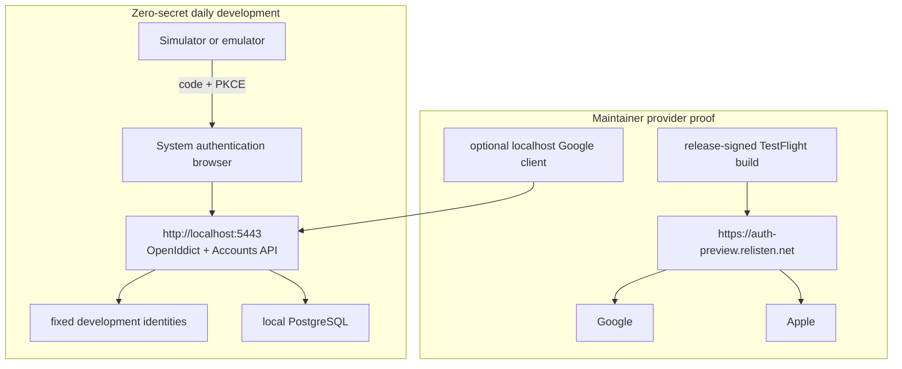

Daily mobile development uses a loopback issuer such as `http://localhost:5443`. The User Service runs the normal OpenIddict authorization-code flow, validates PKCE, persists normal users/sessions/authorizations, issues normal Relisten access and refresh credentials, and authorizes the normal Accounts API. A development-only identity page supplies one of a small checked-in set of fixed issuer/subject/profile tuples to the same external-identity completion service used by Apple and Google. It exists only on the localhost Development issuer. It never mints a credential directly, bypasses `/connect/authorize` or `/connect/token`, or accepts an arbitrary subject/email from query parameters.

Register the development identity page only when `ASPNETCORE_ENVIRONMENT=Development` and an explicit setting enables it. Startup fails if it is enabled in another environment. Permit OpenIddict's HTTP development mode only when the configured issuer is loopback. Production tests prove that neither the page nor insecure transport mode can be enabled.

Seed separate public iOS and Android development clients. They use authorization code, PKCE, refresh tokens, no client secret, and platform-specific custom-scheme callback URIs. The iOS simulator reaches the Mac's loopback service. The Android emulator uses `adb reverse` so it can use the same issuer. Physical iOS devices use preview or an optional trusted tunnel; exact local web cookie-host testing may later add a development CA and reverse proxy, but that is not a prerequisite for the mobile slices.

Local PostgreSQL deliberately does not reproduce the production role topology. One TimescaleDB/PostgreSQL container runs three logical databases: `relisten_db`, `temporal`, and `temporal_visibility`. The single `relisten` login role owns all three and runs EF Core, catalog, and Temporal schema migrations. The repeatable local bootstrap creates any missing database but does not create `app`, `user_service_*`, or `temporal_server` roles and does not apply production grants. Database and schema names remain representative; credential and privilege separation are production concerns.

Google permits exact HTTP localhost callbacks. A contributor who wants real Google proof may create a Web application OAuth client, register the exact local User Service callback, and store its client ID and secret in .NET user-secrets or environment variables. Mobile receives no Google secret or provider token.

The stable preview User Service has its own database and real Google registration; every preview TestFlight build proves sign-in through Google, and fixed Development identities are unavailable there. Apple's web callback requires a registered HTTPS domain and cannot use `localhost` or an IP address, so real Apple testing also uses a registered preview or production issuer, with private keys kept server-side. Release-signed TestFlight builds prove the claimed-HTTPS callback, Associated Domains/AASA or App Links, provider cancellation, first-login email/private-relay behavior, and real token validation. This keeps daily OSS development zero-secret without allowing a localhost convenience to masquerade as provider proof.

## Client execution boundaries

The same account contract has different safe adapters on web and mobile.

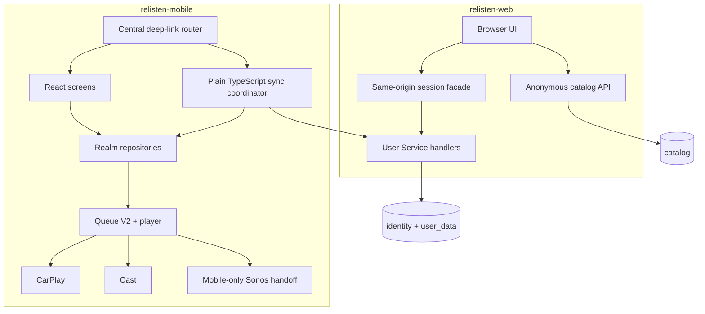

Web renders account-aware pages through the same-origin session facade and fetches user-specific data with `no-store`. Playlist detail responses already contain normalized catalog metadata, so web does not implement a second hydration path. A published playlist page reads the anonymous public snapshot without creating a cookie or grant. Browser JavaScript never receives Relisten access/refresh tokens or Sonos Control credentials.

Mobile has one central deep-link router that handles cold and warm OAuth callbacks, public playlist paths, collaborator-invitation fragments, and normal app navigation. A `public_code` is ordinary route data. The router consumes an invitation secret once, removes that fragment from visible navigation, and waits for Realm/auth initialization before routing. Individual screens must not independently interpret auth or invitation links.

The mobile sync coordinator owns network scheduling, auth-generation checks, cursor progression, outbox draining, retry/backoff, and snapshot recovery. Screens write optimistic account-scoped Realm state and a pending domain operation in one local transaction; they do not call account endpoints directly and then separately mutate Realm. The coordinator may run while a screen is absent, but does not promise OS background execution.

Queue V2 uses stable UUIDv7 occurrence identity, supports duplicates, records playlist/segment context, and shuffles segments as units when requested. A scoped playlist queue belongs to the active account/anonymous scope. Device-global downloaded files are resolved at playback time. CarPlay and Cast consume the active scoped library and queue but consult the global Offline Library; Cast and Sonos require a current remote URL and therefore cannot play licensing-removed local-only media.

The dedicated mobile architecture and implementation plan are the detailed contract for Realm migration, screen state, cold-start routing, CarPlay, Cast, and queue migration. This cross-platform document remains authoritative for ownership, wire protocols, identifiers, and account-switch semantics.

## Data architecture

### Schema ownership

CloudNativePG owns cluster-global database setup in production. Standalone `DatabaseRole` resources declare PostgreSQL role existence, login attributes, membership, and password Secret references. `Database` resources declare the `app`, `temporal`, and `temporal_visibility` databases and their owners. Use `databaseRoleReclaimPolicy: retain` and `databaseReclaimPolicy: retain` so deleting a Kubernetes object cannot silently drop production data. Audit the existing `app` role before adopting it into `DatabaseRole`; CloudNativePG applies every declared and defaulted role attribute during adoption.

The minimum database-role baseline is the existing `app` role and one `temporal_server` login role that owns both Temporal databases. The account security boundary adds the User Service owner, migrator, runtime, worker, and backup roles described below. Each production role is a standalone `DatabaseRole`, rather than an inline `Cluster.spec.managed.roles` entry. All three `Database` resources point to the existing `relisten-db-target` CloudNativePG cluster. Do not create a second CloudNativePG cluster or another PostgreSQL primary/replica pair for Temporal.

CloudNativePG does not own application tables, indexes, constraints, functions, or table-level privileges. Although `Database.spec.schemas` can create a top-level PostgreSQL schema, Relisten does not use it for `identity` or `user_data`; two controllers should not share schema ownership. EF Core migrations own those schemas and their contents. Temporal's supported schema jobs own the contents of `temporal` and `temporal_visibility`. A reviewed, versioned SQL permissions step owns grants and default privileges that `DatabaseRole` cannot express. Local development skips that production permissions step because every local connection uses `relisten`.

The existing catalog tables remain in `public` for the first release. The catalog code uses unqualified table names and Simple.Migrations, so moving those tables to a new `catalog` schema would expand the account project without improving its user-visible result.

Create two new schemas:

- `identity` contains Relisten users, external identities, browser and native sessions, short-lived login/link intents, account-deletion work, data-protection keys, and OpenIddict records.
- `user_data` contains favorites, playlists, qualified-listen history, sync revisions and receipts, workflow outbox rows, Sonos connections, and ephemeral Sonos queue snapshots.

The word `catalog` in this document means the catalog-owned tables currently in `public`. A future move from `public` to `catalog` is a separate migration with its own compatibility plan.

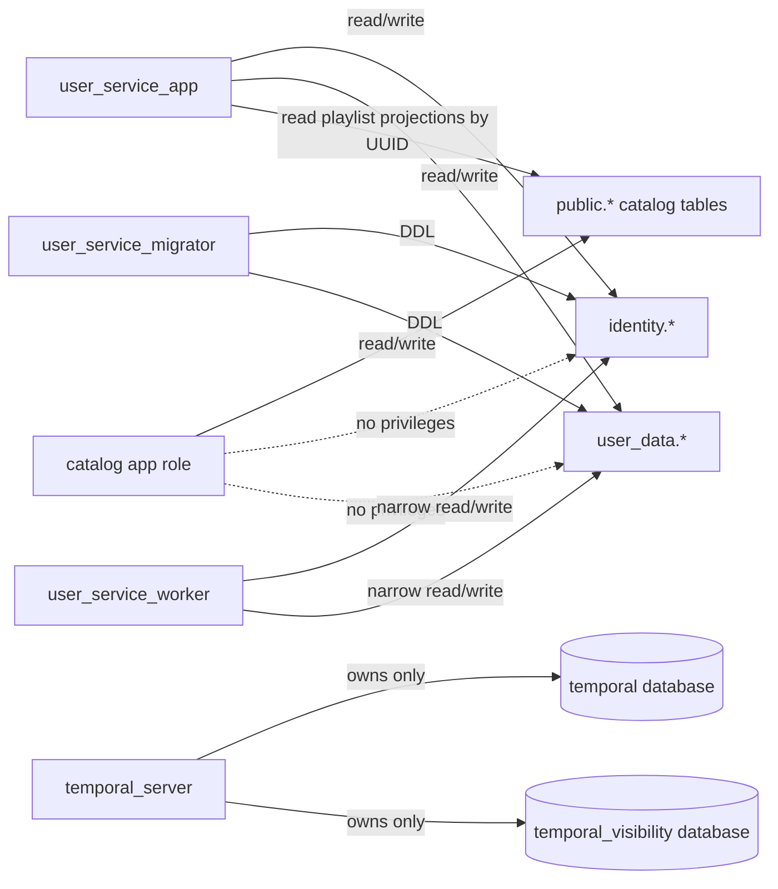

Runtime and migration roles are distinct:

- `user_service_owner` is a `NOLOGIN` role that owns `identity` and `user_data`.
- `user_service_migrator` applies reviewed EF Core migrations and receives `REFERENCES` on the specific catalog UUID columns used by foreign keys.
- `user_service_app` receives DML on the two user schemas and `SELECT` on the narrow catalog-owned projection required for playlist hydration. Favorite writes never read catalog tables: they validate only the catalog-type allowlist and UUID syntax, then preserve the listener's reference even when the catalog cannot currently resolve it. The role receives no catalog DML.
- `user_service_worker` receives only the table and stored-command privileges needed by asynchronous activities. The worker references the same versioned application/domain assembly as the User Service and executes those commands directly against PostgreSQL; it does not call a privileged HTTP backdoor. External provider calls remain explicit worker activities with idempotency keys.
- `user_service_backup` receives read access to `identity`, `user_data`, and the catalog objects included in the single-snapshot account recovery bundle; it cannot write application data.
- The catalog runtime role receives no `USAGE` on `identity` or `user_data`.
- `temporal_server` is a dedicated login role for the `temporal` and `temporal_visibility` databases. Temporal server components do not receive direct access to `identity`, `user_data`, or catalog tables; only the separate Relisten worker role has its narrow business-table grants.

The eventual production permissions SQL revokes `CREATE` on `public` from the database-wide `PUBLIC` role and sets default privileges explicitly so new user tables are not accidentally exposed. The first internal TestFlight rollout intentionally uses the existing `app` owner credential and does not pretend this target role split already exists. When the split is introduced, the migration Job applies the versioned permissions SQL after EF creates or upgrades the owned objects; CloudNativePG manifests do not duplicate it.

The current production catalog credential owns the database and runs Simple.Migrations at application startup, so the diagram is a target rather than today's full security boundary. Before account launch, split it into a restricted `catalog_app` runtime role and an explicit `catalog_migrator` path. Until that happens, schema grants prevent accidental reads but must not be described as isolation from a compromised database-owner credential.

TimescaleDB is an extension inside the same PostgreSQL cluster and application database. `user_data.qualified_listens` is the only launch hypertable. `identity`, playlist state, receipts, workflow outbox rows, and per-user history rollups remain ordinary PostgreSQL tables because their query patterns and deletion semantics benefit from normal constraints and transactions.

### UUIDv7 policy

Every new domain row in `identity` or `user_data` that is addressed, synchronized, audited, or referenced independently has an explicit UUIDv7 primary key. Natural keys remain unique constraints; they do not replace row identity. The one physical-storage exception is the TimescaleDB `qualified_listens` hypertable: its logical row identity is UUIDv7 `event_uuid`, but its physical primary key must be `(qualified_at, event_uuid)` because a Timescale unique index must include the partition column. The ordinary `qualified_listen_receipts.event_uuid` remains the globally unique single-column primary key. This includes:

- Relisten users and external identities;
- browser sessions, native sessions, and one-time login, linking, and reauthentication intents;
- OpenIddict applications, authorizations, scopes, and token records;
- favorites, favorite mutations, library changes, playlists, memberships, segments, occurrence items, operations, revisions, follows, and invitations;
- qualified-listen events and receipts, history state, and workflow outbox events;
- Sonos connections, ephemeral queues, queue items, link attempts, and account-deletion jobs.

Server-created UUIDs use `.NET 10`'s `Guid.CreateVersion7()`. OpenIddict uses its built-in `Guid`-key entities with one shared EF `ValueGenerator<Guid>`; custom entities are unnecessary unless Relisten later adds protocol-record fields. EF migrations add this check to each UUIDv7 entity key:

```sql
CHECK (uuid_extract_version(id) IS NOT DISTINCT FROM 7)
```

`IS NOT DISTINCT FROM` matters because a PostgreSQL `CHECK` accepts `NULL`; the simpler equality check would admit the nil UUID. Integration tests reject nil, UUIDv4, and UUIDs without an extractable version.

The service validates client-created entity IDs before writing them. Mobile creates UUIDv7 favorite-mutation, playlist-operation, playlist/segment/occurrence, and qualified-listen event IDs offline so retries are idempotent. The server must not use the timestamp embedded in a client UUID for authorization, abuse detection, event ordering, or billing. Explicit server receipt time, playlist revision, and event timestamps remain authoritative.

The UUIDv7 rule does not replace natural or protocol-defined values:

- Natural tuple uniqueness, such as one favorite per `(user_id, catalog_type, catalog_uuid)` or one membership per `(playlist_id, user_id)`, is enforced in addition to the UUIDv7 primary key.
- A sync cursor or playlist revision may be an integer because it is a sequence, not an entity identity.
- Provider subjects, Sonos household IDs, group IDs, service IDs, and session IDs remain opaque strings.
- OpenIddict reference identifiers, session validators, link codes, and queue credentials remain random secrets.
- Existing catalog UUIDs retain their current UUID versions. User data copies the UUID exactly and never substitutes a numeric catalog ID.

### Catalog-reference invariant

The following is valid:

```text
user_data.playlist_items.source_track_uuid -> public.source_tracks.uuid
```

The following is forbidden:

```text
user_data.playlist_items.source_track_id -> public.source_tracks.id
```

Use physical cross-schema foreign keys for concrete types such as `source_track_uuid`. The delete action is `RESTRICT` or `NO ACTION`, never `CASCADE`. A catalog cleanup must not erase a listener's operation history or invalidate a sync cursor. A referenced source-track row remains under the same UUID and carries availability state when licensing or upstream removal prevents future use. The importer must treat a foreign-key violation as a retention signal, not bypass the constraint. Favorites are deliberately different: they have no physical polymorphic FK, and their membership survives whether or not the catalog currently contains the referenced UUID.

Favorites can refer to several catalog types. Store `(catalog_type, catalog_uuid)` and restrict `catalog_type` to an application allowlist, but do not query the catalog or reject a favorite because the UUID is currently absent. Do not create a synthetic universal catalog-entity table solely to obtain a polymorphic foreign key.

Initial `catalog_type` wire values are `artist`, `show`, `source`, `source_track`, `song`, `tour`, and `venue`. Removing or renaming a value is an API migration, not an enum refactor.

CI must inspect the generated schema and fail if a column in `identity` or `user_data` references a catalog integer key. API contract tests must also prove that user endpoints expose catalog UUIDs only.

Catalog removal and a user-authored content removal are different states:

- A **user-authored occurrence or segment removal marker** is an internal playlist operation/revision artifact. It preserves idempotency and collaborator convergence, but it never renders and is not a deleted-playlist aggregate.
- A **catalog-unavailable item** remains referentially identifiable. The active playlist projection omits it from rendering, counts, duration, cloning, and Sonos handoff. If every item in a segment is unavailable, the segment also disappears from the active projection. The service does not promise automatic restoration if the catalog item later reappears.
- A mobile device that already downloaded the media may keep and play that file until the listener deletes it. Licensing removal blocks new stream/download URL issuance and remote playback such as Sonos or Cast; it does not remotely purge a file already on the device.

Filtering is projection behavior, not a fan-out rewrite of every playlist. Catalog availability changes therefore do not generate one playlist operation per affected occurrence. Availability participates in the rendered projection revision and makes clients refresh a stale playlist response without rewriting user authorship history.

The catalog introduces a monotonic, global `availability_revision` with the playlist slice, advancing it only when the remotely playable/unavailable state of a UUID changes. Hydrated playlist reads return it, and the playlist projection token combines playlist revision with `availability_revision`; clients compare that token for freshness rather than coordinating resolver chunks. Favorites do not need this machinery at launch. The standalone resolver runs only its ordinary UUID-targeted hydration queries, omits entities it cannot currently hydrate, and derives each requested reference's status from the target DTOs actually returned. It does not run a second SQL graph-validation pass. Mobile preserves membership and cached catalog objects, retries unresolved references only while they belong to an active favorite, and stops retrying after unfavorite. Refavoriting makes the reference eligible for hydration again. This keeps the favorites slice straightforward while preserving the no-fan-out removal contract needed by large playlists.

### Core entity relationships

```mermaid
erDiagram
    IDENTITY_USERS {
        uuid id PK "UUIDv7 and OIDC sub"
        text status
        text username UK "lowercase public handle"
        bigint username_version
        timestamptz username_reviewed_at
        timestamptz username_changed_at
        integer security_version
        bigint lifecycle_generation
        timestamptz created_at
        timestamptz updated_at
    }

    IDENTITY_EXTERNAL_IDENTITIES {
        uuid id PK "UUIDv7"
        uuid user_id FK
        text issuer
        text provider_subject
        text email_at_provider
        boolean email_verified_at_provider
        boolean email_is_private_relay
        timestamptz email_observed_at
        timestamptz last_login_at
    }

    IDENTITY_USERNAME_HOLDS {
        uuid id PK "UUIDv7"
        uuid user_id FK
        text username UK "lowercase"
        timestamptz release_at
    }

    IDENTITY_USERNAME_COMMAND_RECEIPTS {
        uuid id PK "client command UUIDv7"
        uuid user_id FK
        bigint expected_username_version
        bytea payload_hash
        jsonb stored_result
        timestamptz created_at
    }

    IDENTITY_SESSIONS {
        uuid id PK "UUIDv7"
        uuid user_id FK
        text purpose
        bytea validator_hash
        integer security_version
        timestamptz authenticated_at
        timestamptz expires_at
        timestamptz revoked_at
    }

    IDENTITY_NATIVE_SESSIONS {
        uuid id PK "UUIDv7 and access-token sid"
        uuid user_id FK
        uuid authorization_id FK
        text client_id
        integer security_version
        timestamptz authenticated_at
        timestamptz absolute_expires_at
        timestamptz revoked_at
    }

    OIDC_APPLICATIONS {
        uuid id PK "UUIDv7"
        text client_id UK
    }

    OIDC_AUTHORIZATIONS {
        uuid id PK "UUIDv7"
        uuid application_id FK
        text subject "user UUID string"
    }

    OIDC_TOKENS {
        uuid id PK "UUIDv7"
        uuid authorization_id FK
        text subject "user UUID string"
        text status
        timestamptz expires_at
    }

    USER_DATA_FAVORITES {
        uuid id PK "UUIDv7"
        uuid user_id FK
        text catalog_type "unique with user and catalog UUID"
        uuid catalog_uuid
        timestamptz created_at
        timestamptz updated_at
    }

    USER_DATA_LIBRARY_CHANGES {
        uuid id PK "UUIDv7"
        uuid user_id FK
        bigint revision "unique with user"
        text change_type
        uuid entity_uuid
        timestamptz created_at
    }

    USER_DATA_PLAYLISTS {
        uuid id PK "UUIDv7"
        uuid owner_user_id FK
        text name
        text description
        text public_code UK "12-letter Base52"
        timestamptz published_at
        timestamptz archived_at
        bigint revision
        timestamptz updated_at
    }

    USER_DATA_PLAYLIST_MEMBERS {
        uuid id PK "UUIDv7"
        uuid playlist_id FK
        uuid user_id FK "unique with playlist"
        text role "manager editor viewer"
        bigint joined_revision
    }

    USER_DATA_PLAYLIST_SEGMENTS {
        uuid id PK "UUIDv7"
        uuid playlist_id FK
        text rank
        text kind
        boolean deleted
    }

    USER_DATA_PLAYLIST_ITEMS {
        uuid id PK "UUIDv7"
        uuid playlist_id FK
        uuid segment_id FK
        uuid source_track_uuid FK "catalog UUID"
        text rank
        boolean deleted
    }

    USER_DATA_PLAYLIST_OPERATIONS {
        uuid id PK "client UUIDv7"
        uuid playlist_id FK
        uuid actor_user_id FK "nullable ON DELETE SET NULL"
        text actor_kind "user system"
        text actor_role_snapshot
        bigint committed_revision
        text operation_type
        jsonb operation_payload
    }

    USER_DATA_PLAYLIST_COMMAND_RECEIPTS {
        uuid id PK "client command UUIDv7"
        uuid playlist_id FK
        text command_type
        bytea payload_hash
        jsonb stored_result
        timestamptz created_at
    }

    USER_DATA_PLAYLIST_FOLLOWS {
        uuid id PK "UUIDv7"
        uuid user_id FK
        uuid playlist_id FK "unique with user"
        timestamptz created_at
        timestamptz updated_at
        timestamptz unavailable_at
    }

    USER_DATA_PLAYLIST_INVITATIONS {
        uuid id PK "UUIDv7"
        uuid playlist_id FK
        uuid inviter_user_id FK
        text role "manager editor viewer"
        bytea secret_hash
        timestamptz expires_at
        timestamptz revoked_at
        timestamptz consumed_at
        uuid consumed_by_user_id FK
    }

    USER_DATA_UNAVAILABLE_PLAYLIST_ENTRIES {
        uuid id PK "UUIDv7"
        uuid user_id FK
        uuid former_playlist_uuid "unique with user, no playlist FK"
        text reason
        timestamptz created_at
        timestamptz dismissed_at
    }

    USER_DATA_QUALIFIED_LISTENS {
        uuid event_uuid PK,FK "client UUIDv7"
        uuid user_id FK
        uuid playback_instance_uuid "nullable for legacy import"
        uuid source_track_uuid FK "catalog UUID"
        timestamptz qualified_at PK "time dimension"
        timestamptz started_at
        bigint history_generation
        integer catalog_duration_ms
        text platform
        text origin
    }

    USER_DATA_QUALIFIED_LISTEN_RECEIPTS {
        uuid event_uuid PK "client UUIDv7"
        uuid user_id FK
        uuid playback_instance_uuid "partial unique with user when non-null"
        bigint history_generation
        bytea payload_hash
        timestamptz qualified_at
    }

    USER_DATA_HISTORY_STATE {
        uuid id PK "UUIDv7"
        uuid user_id FK "unique"
        boolean collection_enabled
        bigint history_generation
        bigint visible_from_generation
    }

    IDENTITY_ACCOUNT_DELETION_JOBS {
        uuid id PK "client UUIDv7"
        uuid user_uuid "deliberately no FK"
        bigint lifecycle_generation
        integer security_version
        bigint history_generation
        text state
        text restore_tombstone_key
        integer attempt_count
        timestamptz next_attempt_at
        timestamptz created_at
        timestamptz completed_at
    }

    IDENTITY_USERS ||--o{ IDENTITY_EXTERNAL_IDENTITIES : authenticates_with
    IDENTITY_USERS ||--o{ IDENTITY_USERNAME_HOLDS : reserves
    IDENTITY_USERS ||--o{ IDENTITY_USERNAME_COMMAND_RECEIPTS : changes_username
    IDENTITY_USERS ||--o{ IDENTITY_SESSIONS : has
    IDENTITY_USERS ||--o{ IDENTITY_NATIVE_SESSIONS : uses
    IDENTITY_USERS ||--o{ USER_DATA_FAVORITES : owns
    IDENTITY_USERS ||--o{ USER_DATA_LIBRARY_CHANGES : synchronizes
    IDENTITY_USERS ||--o{ USER_DATA_PLAYLISTS : owns
    IDENTITY_USERS ||--o{ USER_DATA_PLAYLIST_MEMBERS : collaborates
    IDENTITY_USERS ||--o{ USER_DATA_PLAYLIST_OPERATIONS : authors
    IDENTITY_USERS ||--o{ USER_DATA_QUALIFIED_LISTENS : generated
    IDENTITY_USERS ||--o{ USER_DATA_QUALIFIED_LISTEN_RECEIPTS : deduplicates
    USER_DATA_QUALIFIED_LISTEN_RECEIPTS ||--|| USER_DATA_QUALIFIED_LISTENS : inserts
    IDENTITY_USERS ||--|| USER_DATA_HISTORY_STATE : controls
    IDENTITY_USERS ||--o{ USER_DATA_PLAYLIST_FOLLOWS : follows
    USER_DATA_PLAYLISTS ||--o{ USER_DATA_PLAYLIST_MEMBERS : delegates
    USER_DATA_PLAYLISTS ||--o{ USER_DATA_PLAYLIST_SEGMENTS : orders
    USER_DATA_PLAYLISTS ||--o{ USER_DATA_PLAYLIST_ITEMS : contains
    USER_DATA_PLAYLISTS ||--o{ USER_DATA_PLAYLIST_OPERATIONS : revises
    USER_DATA_PLAYLISTS ||--o{ USER_DATA_PLAYLIST_INVITATIONS : invites
    USER_DATA_PLAYLISTS ||--o{ USER_DATA_PLAYLIST_FOLLOWS : is_followed
    IDENTITY_USERS ||--o{ USER_DATA_UNAVAILABLE_PLAYLIST_ENTRIES : sees
    USER_DATA_PLAYLIST_SEGMENTS ||--o{ USER_DATA_PLAYLIST_ITEMS : groups
    OIDC_APPLICATIONS ||--o{ OIDC_AUTHORIZATIONS : receives
    OIDC_AUTHORIZATIONS ||--o{ OIDC_TOKENS : produces
    OIDC_AUTHORIZATIONS ||--o| IDENTITY_NATIVE_SESSIONS : backs
    IDENTITY_USERS ||..o{ OIDC_AUTHORIZATIONS : "UUID serialized as subject"
```

OpenIddict also owns a scopes table and application-to-token relationships. The EF Core migration generated from the pinned OpenIddict package is authoritative for OpenIddict's internal columns.

### Identity tables

`identity.users` contains:

- UUIDv7 `id`, used as the OIDC `sub`;
- `status`: `active`, `disabled`, or `deleting`;
- lowercase, globally unique `username`, monotonic `username_version`, and review/last-change timestamps; `username` becomes null only after the account enters `deleting`;
- `security_version`, incremented to invalidate all sessions;
- monotonic `lifecycle_generation`, captured by asynchronous jobs and advanced before deletion or another account-wide invalidation so stale work cannot publish data or credentials;
- creation, update, last-login, and deletion-request timestamps.

`identity.external_identities` contains one row per linked provider identity. Its unique keys are `(issuer, provider_subject)` and `(user_id, issuer)`. It retains the provider's last observed email, provider verification claim, private-relay claim when supplied, and observation time. These provider observations are nullable and may change. Email never links or merges accounts: Apple relay addresses can differ, providers can stop returning email, and identity ownership follows the verified issuer and subject.

`identity.users.username` is the lowercase, globally unique public handle assigned in the first account transaction. The row also records a monotonic username version plus review and last-change timestamps so clients can show onboarding review without gating account use, reject stale-device commands, and enforce the rename interval. `identity.username_command_receipts` gives each client command a UUIDv7 primary key, normalized payload hash, expected version, and stored result for exact same-user replay. `identity.username_holds` gives each voluntarily abandoned lowercase name a UUIDv7 row, the prior user, and a 30-day `release_at`; account deletion removes that user's holds and releases the current username immediately. The account-creation and linking section defines the canonical generation and validation rules.

`identity.sessions` stores auth-host SSO and web sessions. It records the session purpose, user, validator hash, security version, `authenticated_at`, timestamps, expiry, revocation, and the associated auth SSO session for a web session. Update `last_seen_at` at most once per hour rather than writing on every request.

`identity.native_sessions` gives each iOS or Android login one device/family UUID. It links one-to-one to an OpenIddict authorization and records user, client, untrusted display metadata, security version, authentication time, last use, absolute expiry, and revocation. Access-token `sid` points here. A user-visible device/session inventory is deferred; the model can support it later without changing token identity.

`identity.account_deletion_jobs` gives each accepted deletion a UUIDv7 primary key and keeps the lifecycle generation, bounded cleanup state, retry metadata, and only the external-revocation material the worker still needs. It deliberately has no user foreign key, because it must survive removal of the target account. The matching create-only object-storage tombstone uses the same deletion UUID.

`identity.openiddict_*` contains OpenIddict's application, authorization, scope, and token records. Keep OpenIddict token storage enabled and use its EF Core provider. Do not recreate its persistence format with Dapper.

`identity.data_protection_keys` stores ASP.NET Data Protection keys shared by User Service replicas. Encrypt the key ring with a dedicated wrapping certificate mounted from a Kubernetes Secret. A framework table whose primary key is dictated by the Data Protection package is an infrastructure exception to the domain UUIDv7 rule.

Ordinary user-owned rows—sessions, native sessions, external identities, favorites, private playlists, memberships/follows, qualified listens, Sonos connections, and queues—use explicit owner/aggregate deletion behavior. Do not cascade a shared playlist merely because one member is deleted; remove that user's membership, follow, and invitation rows explicitly. Account deletion is the sole exception: after warning about the impact, it permanently purges every playlist the deleting user owns. The account-deletion job deliberately has no user foreign key so it survives target removal. OpenIddict stores subjects as strings rather than foreign keys; deletion must explicitly revoke and remove those records and assert that none remain.

### User-data tables

Start with product concepts that exist in the clients. Avoid generic entity stores.

#### Favorites

`user_data.favorites` is the materialized membership set. Every row has a UUIDv7 `id`; a unique constraint on `(user_id, catalog_type, catalog_uuid)` prevents duplicate membership. It also stores `created_at` and `updated_at`. `user_data.favorite_mutation_receipts` records the client-created UUIDv7 mutation ID, user, desired state, normalized payload hash, server receipt time, resulting favorite UUID when present, and resulting library revision. The launch limit is 10,000 active favorites per user.

Favorite membership is user intent, not a materialized assertion that the catalog currently contains the target. A syntactically valid allowlisted reference is accepted even when its UUID is missing. Catalog absence never deletes or rejects membership. A fresh device may omit an unresolved favorite from catalog-backed presentation until hydration succeeds; a device with cached metadata keeps that cache. Neither case is an account-sync failure or a condition requiring user attention.

A mutation says “this object should now be favorite” or “this object should not now be favorite”; it is not a blind toggle. A client creating a favorite supplies a provisional UUIDv7 `favorite_uuid`. If two clients concurrently add the same natural target, the first committed row ID becomes canonical. Every response and library delta returns that canonical ID, and a losing client remaps its provisional local ID before acknowledging the outbox item. Removal names the natural target and returns the canonical row ID it removed, if any. Under concurrent offline writes, server receipt order wins. Repeating one mutation ID with an identical normalized payload returns the original result. Reusing it with a different payload returns `409 idempotency_conflict`.

Each accepted state change increments the user's monotonic `library_revision` and appends a compact `user_data.library_changes` row with its own UUIDv7 `id`, unique `(user_id, revision)`, affected entity UUID, and change type. A no-op desired-state retry returns the current revision without emitting another logical change. The full snapshot returns row UUIDs, the numeric diagnostic revision, and an opaque server-protected cursor. Mobile then calls `GET /v1/library/changes?after={opaque_cursor}`; clients neither construct a cursor from `library_revision` nor interpret its contents. The cursor is bound to the user/scope and retained position. An expired or unknown cursor returns HTTP `410` with problem code `sync_cursor_expired`, after which the client fetches a new full snapshot and atomically replaces that scope. This is a favorites/library protocol, not a generic event bus.

#### Playlists

`user_data.playlists` contains a client-generated UUIDv7 `id`, the owner, name, optional description, monotonic `revision`, nullable `published_at`, nullable `archived_at`, nullable `public_code`, and timestamps. `archived_at` is the only ordinary soft-removal state. An archived playlist is absent from normal owner, collaborator, follower, and public reads. `GET /v1/playlists?view=active` is the default active list; omitting `view` is equivalent. `GET /v1/playlists?view=archived` is a separate owner-only projection containing only playlists whose `owner_user_id` is the caller and `archived_at` is non-null. It never returns a collaborator's archived playlist. Only that explicit **Archived** list offers **Unarchive**. Archive is reversible and retains playlist contents, memberships, follows, publication timestamp, and public code; unarchive restores all of those relationships and the same public URL. The first successful publication assigns a case-sensitive, uniformly random 12-letter Base52 `public_code`.

Every top-level unit is an explicit `user_data.playlist_segments` row with UUIDv7 `id`, playlist UUID, fractional `rank`, kind, timestamps, and internal deletion state. A contiguous selection from one source/recording normally creates one source-run segment. A standalone track is a valid one-item segment. Segment identity—not `show_uuid` or visual adjacency—controls block-preserving shuffle and editing semantics.

`user_data.playlist_items` represents one occurrence. It has a UUIDv7 `id`, playlist UUID, segment UUID, catalog `source_track_uuid`, fractional rank within the segment, creation metadata, and internal deletion state. The same source track may occur more than once because every occurrence has a distinct UUID.

`playlists.owner_user_id` is the single canonical owner field. `user_data.playlist_members` has a UUIDv7 `id`, unique `(playlist_id, user_id)`, and contains manager, editor, or viewer grants; it never duplicates the owner. Authorization first compares `owner_user_id`, then reads an active membership:

| Role | Allowed | Not allowed |
| --- | --- | --- |
| Owner | Edit content and metadata; publish/unpublish; manage collaborators; archive/unarchive | There is exactly one owner. |
| Manager | Edit content and metadata; publish/unpublish; add/remove viewers, editors, and managers | Remove or demote the owner; archive/unarchive |
| Editor | Edit playlist metadata; add, remove, and move segments or occurrences | Publishing, collaborator management, archive/unarchive |
| Viewer | View and play the private playlist | Any mutation |

Playlist creation, archive state, and publication state carry client-created `client_command_uuid` values and use durable `playlist_command_receipts` with the same canonical-hash rules as playlist operations. Receipts hash the command type, route playlist UUID, and versioned semantic payload; bind the authenticated actor; and retain the stored response. Identical retries return that result; changed payloads return `409 idempotency_conflict`.

`user_data.playlist_operations` is a domain-specific idempotency and revision log, not an assertion that the whole service is event sourced. Each row records UUIDv7 operation ID, playlist, nullable actor user, `actor_kind`, role at acceptance, base revision for diagnostics, operation type, normalized payload and hash, committed revision, result, and server receipt time. `actor_user_id` uses `ON DELETE SET NULL`. Revision history then renders a null user actor as **Deleted member**, preserves only the role snapshot needed to explain authorization, and retains no provider identity, display name, or other account identity. System rebalances use `actor_kind=system`. Repeating an ID with the same hash returns the stored result; a different hash returns `409 idempotency_conflict`. Materialized playlist, segment, and item rows are the read model. `user_data.playlist_revisions` stores the revision envelope and periodic checkpoints needed to bound replay and make later user-visible restore possible without requiring launch UI.

The launch limits are 250 owned or collaborative playlists per user, 5,000 active occurrences in one playlist, and 25,000 active occurrences owned by one user. A playlist operation batch is capped at 500 operations and 2 MiB. Limits apply to the active projection; retained operations and checkpoints have their own monitored storage budget.

#### Playback history

History stores one positive fact: `qualified_listen`. Qualification uses monotonic media-position progress for one `playback_instance_uuid`, never wall-clock residence in the player. Let `progress_ms` be the greatest valid absolute media position observed for that instance; backward seeks, replay, pauses, buffering, and clock time do not reduce or advance it. At instance creation, pin the catalog duration only if it is positive and finite; that `catalog_duration_ms` value never changes for the instance. If no valid duration is available then, leave it null for that instance and disable only the percentage branch. Local Relisten playback uses `progress_ms >= 240000 || (catalog_duration_ms != null && progress_ms * 2 >= catalog_duration_ms)` and emits at most one fact. Relisten does not infer or persist a skip, completion, checkpoint stream, or exact listened duration.

`user_data.qualified_listens` is a TimescaleDB hypertable partitioned on `qualified_at`, with physical primary key `(qualified_at, event_uuid)`. Each immutable fact uses the client-created UUIDv7 `event_uuid` as its logical identity and includes user UUID, catalog `source_track_uuid`, accepted history generation, `started_at`, `qualified_at`, nullable pinned catalog-duration snapshot, platform/app/device-class fields, online/offline flag, origin, and optional playlist, segment, occurrence, and queue context UUIDs. New local playback has a stable `playback_instance_uuid`; a legacy import may leave it null because the old Realm model never stored one. Context values are nullable because a listen may start outside a playlist. The duration snapshot supports **Estimated listening time**; product text must not call it exact listening time.

TimescaleDB uniqueness must include the time partition key, so global idempotency lives in ordinary PostgreSQL. `user_data.qualified_listen_receipts` has `event_uuid` as its UUIDv7 primary key and stores user UUID, nullable `playback_instance_uuid`, normalized payload hash, accepted history generation, and `qualified_at`. A partial unique constraint on `(user_id, playback_instance_uuid) WHERE playback_instance_uuid IS NOT NULL` prevents two event UUIDs from qualifying one new local playback instance without adding an ownership state machine; legacy imports may leave the instance UUID null. One event has one identifier across mobile storage, upload, receipt, and fact. `POST /v1/history/qualified-listens:batch` accepts exactly `{history_generation, events}`; one top-level generation applies to every event and an event object never repeats it. The API validates the entire bounded batch in one transaction before inserting any new receipt or fact. Repeating an `event_uuid` with the same user and normalized payload returns its stored result. If any `event_uuid` already exists with another user or payload hash, or another event already qualified the same non-null playback instance, the whole request returns `409 idempotency_conflict` with every colliding event UUID in deterministic request order; no noncolliding sibling receives a new receipt or fact.

Start the production benchmark with roughly 30-day chunks, then enable the Hypercore columnstore APIs supported by the deployed TimescaleDB version after the measured hot window, using `segmentby = user_id` and ordering by `qualified_at`. These are benchmark hypotheses, not constants hidden in migrations; measure chunk size, ingest, compression, per-user pagination, and deletion before production. Configure no automatic history retention policy. Query a user's history with keyset pagination on `(qualified_at, event_uuid)` and at most 500 facts per page.

`user_data.history_rollups` and future Wrapped aggregates are ordinary, user-owned tables refreshed by a coalesced outbox signal and Temporal workflow. Do not start one workflow per listen. Rollups are deletion-safe and rebuildable from facts. Do not put user-bearing continuous aggregates between account deletion and its proof of completion.

`user_data.history_state` has a UUIDv7 `id`, unique `user_id`, `collection_enabled`, server-controlled monotonic `history_generation`, and monotonic `visible_from_generation`. Every qualified-listen batch carries the generation last read from the server. The typed toggle is `PUT /v1/history/state` with exactly `{contract_version, client_command_uuid, expected_history_generation, collection_enabled}`. The server locks the row, returns `409 history_generation_stale` with current state when the expected generation is stale, and otherwise stores a canonical command hash and receipt. A state-changing toggle increments `history_generation`; an exact replay returns its original receipt and current `{collection_enabled, history_generation, visible_from_generation}`, while changed command reuse returns `409 idempotency_conflict`. Turning collection off, clearing history, or entering account deletion increments `history_generation`, so a phone returning after months offline cannot resurrect pre-clear or pre-disable events. Facts and receipts record the generation under which they were accepted.

Cloud history is enabled by default with clear first-use disclosure and a typed control that stops future uploads. Disabling collection increments `history_generation` and rejects future writes but deliberately leaves `visible_from_generation` unchanged, so existing visible history remains readable. Re-enabling uses the current generation. Authenticated `POST /v1/history-clears` requires recent authentication and accepts exactly `{contract_version, client_command_uuid}` with a UUIDv7 command ID; exact replay returns its stored receipt and changed reuse returns `409 idempotency_conflict`. The command synchronously increments `history_generation` and sets `visible_from_generation` to that new value in the same locked transaction. From that commit onward, history queries, rollups, and recommendation inputs filter out facts and receipts below the visible boundary even if physical rows remain. A Temporal workflow later purges hidden facts, receipts, and obsolete rollups idempotently; purge delay can never make cleared history visible again. History collection, read, and clear are distinct authorization actions: native/browser user policies require the current user plus `history.write`, `history.read`, or `history.manage` as appropriate. No public-playlist reader, collaborator role, or Sonos SMAPI credential can read account history.

Existing anonymous mobile history can be claimed only after a separate explicit confirmation showing the target account, event count, and date range. Import at most the newest 24 months and 25,000 events per account through the ordinary qualified-listen endpoint, in batches of at most 500 or 2 MiB. Each imported event is marked `origin=legacy_import`; its playback-instance UUID may be null because the old model did not persist that identity, and the server never projects another anonymous popularity event for it. Before first upload, mobile persists one UUIDv7 `event_uuid` on every eligible legacy row. Per-event receipts and the ordinary pending outbox make the upload resumable, so there is no import aggregate, manifest, or second batch protocol.

Legacy imported rows never project a second anonymous catalog-popularity event because older clients likely already sent one. For a newly qualified signed-in listen, the User Service is the sole projector of one anonymized catalog-popularity signal; signed-in clients stop also calling the anonymous `/v2/live/play` path. Anonymous listening continues to use the existing anonymous path.

#### Settings

Do not add a general synchronized-settings document at launch. History collection already has the typed `/v1/history/state` contract, while download, storage, network, audio, accessibility, and playback-engine preferences remain device-local. Add a typed cross-device preference only when a concrete product slice needs one; do not prebuild a JSON settings blob or generic settings sync adapter.

### Synchronization model

Relisten has domain-specific synchronization, not one generic replication engine. The shared envelope is limited to authentication, UUIDv7 idempotency keys, cursors, snapshot fallback, and stable problem details.

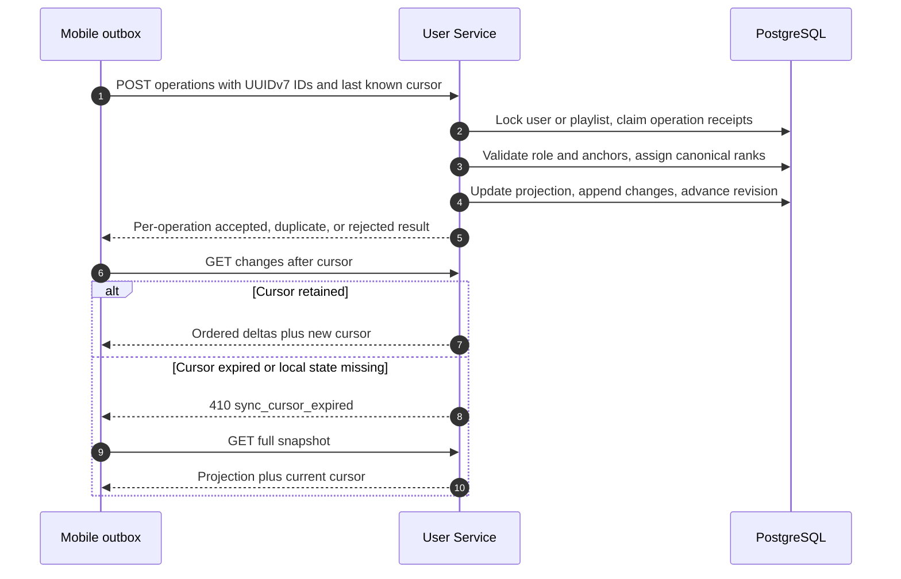

- Favorites submit desired-state mutations and share the account library revision/delta feed.
- Playlists submit semantic operations and use a per-playlist revision/change feed.
- Qualified listens are immutable idempotent batches and use history pagination rather than the library feed.

The mobile coordinator is plain TypeScript and independent of React rendering. Launch, foreground, reconnect, account-scope change, and each local write schedule synchronization. It must not depend on iOS or Android granting background execution. Each account/anonymous scope has its own cursor and outbox; switching scope cannot drain another account's operations.

#### Playlist operation and ordering contract

Playlist creation is a separate versioned aggregate command, not a playlist operation. `POST /v1/playlists` accepts exactly `{contract_version, client_command_uuid, playlist_uuid, metadata, initial_segments}`. Both command and playlist IDs are client-generated UUIDv7 values; `metadata` is `{name, description}`, and `initial_segments` is an ordered, possibly empty array of `{segment_uuid, kind, occurrences}`, where every included segment contains a nonempty ordered array of `{occurrence_uuid, source_track_uuid}` values. The server validates the 2 MiB/5,000-occurrence and account quotas, assigns canonical ranks, and atomically commits the private aggregate, initial revision `1`, library change, and durable command receipt. The server alone computes the canonical hash as `SHA-256("relisten-playlist-command-v1\n" || JCS(value))` over exactly `{contract_version, command_type:"playlist.create", playlist_uuid, metadata, initial_segments}`; `client_command_uuid` selects the receipt and is excluded from the semantic hash. Mobile sends the typed JSON command and never computes or submits this hash. A first success is `201`; exact replay returns the stored success, and changed command reuse returns `409 idempotency_conflict`. A client must receive that creation receipt before sending any dependent `/operations:batch`; a lost response is recovered by replaying the same creation command first.

Content operations do not create an aggregate. Clients do not submit authoritative fractional-rank strings. A move or insert names stable anchors such as `after_segment_uuid`, `before_segment_uuid`, `after_occurrence_uuid`, and `before_occurrence_uuid`. Their segment and occurrence UUIDs are client-generated UUIDv7 values so an offline optimistic projection has stable identity. Mobile may assign provisional local ranks to render immediately, but replaces them with the canonical ranks returned by the server.

The launch wire envelope is versioned independently of the HTTP API:

```json
{
  "contract_version": 1,
  "operations": [
    {
      "operation_uuid": "019b2f4a-7c00-7000-8000-000000000001",
      "base_revision": 41,
      "operation_type": "occurrence.move",
      "payload": {
        "occurrence_uuid": "019b2f4a-7c00-7000-8000-000000000002",
        "target_segment_uuid": "019b2f4a-7c00-7000-8000-000000000003",
        "after_occurrence_uuid": "019b2f4a-7c00-7000-8000-000000000004",
        "before_occurrence_uuid": null
      }
    }
  ]
}
```

The route DTO has one top-level `contract_version`; `playlist_uuid` comes only from the route. Each operation object contains exactly `operation_uuid`, required diagnostic `base_revision`, `operation_type`, and `payload`: it never repeats `contract_version` or `playlist_uuid`. Unknown envelope or payload fields are rejected so the server hashes one unambiguous meaning. `base_revision` is required and recorded for diagnostics but is not semantic idempotency material. For every operation receipt, the server computes `SHA-256("relisten-playlist-operation-v1\n" || JCS(value))`, where `JCS` is RFC 8785 JSON Canonicalization of exactly `{contract_version, playlist_uuid, operation_type, payload}` after inserting the canonical route UUID. Before JCS, the server parses every UUID and serializes it as lowercase, hyphenated canonical text. It preserves array order because every launch array is semantic, preserves user text exactly rather than applying Unicode normalization, and rejects floating-point values, duplicate JSON object keys, invalid/nil UUIDs, UUIDs whose required client-created version is not v7, and unknown operation versions. JSON `null` and an absent optional field remain different where the payload schema says they are different. Command receipts for creation, archive state, and publication state use the same server-only process with the domain separator `relisten-playlist-command-v1` and their versioned command type. Clients persist their typed payload and UUIDv7 operation ID for retries; they do not implement JCS or compare hash bytes.

Contract version 1 has these payloads and effects:

| Operation | Required payload and launch semantics |
| --- | --- |
| `playlist.metadata.update` | `{fields}` where `fields` contains at least one of `name` or `description`. An absent field is unchanged; `description: null` clears it; `name` cannot be null. Validation applies the documented size limits. |
| `segment.insert` | `{segment_uuid, kind, after_segment_uuid?, before_segment_uuid?, occurrences}`. `occurrences` is an ordered nonempty array of `{occurrence_uuid, source_track_uuid}`. The route playlist is the explicit parent. Client IDs survive; the server assigns the segment rank and item ranks. |
| `segment.move` | `{segment_uuid, after_segment_uuid?, before_segment_uuid?}`. The segment keeps its UUID and contents. Its anchors refer to the route playlist after temporarily removing the moved segment from the ordering calculation. |
| `segment.delete` | `{segment_uuid}`. The segment and all active occurrences it contains become internal tombstones in one revision; none render. A repeated delete is `target_deleted`. |
| `occurrence.insert` | `{occurrence_uuid, source_track_uuid, target_segment_uuid, after_occurrence_uuid?, before_occurrence_uuid?}`. The target segment is explicit; the new occurrence keeps its client UUID and receives a canonical item rank in that parent. |
| `occurrence.move` | `{occurrence_uuid, target_segment_uuid, after_occurrence_uuid?, before_occurrence_uuid?}`. The occurrence UUID survives across segments. Anchors are resolved inside the explicit target after temporarily removing the occurrence if it is already there. If moving it empties the old segment, that segment becomes a tombstone in the same revision. |
| `occurrence.delete` | `{occurrence_uuid}`. The occurrence becomes a tombstone. If it was the final active occurrence, its segment becomes a tombstone in the same revision. A repeated delete is `target_deleted`. |

Version 1 supports segment insert, move, and delete plus occurrence insert, move, and delete. The initial mobile UI uses only those primitives. A later segment split or merge can compose them into one batch, or gain a dedicated server command if the exercised UX needs stronger atomic semantics. No payload contains a canonical rank. A snapshot never renders an empty segment, including one emptied by catalog availability filtering.

The server serializes accepted operations for one playlist with a row lock or transaction-scoped advisory lock. It resolves anchors against the current materialized projection, validates role and catalog UUIDs, creates the canonical fractional rank between neighbors, writes the projection and operation receipt, and increments `revision` in one transaction. The current revision may differ from `base_revision`; that is diagnostic, not an automatic conflict. Independent anchored operations usually both succeed.

One batch is processed in client order under one playlist lock. Each accepted state-changing operation gets the next revision; accepted no-ops retain the current revision; semantic rejections receive stored per-operation results while later independent operations continue. The database commits the resulting projection and all receipts atomically, so an infrastructure failure retries the batch without partially forgotten outcomes. Loss of playlist access, malformed framing, quota failure, or an idempotency payload collision rejects the request before applying new operations. A requested delta older than retained playlist history returns exactly HTTP `409` with code `snapshot_required` and directs the client to `GET /v1/playlists/{playlist_uuid}/snapshot`; `410 sync_cursor_expired` is reserved for the account library cursor.

Anchor resolution is explicit: if both anchors still exist they must define a valid interval; if one disappeared, the surviving anchor is sufficient; if neither survives, the server appends within the intended live parent. An operation against an already deleted item or segment is an accepted `target_deleted` no-op. Inserting or moving into a missing or deleted parent produces a terminal `parent_missing` result, so mobile can rebase or discard that operation. Anchors in conflicting containers return `anchor_conflict`. Server receipt order resolves two accepted operations that target the same location. Each operation response records the resulting revision and canonical ranks, so a reconnecting client can reconcile optimistic state without a human conflict dialog.

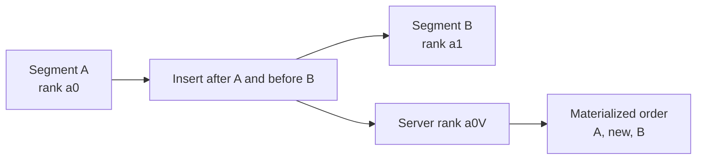

The implementation uses two rank domains: `playlist_segments.rank` for segment order and `playlist_items.rank` for order inside one segment. Rank columns use the algorithm's restricted alphabet, a length constraint, and PostgreSQL `COLLATE "C"` so comparison is bytewise and independent of database locale. When a rank approaches the configured maximum length or density makes insertion expensive, the server writes a deterministic rebalance as a system revision. Clients consume the resulting rank changes from the delta feed. Rebalance never changes segment or occurrence UUIDs.

The versioned payload table above defines launch content and metadata operations. Creation, archive/unarchive, publishing, and membership are aggregate commands rather than segment operations. Archive state uses owner-authenticated `PUT /v1/playlists/{playlist_uuid}/archive-state` with `{contract_version, client_command_uuid, archived}`. An exact command retry returns its stored result; reusing the command UUID with another value conflicts. Archive is an online acknowledged state change, not an optimistic offline content operation. The archive transaction sets or clears `archived_at` and emits one library revision; it does not delete content, memberships, follows, or publication state.

If an offline editor submits operations after their previously synchronized membership was revoked, the server returns stable `403 collaborator_access_revoked` without accepting them. Mobile stops retrying that playlist. After the listener acknowledges a plain explanation that access changed while the device was offline, the app discards the unsynchronized operations and local collaborator projection. Ordinary `403 permission_denied`, `404`, and authentication failures remain ordinary access failures. `POST /v1/playlists/{playlist_uuid}/clone` requires current public or member access and copies only the current server projection.

#### Publishing, following, invitations, and cloning

Playlists are private by default. Publishing makes the active projection publicly readable at a stable URL. It does not create a public profile, discovery feed, or playlist search product.

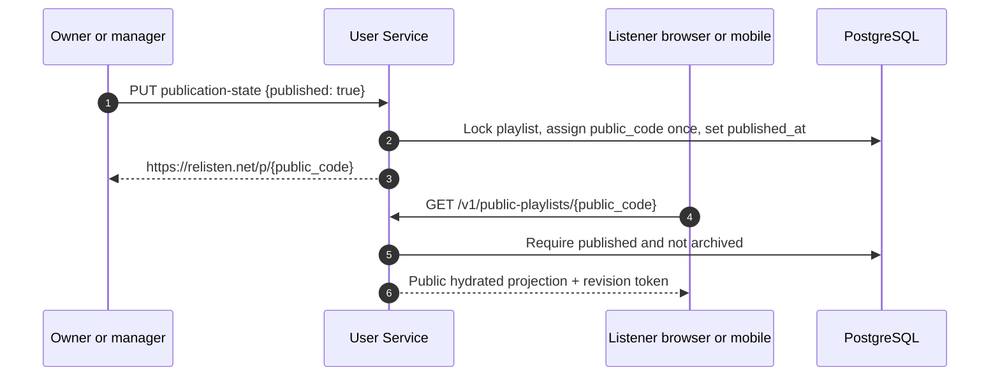

`public_code` is a routing identifier, not a secret or authorization capability. On first publication, the server generates 12 uniformly random characters from `A-Z` and `a-z`, inserts under a case-sensitive unique index, and retries with a new value after a unique-key collision. The canonical URL is `https://relisten.net/p/{public_code}`. Clients and proxies must preserve case. The identifier remains on the playlist through unpublish and archive.

`PUT /v1/playlists/{playlist_uuid}/publication-state` is an authenticated, online-only owner/manager command with `{contract_version, client_command_uuid, published}`. Its receipt returns the playlist UUID, `public_code`, public URL, nullable `published_at`, and resulting revision. Exact retry returns the stored receipt. Unpublish sets `published_at` to null without changing `public_code`; republish restores the same URL. Archiving leaves publication state intact but makes the public route unavailable until the owner unarchives.

`GET /v1/public-playlists/{public_code}` needs no token, cookie, secret exchange, or special header. Missing, private, and archived codes all return the same `404 playlist_not_found`. A successful response contains the public hydrated active projection and the owner's `@username` attribution and uses `Cache-Control: public, max-age=0, must-revalidate`. The playlist/availability projection revision is a sync token, not a validator for every included title or venue field, so launch clients do not treat it as a byte-for-byte representation ETag or accept `304` as proof that all catalog metadata is unchanged. Add a full-representation validator only if caching measurements justify a referenced-entity digest or catalog projection version. Anonymous listeners may view and play. A signed-in listener may follow or clone while the playlist is published and not archived. Ordinary anonymous rate limits control scraping; identifier entropy is not access control.

`playlist_follows` has a UUIDv7 primary key and unique `(user_id, playlist_id)`. A follow is a subscription, not permission. `PUT /v1/playlist-follows/{playlist_uuid}` creates or restores it only while the playlist is published and not archived; `DELETE /v1/playlist-follows/{playlist_uuid}` removes it. The library feed returns each followed playlist's current revision and availability state, and mobile silently pulls that playlist's delta feed when it advances. The service does not fan out one library-change row to every follower for every edit. Unpublish or archive makes the follow unavailable without deleting it; republish or unarchive restores it when both visibility conditions are true. The exceptional account-deletion purge converts each affected follow into a UUIDv7 `unavailable_playlist_entries` row, unique `(user_id, former_playlist_uuid)`, and emits the corresponding library change. This minimal row has no playlist foreign key or copied title/owner metadata and survives until the follower dismisses it.

Collaborator invitations are the only playlist-sharing mechanism that uses a secret. They are one-time, sign-in-required links because acceptance creates viewer, editor, or manager membership. Creation is an online idempotent command: `POST /v1/playlists/{playlist_uuid}/collaborator-invitations` accepts exactly `{contract_version, invitation_uuid, role, fragment_secret}`. Mobile or web generates the UUIDv7 invitation ID and a 256-bit Base64url fragment secret immediately before the request, retains the secret only in request memory, and does not expose the share URL until success. The server stores only the secret hash and returns exactly `{invitation_uuid, role, expires_at}`; it never returns the fragment secret or complete URL. After success, the client constructs `https://relisten.net/i/{invitation_uuid}#k={fragment_secret}` from its in-memory values and opens the share UI. Exact retry with the same invitation UUID, actor, role, and secret returns the same secret-free invitation metadata; changed reuse conflicts. If the creator process dies after commit, the secret is intentionally unrecoverable: list the pending invitation, revoke it, and create another.

`POST /v1/playlist-collaborator-invitations/exchange` accepts exactly `{invitation_uuid, fragment_secret}`, validates the fragment secret, and replaces it with a short-lived pending-invitation grant. Its native response is exactly `{invitation_uuid, pending_grant, expires_at, preview:{playlist_name, role}}`. The preview is bounded invitation context, not anonymous access to playlist contents, members, owner identity, or revisions. Mobile keeps `{invitation_uuid, pending_grant, expires_at, preview, acceptance_command_uuid?}` only in its protected pending-deep-link store so process death during system-browser login cannot lose it. The raw fragment is scrubbed and never persisted. Exchange is retry-safe, not a command-receipt operation: while the original fragment remains available and the invitation is active, another exchange may create another equivalent short-lived pending-grant row. The first successful acceptance, invitation revocation, or invitation expiry invalidates every outstanding grant for that invitation atomically. Rate limits and a small per-invitation live-grant cap prevent an unaccepted link from creating unbounded rows.

Anonymous same-origin `POST /api/playlist-collaborator-invitations/exchange` accepts the same request but does not expose `pending_grant` to browser JavaScript. It returns `{invitation_uuid, expires_at, preview:{playlist_name, role}}` and stores the opaque grant in a Secure, HttpOnly, SameSite=Lax, host-only `__Host-relisten_invitation` cookie. The server-rendered confirmation route reads that cookie to recover the bounded preview after login; the browser cannot read or submit the grant itself. The launch mobile slices do not depend on this future web confirmation UI.

Authenticated native `POST /v1/playlist-collaborator-invitations/{invitation_uuid}/accept` accepts exactly `{contract_version, client_command_uuid, pending_grant}`. Same-origin web `POST /api/user/v1/playlist-collaborator-invitations/{invitation_uuid}/accept` accepts exactly `{contract_version, client_command_uuid}`; the facade reads and consumes the grant from the HttpOnly invitation cookie and applies the ordinary antiforgery policy. Before first send, native stores the UUIDv7 command ID beside the protected pending grant, while web persists it in server-rendered form state. The server locks the invitation, verifies inviter authority, current user, grant binding, expiry, revocation, and prior consumption, then creates membership, marks `consumed_at`/`consumed_by_user_id`, advances the library revision, and writes a command receipt atomically. The response is exactly `{playlist_uuid, membership_uuid, role, library_revision}`. An exact retry by the same authenticated user returns that stored success before evaluating the now-consumed invitation; changed command reuse conflicts. A different user or a new command against a consumed, revoked, or expired invitation receives the same `404 invitation_unavailable`. Thus the first signed-in holder to confirm wins, while a lost success response is recoverable without weakening the generic unavailable result. Removing or demoting a manager revokes every unconsumed invitation issued under that manager's authority in the same playlist revision. Publishing, unpublishing, archiving, and unarchiving never add or remove collaborators.

Any signed-in listener with current public or member access may clone. `POST /v1/playlists/{playlist_uuid}/clone` accepts exactly `{contract_version, client_command_uuid}`. On first acceptance, the server creates fresh UUIDv7 playlist, segment, and occurrence IDs and copies the active rendered order, duplicates, segments, name, and description. Its command receipt binds the actor, source playlist UUID, source content revision plus availability revision used for the copy, and complete destination result. An exact retry returns the same destination IDs even if the source changed afterward; reuse of that command UUID for another source or actor conflicts. It never copies members, followers, publication state, invitations, operation history, play counts, or collaborator attribution. The clone is a private independent playlist.

Store playlist operations and periodic checkpoints now so later revision browsing and restore do not require a schema reset. Launch exposes no user-facing restore UI.

Retain accepted, no-op, and rejected operation IDs, payload hashes, results, and reconstructable revision checkpoints for the playlist's lifetime, including while archived. At this scale, that clear retry guarantee is worth more than an early receipt-compaction policy. The exceptional account-deletion purge removes the owned aggregate and its revision history after follower-unavailability changes and the deletion tombstone are durable. Any future compaction must prove that every retained revision promised to users can still be reconstructed and that an old operation ID cannot be reapplied.

### Large-playlist hydration

Playlist detail APIs hydrate automatically. Authenticated `GET /v1/playlists/{playlist_uuid}/snapshot` returns the complete authored structure plus one normalized catalog sidecar. Anonymous `GET /v1/public-playlists/{public_code}` returns only active structure plus an unavailable count, using the same sidecar shape; it does not expose removed UUIDs or editing tombstones. Playlist list APIs remain summary-only.

The response contains every segment and occurrence, including stable UUIDs, fractional ranks, typed availability, content revision, and availability revision. Its `catalog` object contains de-duplicated, shallow UUID-bearing arrays for the source tracks, sources, shows, artists, and venues needed by those occurrences. Add another entity family only when a current mobile or web consumer requires it. Do not repeat catalog graphs per occurrence, expand every alternate recording for a show, return numeric catalog IDs, or return stream authorization in this representation.

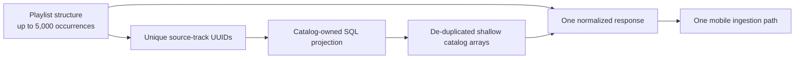

The User Service and catalog share the `app` database. The initial implementation reads a narrow catalog-owned view or projection with explicit `SELECT` grants and set-based queries inside the same PostgreSQL repeatable-read transaction as the playlist projection. Put this behind a catalog-projection interface so the implementation may later move to an internal catalog API without changing clients. Do not give the User Service arbitrary catalog-write access.

The authenticated snapshot preserves unavailable user-authored occurrences in structure with `removed`, `upstream_missing`, or `not_found`. They are absent from the normalized catalog sidecar when no safe catalog row remains and are excluded from active counts, new queues, clone, Cast, and Sonos. The public snapshot omits them and returns only the count. A file already on a device remains governed by the device-global Offline Library rule.

Start with one compressed response at the existing 5,000-occurrence limit. Measure a worst-case fixture on representative mobile hardware. The cost is that a cold read may transfer normalized metadata already present in Realm; the benefit is one request, one consistency boundary, one retry, and no client batch/revision state machine. Add server-driven pagination, a structure-only representation, or windowing only after compressed size, parse memory, Realm transaction duration, or first-useful-render latency demonstrates the need.

Authenticated playlist change pages, if retained, include the normalized catalog rows needed by newly introduced source-track UUIDs. Mobile never invokes the catalog resolver for playlist hydration. The anonymous typed resolver remains available for favorites and other standalone catalog references.

### Temporal and background work

Temporal is the strategic background-work engine from launch. It uses the official self-hosted services with PostgreSQL persistence and PostgreSQL visibility in the `temporal` and `temporal_visibility` logical databases. Both databases live beside `app` in the existing two-instance `relisten-db-target` CloudNativePG cluster and use one `temporal_server` owner/login role. They share the cluster's primary, replica, CPU, memory, storage, failover, maintenance, and physical-recovery boundary. Relisten accepts that coupling to avoid operating another PostgreSQL deployment at this scale.

CloudNativePG `DatabaseRole` and `Database` resources create and retain the Temporal role and databases. Temporal must not compete with CloudNativePG for that ownership. The pinned Helm values therefore set `createDatabase: false` and `manageSchema: true` for both SQL stores. Set `schema.useHelmHooks: false` under Flux so setup and upgrade jobs are ordinary rendered resources with visible status. Flux ordering is explicit: reconcile the existing CloudNativePG cluster, role, and databases; wait for both `Database` resources to report applied; complete the pinned Temporal schema job; then start or upgrade Temporal services. The same `temporal_server` credential runs Temporal's supported schema tooling and runtime because the official chart does not expose a separate schema-job credential without customization.

Create one Temporal namespace, `relisten-user`, with 30-day history retention and no archival. Start with the minimum official service topology and one Relisten worker/dispatcher. Do not add Elasticsearch. Pin compatible chart, server, schema-tool, and .NET SDK versions and choose `numHistoryShards` before bootstrap.

Temporal does not participate in login, refresh, favorite, playlist, publication, invitation, history-ingest, or sync commits. A synchronous business transaction writes domain state and a small `user_data.workflow_outbox` row together. The dispatcher starts a workflow whose ID is the outbox UUID. A start acknowledgement proves only dispatch; the durable business job records terminal outcome. If Temporal is unavailable, ordinary APIs continue and outbox age grows.

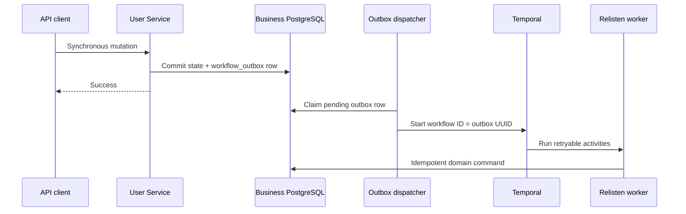

The first workflow is account-deletion cleanup. Sonos revocation/subscription work follows when Sonos ships. Qualified-history ingestion is synchronous; add rollup workflows only when a user-facing rollup exists. Importers migrate from Hangfire one at a time after the account path is stable.

Workflow payloads contain UUIDs and small immutable facts, not provider tokens, complete playlists, or catalog blobs. Activities load current state through the shared domain/persistence assembly, use explicit external idempotency keys, and record outcomes in business tables. The Temporal frontend is an internal-only ClusterIP with pod-selected NetworkPolicy and workload-scoped credentials. Do not build a custom ClaimMapper/Authorizer matrix or separate dispatcher/worker database roles until more than one trusted worker boundary exists.

Business rows and outbox jobs are the recovery authority. Test one shared CloudNativePG physical restore that brings back `app`, `temporal`, and `temporal_visibility` at the same recovery point. If Temporal persistence cannot be trusted, keep the dispatcher stopped, create a clean replacement namespace during the recovery procedure, and re-enqueue only nonterminal authoritative business jobs. Activities check the business job and external receipt before a side effect. Add workflow-versioning and replay machinery or archival only when workflow lifetime and incompatible code evolution make them necessary; they are not prerequisites for the first short deletion workflow.

### Deferred account data export

Self-service account export is not part of the first account slices. Do not build an artifact workflow, anonymous download grant, object-store lifecycle, or mobile UI without a concrete product or regulatory requirement.

When the requirement becomes real, start with an authenticated, rate-limited JSON or ZIP stream produced from one consistent database snapshot. If measured data size or generation time makes a synchronous stream unsafe, design an asynchronous artifact at that point with the exact retention and cancellation rules the requirement needs. General playlist M3U/CSV import and export remain separate product work.

### Account deletion

Account deletion requires recent authentication and explicit confirmation. Before confirmation, `GET /v1/account-deletion/impact` lists every owned playlist and highlights collaborators, followers, publication, and archive state. The copy states plainly that every playlist the account owns will be permanently removed for everyone. Ordinary playlist UI has no permanent-delete action.

The client persists a UUIDv7 deletion command ID before sending `POST /v1/account-deletions`. In one transaction, the service locks the user and owned playlists, rechecks impact, sets the account to `deleting`, advances lifecycle/security/history generations, revokes all Relisten sessions and protocol credentials, releases the username and holds, creates a no-user-FK deletion job, and writes a workflow outbox row. Public and follower reads require an active owner, so owned playlists become unavailable at that commit. Exact same-user retry returns the existing job; changed reuse conflicts.

The service returns `202 Accepted {deletion_uuid,state:"deleting"}` after that fail-closed transaction. Mobile may immediately remove scoped local data and return to anonymous mode while preserving device-global downloads. If the response is lost, a client with a still-valid session exact-retries. A revoked session is evidence that the fail-closed transaction committed, but the UI does not claim that asynchronous purge or upstream Sonos cleanup is complete.

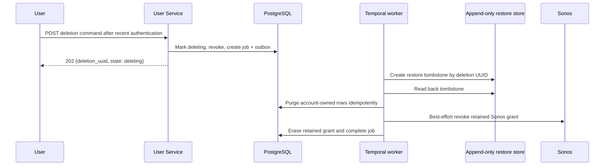

The Temporal workflow first writes one create-only append-only restore tombstone and reads it back, then hard-purges user-owned rows, owned playlist aggregates, memberships/follows/invitations, identity/provider rows, and the user. This small external record prevents a database backup restore from silently resurrecting a deletion. It is not a separate signer service or application lookup path. The worker uses a narrow object prefix and create/read credentials; the bucket blocks overwrite and retains tombstones longer than the longest database backup.

`identity.account_deletion_jobs` stores the deletion UUID and former user UUID without a foreign key, state, attempts, timestamps, restore-object version/checksum, and only the minimum encrypted Sonos credential needed for revocation. PostgreSQL row locks and activity idempotency make retries safe. If object storage is unavailable, the account remains unusable and the job retries; hard purge waits for tombstone read-back. Sonos revocation is retried for a bounded period and its credential is then erased whether or not the speaker service acknowledged.

Before external beta, run a focused deletion-restore replay from a representative snapshot containing a deleted account. It must load the append-only tombstone and remove the matching restored account plus its credentials before traffic opens. This is the no-resurrection product invariant; it does not require a full clean-cluster disaster-recovery exercise or rotation of every unrelated credential. Before broad public rollout, run the complete restore rehearsal, including credential invalidation/rotation and provider or Sonos reauthentication where needed. Add further recovery hardening only when the measured threat model or longer-lived workflows justify its operational cost.

Do not retain a permanent provider subject or email tombstone by default. If abuse prevention later requires a denylist, document its purpose and retention separately and store an HMAC rather than the original identity value.

## User API

The target route table on `accounts.relisten.net` begins with the following. Slices expose only the routes their current UI and lifecycle require; the presence of a route in this architecture is not permission to front-load its workflow. Bearer authentication is the default; the public playlist and invitation-exchange exceptions are enumerated immediately after the table.

```text
GET    /v1/me
PATCH  /v1/me
POST   /v1/logout
GET    /v1/account-deletion/impact
POST   /v1/account-deletions

POST   /v1/reauthentication/start

GET    /v1/library/snapshot
GET    /v1/library/changes?after={opaque_cursor}
POST   /v1/library/favorite-mutations:batch

GET    /v1/playlists?view={active|archived}
POST   /v1/playlists
GET    /v1/playlists/{playlist_uuid}/snapshot
GET    /v1/playlists/{playlist_uuid}/changes?after_revision={revision}
POST   /v1/playlists/{playlist_uuid}/operations:batch
PUT    /v1/playlists/{playlist_uuid}/archive-state
POST   /v1/playlists/{playlist_uuid}/clone
GET    /v1/playlists/{playlist_uuid}/members
POST   /v1/playlists/{playlist_uuid}/collaborator-invitations
DELETE /v1/playlists/{playlist_uuid}/collaborator-invitations/{invitation_uuid}
PUT    /v1/playlists/{playlist_uuid}/members/{member_user_uuid}
DELETE /v1/playlists/{playlist_uuid}/members/{member_user_uuid}
PUT    /v1/playlists/{playlist_uuid}/publication-state
GET    /v1/public-playlists/{public_code}
PUT    /v1/playlist-follows/{playlist_uuid}
DELETE /v1/playlist-follows/{playlist_uuid}
POST   /v1/playlist-collaborator-invitations/exchange
POST   /v1/playlist-collaborator-invitations/{invitation_uuid}/accept

POST   /v1/history/qualified-listens:batch
GET    /v1/history/state
PUT    /v1/history/state
GET    /v1/history
POST   /v1/history-clears

GET    /v1/integrations/sonos
POST   /v1/integrations/sonos/connect
DELETE /v1/integrations/sonos
GET    /v1/integrations/sonos/groups
POST   /v1/integrations/sonos/handoffs
GET    /v1/integrations/sonos/playback/{playback_handle}
POST   /v1/integrations/sonos/playback/{playback_handle}/commands
DELETE /v1/integrations/sonos/playback/{playback_handle}
```

The eventual web facade uses an explicit allowlist, not automatic wildcard forwarding. When a shipped web screen first consumes a credentialed handler, prefix its canonical path with `https://relisten.net/api/user`—for example, `/api/user/v1/playlists/{playlist_uuid}/snapshot`—and authenticate the opaque web session plus fixed web capability matrix instead of a bearer token. The facade is not a second implementation of business logic. During the mobile-first slices, do not create wrappers, route-generation tests, or session capabilities merely because a native bearer endpoint exists. Initial web work is limited to exact mobile callback routing and, in Slice 5, the credential-free public-playlist fallback. Add the credentialed web session/facade with the first credentialed web product slice.

Public playlist and credential-free invitation-exchange handlers use separate `/api/...` paths and are never placed under `/api/user` when their web fallbacks ship.

When a credentialed Sonos web settings screen eventually ships, it is a narrow exception: expose only `GET /api/user/v1/integrations/sonos` for connection status and `DELETE /api/user/v1/integrations/sonos` for recently reauthenticated disconnect. The first mobile Sonos slice does not add those web routes. Its state-bound browser callback is server-side integration plumbing, not a web control surface. Web never receives prefixed versions of Sonos connect initiation, groups, handoffs, playback handles, or commands; those native bearer routes require `sonos.control`, which no web session has. Add the allowlist comparison test when the first Sonos web route actually exists.

Reauthentication returns a short-lived exact authorization URL for mobile and creates a one-time server-side intent before leaving Relisten. It binds the initiating user and exact session and accepts only one of that user's existing provider subjects. Account deletion, Sonos connect/disconnect, and clear-history require recent authentication. When credentialed web flows later ship, their adapter may redirect to the same authorization URL; browser calls additionally require the antiforgery contract. Browser-only logout/switch routes and their forced account selection arrive with that web slice, not with mobile auth. Native switching freezes scoped work, makes one bounded revocation attempt, deletes the old local credential, advances the account generation, then sends `prompt=select_account` and requires visible provider interaction. It does not retain an old-token retry envelope.

`GET /v1/public-playlists/{public_code}` is the only credential-free public resource. The only credential-free capability route is `POST /v1/playlist-collaborator-invitations/exchange`; it validates an invitation fragment secret and returns a bounded pending-invitation grant in a `no-store` response. Following, cloning, invitation acceptance, account deletion, and every other mutation require sign-in. The same-origin exceptions are `GET /api/public-playlists/{public_code}` and `POST /api/playlist-collaborator-invitations/exchange`; they remain outside the authenticated `/api/user/v1` allowlist.

API conventions:

- Use JSON names ending in `_uuid` for catalog and user entity references.
- Use RFC 9457 problem details for errors.
- Use keyset pagination, not page numbers, for history and long operation/change feeds.
- Return `revision`, `next_cursor`, and explicit snapshot-fallback errors; do not overload HTTP ETags as the offline merge protocol.
- Accept idempotent retries for favorite mutations, playlist creation and operations, history-state commands, identical qualified listens, token revocation, and disconnect operations.
- Treat required playlist `base_revision` as diagnostic context. The server accepts or rejects each semantic operation against current materialized state and stable anchors; it does not require whole-aggregate replacement.
- Return `404` rather than revealing whether another user owns a UUID.
- Never accept a user UUID from the client to scope an operation. Resolve the user from the session or access token.
- Return per-operation results for a mixed playlist batch so an obsolete move can fail without discarding unrelated valid offline edits. Reject the whole request only for malformed framing, authorization loss, quota, or idempotency-key payload collision. A known formerly authorized collaborator receives stable `403 collaborator_access_revoked`; ordinary lack of permission remains `403 permission_denied`.
- Keep snapshot failures domain-specific: library cursor expiry is `410 sync_cursor_expired` and points to the library snapshot; playlist delta retention is `409 snapshot_required` and points to that playlist snapshot.
- A changed-payload qualified-listen collision rejects the entire batch and returns every colliding `event_uuid`; no sibling receipt is created.

### Launch quotas and request limits

Accounts are free and writes are transactional, so one authenticated client must not be able to create an unbounded request or database transaction. Launch with configurable server-enforced limits:

| Surface | Launch limit |
| --- | --- |
| Default account mutation body | 256 KiB |
| Playlist-operation or history batch body | 2 MiB |
| Playlist create or Sonos handoff body | 2 MiB and the corresponding 5,000-occurrence limit |
| Favorites | 10,000 per user |
| Playlists | 250 per user; 5,000 occurrences each; 25,000 occurrences total |
| Playlist operation batch | 500 operations |
| Playback history | 500 events per batch; legacy import newest 24 months and at most 25,000 rows |
| Sonos queues | 10 active transport snapshots per user; 5,000 occurrences each; 24-hour inactivity and hard seven-day expiry |
| Ordinary mutations | 120 per user per rolling minute |
| Playlist-operation batches | 30 per user per rolling minute; at most two concurrent per playlist |
| History batches | 30 per user per rolling minute; at most two concurrent per user and history generation |
| Login and recent-auth starts | 60 per IP and 10 per existing session per ten minutes, with a small burst allowance |

Kestrel and ingress reject an oversized body before JSON materialization with `413 Payload Too Large`. Schema or item-count violations return RFC 9457 `422 Unprocessable Content` with a stable `limit_exceeded` code. A per-account count limit returns `422 quota_exceeded`; the service does not silently evict history or playlist data. Rate rejection returns `429 Too Many Requests` and `Retry-After`.

Do not add normalized-byte storage accounting or a cross-domain `account_usage` ledger in the launch slices. Enforce body, batch, and per-aggregate item limits at the owning domain boundary. When a limit spans aggregates, such as 25,000 occurrences across playlists, serialize cardinality-changing commands on the existing user boundary and use an indexed count; add one narrow integer counter only if measurement shows that query is too expensive. The check and mutation share one PostgreSQL transaction, so parallel requests cannot cross the limit. Request-body and unauthenticated IP limits remain cheap middleware/edge checks. Identical retries do not add rows, although they still count as attempts.

Use one parameterized boundary test for each shared body/item-limit mechanism and one concurrency test for the authoritative cross-aggregate count. Do not repeat the same limit test through every controller. In the single pre-public capacity rehearsal, exercise a near-limit 5,000-occurrence snapshot, accepted/rejected 500-item batches, and sustained rate-limit traffic. Change defaults only with measured request distributions and an updated capacity note.

## Sonos architecture

### Current and target behavior

Today, `relisten-sonos` is an anonymous SMAPI catalog server. Sonos browses Relisten through SOAP, asks `getMediaURI` for a track, and builds its own native queue. The service has no account database and no Sonos Control API credentials.

The target adds three capabilities:

1. Authenticated SMAPI account linking so a Sonos household can identify a Relisten user.
2. Sonos Control OAuth so Relisten mobile can discover and control a listener's Sonos groups.
3. A Sonos Cloud Queue protocol baseline compatible with Sonos's published Play Audio flow (currently documented as v2.1), with negotiated v2.3 reporting where partner approval and player support permit, so a snapshot of the mobile queue continues on Sonos after the phone disconnects.

These capabilities justify replacing the internal Sonos server if a clean implementation is easier to verify. The existing repository and runtime are not an architectural constraint. The public SMAPI contract, service registration, media IDs, and current anonymous behavior are compatibility constraints until Sonos approves and users migrate. The Dev Portal registration and real-speaker validation decide which Cloud Queue version is advertised; this document does not label v2.3 unconditionally “latest.”

SMAPI authentication mode is integration-wide. An anonymous account cannot silently become a particular Relisten user. Follow Sonos's documented upgrade path: create a new OAuth version of the existing content service, and return blank credentials to upgrade-form `getDeviceAuthToken` requests so listeners reauthorize rather than being mapped to a guessed account. Announce the reauthorization requirement before Sonos activates the version. The previous anonymous adapter remains useful for pre-activation rollback, but it is not a second mode the same production registration can serve afterward. Sonos must approve the version plan before production Milestone 5.

### Sonos adapter replacement strategy

The default plan is a clean TypeScript v2 implementation in `relisten-sonos` because the current TypeScript deployment and `soap` WSDL path already work. Before replacement:

1. Capture real anonymous SMAPI request and response fixtures for every supported method.
2. Add contract tests for WSDL shape, SOAP faults, metadata IDs, search, media resolution, and playback reporting.
3. Create a genuinely isolated `relisten-sonos-preview` Deployment, Service, hostname, credentials, and test service ID; the current preview and production hosts must no longer share a backend.
4. Add authenticated SMAPI and versioned Cloud Queue contract tests, including the negotiated reporting surface.
5. Run Sonos sandbox tests and real-speaker playback.
6. Cut production traffic only after the new adapter passes the compatibility suite.

Moving the adapter to ASP.NET is allowed, but it is not the default. The move should happen only if a spike proves that the .NET SOAP stack can match Sonos's WSDL and fault behavior with less code and no loss of testability. Sharing a language with the User Service is not enough reason by itself.

The v2 adapter remains stateless. It does not store user accounts, Sonos Control tokens, queues, or link codes in Node process memory or a private database.

Authenticated SMAPI implements and contract-tests this matrix:

- `getAppLink` begins browser linking, returns one expiring `linkCode`, and may also bind an optional `linkDeviceId` to that attempt;
- `getDeviceAuthToken` identifies an authentication-upgrade request by the absence of `linkCode`, not by the optional `linkDeviceId`; it returns blank credentials for that anonymous-account upgrade, the documented retry fault while an ordinary browser link is pending, and one per-user/per-household SMAPI credential on success;
- every authenticated SOAP request validates the Sonos credential header;
- `getUserInfo` and the advertised `userInfo` capability return the same immutable `userIdHashCode` and compatible nickname used for Control account matching;
- revoked or expired credentials produce the documented reauthorization response rather than an application exception.

The User Service persists one random opaque `userIdHashCode` per Relisten user and distinct hashed SMAPI credentials per user-household association. It stores the `linkCode`, household identifier, issuance, expiry, and revocation, plus `linkDeviceId` when Relisten issued one. An ordinary request with a valid `linkCode` remains a linking request when `linkDeviceId` is absent; when the attempt includes a `linkDeviceId`, the returned value must match. The content-integration service ID and the Sonos Control OAuth client ID are different identifiers and are never substituted for each other.

### Two independent authorization relationships

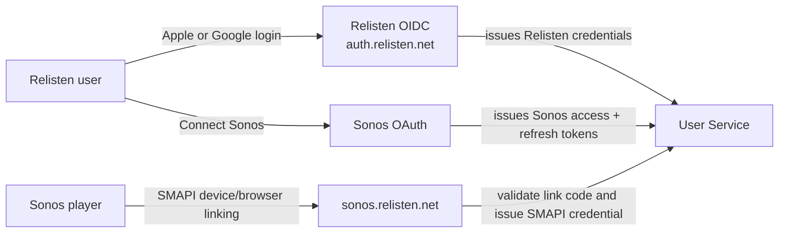

- Relisten is the authorization server for Relisten clients.
- Relisten is an OAuth client of Sonos for Control API access.
- Sonos players are SMAPI clients of the Relisten content service.

No token from one relationship is valid in another.

### Ownership

The User Service owns:

- encrypted Sonos Control access and refresh tokens;
- Sonos OAuth state and callback handling;
- single-use Sonos OAuth state bound to the current Relisten session, user, exact callback, and return target;
- Relisten-to-Sonos account matching state, the content service ID, reserved `appId`, one stable opaque `appContext` per Relisten user, and matched `accountId`;
- one-time SMAPI link-code records, per-household associations, credentials, and stable opaque user hashes;
- ephemeral Cloud Queue transport snapshots, item order, context and queue versions, short-lived tombstones, per-occurrence item UUIDs, logical playback-report state, and exact-payload receipts;
- active playback-session metadata useful to mobile and account-disconnect/recovery pages;
- Sonos event signature verification, subscription renewal, and persisted playback/session state;
- calls to Sonos households, groups, playback-session, transport, and volume APIs.

The User Service does **not** own a universal Relisten queue. A Cloud Queue snapshot is created only from an explicit mobile handoff and is not listed, followed, or synchronized back to web or another mobile device. Mobile's later local queue edits do not mutate the active Sonos snapshot. The listener hands off again to replace it.

The Sonos adapter owns protocol translation:

- SMAPI SOAP and WSDL behavior;
- SMAPI browser/device auth methods and credential extraction;
- versioned Cloud Queue HTTP endpoints for the Dev Portal-approved baseline and reporting capability;
- Sonos `MusicObjectId` encoding and decoding using catalog UUIDs;
- calls to narrow internal User Service and catalog endpoints.

The catalog service owns track metadata and media resolution. New Sonos object IDs use stable catalog UUIDs rather than the existing compound numeric-ID format. During the Sonos migration only, the public adapter keeps a compatibility decoder for an **inbound** legacy compound numeric `MusicObjectId`, resolves it immediately through a catalog-owned numeric-to-UUID lookup, and discards the numeric form. Every new/outbound `MusicObjectId`, internal adapter request, Cloud Queue item, log field, fixture update, and persisted row uses the UUID form. A production rollout gate proves old household queues still decode while contract tests prove no new response emits a compound numeric ID; removing that decoder waits for the agreed compatibility window, but expanding the exception is forbidden.

### Connect Sonos and start playback

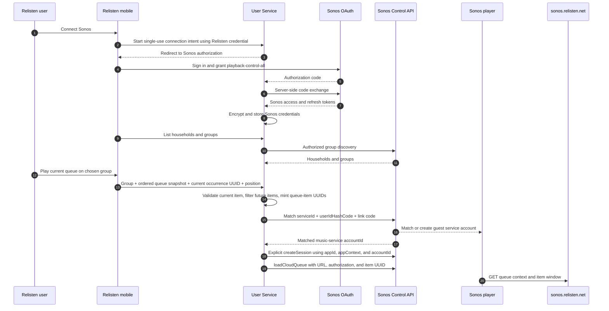

The Sonos connection intent is random, single use, expires after ten minutes, and is stored server-side with the initiating Relisten session and user. The callback validates exact state and redirect URI before attaching a grant; use PKCE only if Sonos's current authorization endpoint supports it. A browser cookie alone never chooses the account. The Sonos Control client secret and refresh token never enter mobile or web. Mobile asks the User Service to perform control commands. Web may host the HTTPS OAuth callback and an account-settings disconnect action; it does not expose group selection or transport controls.

The handoff request contains UUIDv7 `client_handoff_uuid`, destination `group_id`, the mobile Queue V2 `queue_uuid`, ordered occurrence descriptors with occurrence/segment/source-track UUIDs, required `current_occurrence_uuid`, and absolute `position_ms`; an array index is never accepted as current identity. Optional playlist context may accompany each occurrence. It does not send catalog numeric IDs, nested metadata, a trusted remote URL, a preexisting server Cloud Queue handle, playback-history state, or a qualified-listen event. After UUIDv7 and ownership validation, the submitted `queue_uuid` becomes the identity of this new immutable server snapshot. The route has a 2 MiB and 5,000-occurrence limit.

Before calling Sonos, one transaction inserts `sonos_handoff_commands` with the client UUID, native `sid`, canonical payload hash, group, expected current occurrence, intended queue/session identifiers, and state `prepared`; changed UUID reuse conflicts. The dispatcher changes it to `dispatching` before the first external call. `createSession` and `loadCloudQueue` cannot share an atomic commit with PostgreSQL, so an ambiguous retry never blindly invokes them again. It first reconciles the observed group playback session, Relisten `appContext`, matched account, and loaded Cloud Queue against the prepared intent. A match commits and returns the original handle; a proven pre-call state may dispatch; an irreconcilable or temporarily unobservable state returns `202 outcome_unknown` and remains pollable through exact replay of the same POST. A new takeover requires a new handoff UUID and explicit user intent. Terminal pre-commit failure returns ownership to mobile; changed payload reuse returns `409 idempotency_conflict`.

Mobile pauses its current native or Cast driver before dispatch and stays paused while the outcome is ambiguous. A committed handoff ends that local or Cast `playback_instance_uuid`; mobile cancels its local qualification timer and does not later upload a listen for that ended instance. A terminal pre-commit failure resumes the same local instance. The Sonos transport session does not inherit the local playback instance and records no Relisten history or catalog-popularity event in this slice.

The User Service resolves current availability and validates the selected occurrence first. If that current occurrence is unavailable or cannot be streamed remotely, it returns exactly `422 current_item_unavailable` and does not take over the room or silently start another track. Otherwise, it drops unavailable non-current items, creates the immutable queue under the submitted `queue_uuid`, assigns new UUIDv7 queue-item UUIDs, issues a random narrow Cloud Queue credential, creates or joins the owned Sonos playback session, and loads the snapshot. A terminal success receipt is exactly `{client_handoff_uuid, state:"committed", playback_handle, queue_uuid, occurrence_mappings, current_mapping, omitted_occurrences}`. Its `queue_uuid` is the submitted UUID. `occurrence_mappings` is in playable queue order and contains `{occurrence_uuid, queue_item_uuid, ordinal}`; `current_mapping` repeats the selected occurrence's exact mapping; `omitted_occurrences` contains every dropped `{occurrence_uuid, reason}` in request order. Exact retry returns this stored receipt byte-for-byte. Mobile commits Sonos as playback owner only after the remote load succeeds.

Creating a playback session can take control from another source, so **Play on Sonos** is explicit user intent and the UI says which group it will control. Relisten joins only a compatible session that it already owns; otherwise it deliberately creates one. The User Service subscribes to playback and playback-session namespaces, renews them every 48 hours and after group movement, exposes a fast public HTTPS callback, verifies `X-Sonos-Event-Signature`, acknowledges before slow work, and persists event state. Mobile polls the User Service for launch; no WebSocket tier is required. If an event reports `ERROR_SESSION_EVICTED`, Relisten stops controlling and tells the user. It does not silently recreate the session and fight another app or TV input.

Every playback handle, handoff command, and Cloud Queue credential records the creating native `sid`. When the revocation request reaches the User Service, RFC 7009/token-family revocation atomically revokes that native session and every bound handle/queue credential before returning. Account switch or sign-out immediately clears mobile's old handle/control state and makes one bounded revocation attempt before deleting the local token and changing scope. If the User Service is unreachable, server transport state may remain valid up to its normal expiry; the new account has no local credential or controls for it. Server-side account deletion still invalidates credentials transactionally and may retry external Sonos stop through Temporal. Buffered audio may continue during an outage, so Relisten guarantees local account separation and bounded remote credentials, not instantaneous remote silence.

### Cloud Queue request path

Every player-facing Cloud Queue endpoint is under `https://sonos.relisten.net/cloud-queue/{queue_uuid}/{negotiated-version}/...`. The adapter translates that public Sonos contract and calls only the cluster-local User Service base `http://relisten-user-service.default.svc.cluster.local/internal/sonos/v1/*`. `/internal/sonos/*` has no public Ingress and is never a player, mobile, or web endpoint.

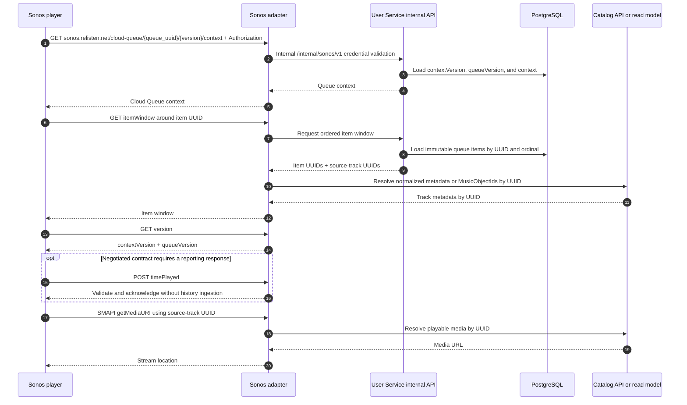

Cloud Queue identifiers have separate meanings:

- Queue `id` is a UUIDv7.
- Queue item `id` is a UUIDv7 for one occurrence. Two occurrences of the same track have different item IDs.
- `source_track_uuid` is the existing catalog UUID and may use any UUID version already assigned by the catalog.
- The `queueBaseUrl` contains only the non-secret queue UUID. `loadCloudQueue.httpAuthorization` carries a random, narrow player-held credential. The User Service stores only its hash; the stateless adapter forwards the presented value to the narrow internal validation operation and retains no credential state.
- `contextVersion` changes when context metadata changes. `queueVersion` changes when the transport snapshot, resolved availability, or short-lived tombstones change. `GET /version` returns both according to the negotiated protocol version.
- If the approved Cloud Queue version requires reporting endpoints, the adapter validates and acknowledges them for protocol compatibility. It does not translate `reportId`, position, duration, or finality into Relisten listening history or catalog popularity in the first Sonos slice.

Generate a random, stable opaque `appContext` for each Relisten user. All mobile-created playback sessions for that user share it; two Relisten users in one Sonos household never do. Keep the combined `appId` and `appContext` representation below Sonos's 255-byte limit.

Set `useHttpAuthorizationForMedia=false` so the queue credential is not forwarded to catalog media URLs. Rotate it through Sonos's `X-Updated-Authorization` mechanism when supported by the negotiated version. A queue expires after 24 hours without valid Cloud Queue access, reporting, or Relisten control activity. Activity may extend that inactivity deadline, but never beyond the hard seven-day lifetime from creation. Expiry revokes its credential and removes transport state; it does not alter the mobile queue, source playlist, or history.

The ordered `sonos_queue_items` snapshot is immutable. A separate availability overlay records a later loss of remote playability, its original ordinal, and `deleted_at`; it never rewrites occurrence order or identity. If Sonos already has the current media URL and is playing it, that buffered/current item may finish. Relisten issues no new URL for it, omits unavailable **future** items from subsequent windows, increments `queueVersion`, and calls `refreshCloudQueue` for active sessions. Retain overlay tombstones for at least 24 hours and while an active session may still center a window on them, so such a request can resolve the next surviving item. If no remotely playable current or future item remains, context/window responses terminate the queue cleanly instead of substituting catalog content.

Transport commands use `POST /v1/integrations/sonos/playback/{playback_handle}/commands` with a UUIDv7 `client_command_uuid`, command contract version, expected playback version/current occurrence UUID, and an absolute desired state or target. Play, pause, seek, and volume are expressed as idempotent target values. Mobile's next/previous intent is resolved server-side against the immutable snapshot into an explicit target queue-item/occurrence UUID and dispatched as Sonos `skipToItem`, never as a blindly repeatable relative skip. `sonos_playback_commands` stores the canonical payload hash, resolved target, `prepared`/`dispatching`/`committed`/`failed`/`outcome_unknown` phase, and result before and after the external call.

Only terminal `committed` or `failed` rows return a final command result/receipt. If the process loses the Sonos response, exact retry first reads fresh observed playback state. If the resolved target is current, it commits the original success. If a terminal failure is proven, it stores and returns that failure. If another item is observed, reconciliation returns `409 playback_state_changed`; if the effect remains unprovable, it returns `202 outcome_unknown`. Neither response is a terminal result receipt, and the command remains reconcilable. After any ambiguous external dispatch, Relisten never issues a second skip—even if the old expected item is still observed—because that observation cannot prove the first call was not accepted. Exact terminal retries return the stored result and changed reuse returns `409 idempotency_conflict`. Contract tests kill the process before dispatch, after Sonos applies the command, and before result commit, especially for next/previous.

Mobile queue edits after handoff do not call this removal path and do not update Sonos. Queue mutation is reserved for server-side loss of streamability, session cleanup, and protocol repair. To send a changed queue, mobile performs a new handoff and Relisten replaces the playback session's Cloud Queue snapshot.

Sonos listening history is a later, independent product slice. It must define its own trustworthy progress evidence, privacy interaction, and deduplication contract after handoff/control has shipped and the negotiated reporting behavior has been observed on real speakers. The first Sonos slice does not reserve history fields in the handoff request, persist Sonos progress as user history, or emit Sonos-derived catalog-popularity events.

### Sonos partner gate

Cloud Queue is available to Sonos content integrations. Account matching requires authenticated SMAPI, stable `userInfo`, media resolution, and a service ID. Sonos's general Play Audio guide currently names Cloud Queue v2.1 while official v2.2/v2.3 endpoint documentation exists and v2.3 adds `reportId`. The repository does not prove the current production service ID, Dev Portal ownership, partner status, Direct Control approval, or the protocol/version combination enabled for Relisten.

The first implementation task is therefore external discovery:

- confirm the current Relisten content-integration record and service ID;
- identify the Sonos partner account owners;
- confirm that Direct Control and account matching are available, and have Sonos validate the exact Cloud Queue baseline and reporting version Relisten may advertise;
- obtain test and production client credentials;
- ask whether the new capability requires a new validation or preview cycle.

This gate starts immediately and runs in parallel with Relisten auth work. It does not block user accounts or local Sonos fixtures, but production authenticated SMAPI, account matching, reporting, and **Play on Sonos** all wait for Sonos's written path. Sonos's published new-service stages total roughly 18–20 weeks; the timing for Relisten's existing-service update is unknown until its Solutions Architect classifies the change.

## Security model

### Trust zones

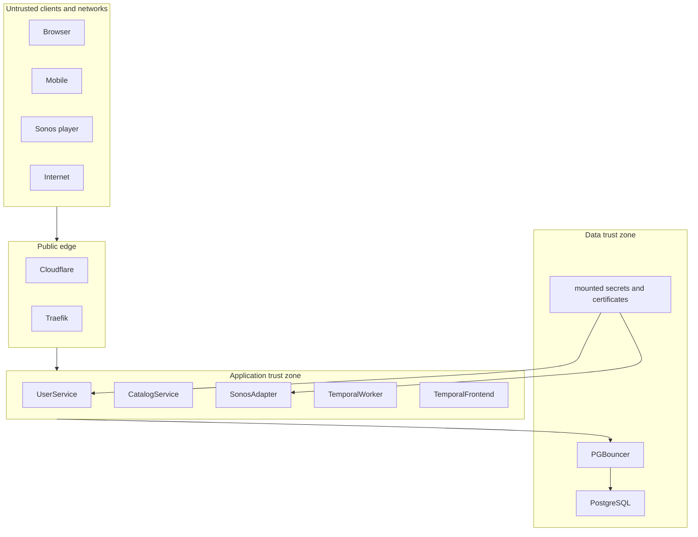

### Required controls

| Threat or mistake | Control |
| --- | --- |
| Authorization-code interception | Exact redirect URIs, single-use codes, PKCE, short code lifetime. |
| Login CSRF or account substitution | Random `state`, OIDC nonce, correlation cookies, recent authentication for linking. |
| Browser token theft through XSS | Browser receives only an HttpOnly session cookie; no OAuth token in JavaScript. |
| Cookie-authenticated CSRF | Host-only SameSite cookie, antiforgery token, and strict `Origin` validation. |
| Refresh-token theft | Device-only secure storage, rotation, replay detection, family revocation. |
| Session database leak | Store only SHA-256 validator hashes; UUID alone is insufficient. |
| Provider account collision | Unique issuer and subject; never link by email. |
| Cross-user UUID access | Resolve user from credential and include `user_id` in every query; return 404 for foreign objects. |
| UUIDv7 enumeration | Authorization on every object. UUIDs are identifiers, never proof of access. |
| Public identifier treated as a secret | Document that `public_code` authorizes nothing; return public data only while `published_at` is set and `archived_at` is null, use one uniform 404 otherwise, and rate-limit anonymous reads. |
| Invitation capability leakage | Accept the fragment secret only in a no-store POST body, store its hash, bind it to one invitation, rate-limit failures, and never place it in a request path or log. |
| Collaborator escalation | Enforce current role inside the same locked transaction that commits each operation; one-time invitation secret cannot encode authority after acceptance. |
| Offline operation replay or mutation | UUIDv7 operation/receipt ID plus normalized payload hash; identical retry returns original result and changed payload fails. |
| Sonos token theft | Encrypt tokens at rest; keep them in the User Service; redact logs. |
| Queue credential leakage | Header-only random credential, bounded lifetime, hashed storage, rotation, and queue-only authority. |
| Catalog cleanup erases user data | UUID-only references with `RESTRICT` or catalog tombstones. |
| Catalog process compromise reaches accounts | Separate database roles; catalog role has no privileges on user schemas. |
| Temporal client can start arbitrary workflows | Internal ClusterIP, pod-selected NetworkPolicy, chart-supported workload authentication, one dedicated namespace/task queue, and small non-secret payloads. |
| Unrelated `default` deployer mounts account Secrets | Cluster-operator-owned admission policy maps each named sensitive Secret to exact workload kind/name and ServiceAccount; deny direct Pod/Job bypasses and negative-test every unrelated workload. User Service deploy rights remain trusted for their own allowlisted workload. |
| Secret disclosure through telemetry | Disable default PII; redact cookies, codes, tokens, emails, provider payloads, and Sonos headers. |

Production uses separate, durable RSA signing and encryption certificates for OpenIddict, a certificate that wraps ASP.NET Data Protection keys, and a versioned symmetric key that envelope-encrypts Sonos grants. Mount them read-only from Kubernetes Secrets and retain encrypted backups outside the cluster.

Routine rotation has different overlap windows:

- A previous signing key remains in JWKS and validators for the 10-minute access-token lifetime plus the measured JWKS cache window.
- A previous OpenIddict encryption certificate remains able to decrypt the longest still-valid 180-day refresh token, unless a forced reauthentication intentionally shortens that window.
- A previous Data Protection wrapping certificate remains in `UnprotectKeysWithAnyCertificate` until persisted Data Protection keys have been rewrapped or can no longer protect a valid artifact.
- A previous Sonos envelope key remains available until every stored grant is rewrapped and a restore test proves the new key inventory.

Private-key compromise uses a different runbook: stop issuance, remove the compromised signing key from issuers and validators immediately, revoke affected native sessions and web sessions, rotate secrets, and require login again. Do not retain a compromised key merely to honor normal overlap.

Do not use development or ephemeral certificates in production. Do not use the HTTPS certificate as the OIDC signing certificate.

## Reliability, performance, and operations

### Production topology

```mermaid
flowchart LR
    Client --> Cloudflare --> Traefik

    subgraph DefaultNs["default namespace"]
        Service["relisten-user-service Service"]
        Pod1["User Service pod 1"]
        Pod2["User Service pod 2"]
        Sonos["Sonos adapter"]
        Dispatcher["Outbox dispatcher"]
        Worker["Relisten Temporal worker"]
        Temporal["Temporal frontend/history/matching"]
        RW["PgBouncer RW"]
        Primary[("Existing CloudNativePG primary<br/>app + temporal + temporal_visibility")]
        Replica[("Existing CloudNativePG replica<br/>same three databases")]
        Service --> Pod1
        Service --> Pod2
        Dispatcher --> Temporal
        Temporal --> Worker
        RW --> Primary
        Primary -. replication .-> Replica
    end

    subgraph BackupNs["relisten-backups namespace"]
        Backup["Account recovery CronJob"]
    end

    Recovery[("Account backups + append-only deletion records")]

    subgraph TelemetryNs["otel-collector namespace"]
        OTEL["OTLP collector"]
    end

    Traefik -->|"auth + accounts + relisten.net user paths"| Service
    Sonos -->|"scoped internal API"| Service
    Pod1 --> RW
    Pod2 --> RW
    Dispatcher --> RW
    Worker -->|"worker-specific DB role"| RW
    Temporal -->|"temporal + temporal_visibility"| Primary
    Backup --> Primary
    Backup --> Recovery
    Worker -->|"create + read deletion tombstone"| Recovery
    Pod1 --> OTEL
    Pod2 --> OTEL
```

Start with two User Service replicas. Use a rolling update with `maxUnavailable: 0`, `maxSurge: 1`, and a disruption budget that keeps one replica ready. Do not add an HPA until CPU, latency, or saturation data shows a need.

Deploy the User Service, its runtime resources, Temporal, and its Ingresses in the existing `default` namespace. Do not create a separate namespace solely for accounts. Keep the operator-owned recovery CronJob and its storage credential in `relisten-backups`.

The diagram contains one CloudNativePG cluster with its existing primary and replica. The `app`, `temporal`, and `temporal_visibility` names are logical databases replicated by that same primary/replica pair. Installing Temporal must not create another CloudNativePG `Cluster`, PostgreSQL Deployment, StatefulSet, primary, replica, or storage set. This saves operational overhead and intentionally makes Relisten and Temporal share PostgreSQL capacity and failover. Monitor connection-pool wait, CPU, I/O, and WAL growth by database so Temporal load cannot silently starve account or catalog traffic.

This is an operational simplification, not a namespace-isolation claim. Without admission control, a principal that can create a Pod/Job or patch any Deployment in `default` can usually mount any Secret there even when RBAC denies direct `get secrets`. Before auth traffic, a cluster operator installs a `ValidatingAdmissionPolicy`/binding—or the cluster's existing equivalent—that rejects references to each account-sensitive Secret unless the workload kind/name, ServiceAccount, and Secret-to-workload mapping match a reviewed allowlist. It covers Deployment, StatefulSet, DaemonSet, Job, CronJob, and direct Pod templates; app CI cannot edit or bypass the policy and cannot create Pods/Jobs. CI includes server-side dry-run negatives for every unrelated workload plus a positive test for each intended mount. This does not protect against the trusted User Service deployer changing its own allowlisted workload, a cluster administrator, or node compromise; those remain explicit operator trust. Per-repository Roles, separate Kustomize/Flux bundles, and audit logs provide the remaining guardrails.

Do not apply a namespace-wide default-deny policy to `default` as part of this project; it could break unrelated workloads. Add pod-selected ingress/egress NetworkPolicies for the User Service, Sonos adapter, Temporal frontend, dispatcher, and workers. Internal rules are narrow selectors and ports: Traefik to public listeners, Sonos adapter to the internal Sonos listener, app/dispatcher/worker to PgBouncer, the User Service's two-connection refresh-lock pool to the CloudNativePG read-write Service, approved Temporal identities to the frontend, Temporal peers to one another, and selected pods to DNS and OTLP. The Temporal frontend is internal-only and additionally enforces mTLS/authorization.

Standard Kubernetes `NetworkPolicy` cannot restrict egress by DNS name. Google, Apple, Sonos, and object-storage addresses can change, so selected pods must allow public-internet TCP 443 through `0.0.0.0/0` except `10.0.0.0/8`, `100.64.0.0/10`, `127.0.0.0/8`, `169.254.0.0/16` (including common metadata addresses), `172.16.0.0/12`, and `192.168.0.0/16`, and through `::/0` except `::1/128`, `fc00::/7`, and `fe80::/10`. Explicit selector/IP rules separately permit the required cluster services. Do not describe that rule as an FQDN firewall. The application is the second boundary: each typed HTTP client has a fixed HTTPS base origin and TLS hostname validation, redirect targets use an exact host allowlist, and no provider, callback, media, or object-store URL from a request body is fetched generically. If future risk warrants true DNS-aware egress enforcement, add an egress proxy or CNI feature as a separately operated control.

Create the `auth.relisten.net`, `accounts.relisten.net`, and longer-prefix `relisten.net` account-path Ingress objects in `default`. Use a dedicated certificate for the auth/accounts hosts and reuse the existing `relisten.net` TLS material for `/auth/session/*`, `/api/user/v1/*`, `/api/public-playlists/*`, and `/api/playlist-collaborator-invitations/exchange`. Verify that Traefik chooses those paths over the web `/` backend, including redirects, `OPTIONS`, body limits, WebSocket-disabled behavior, and certificate selection.

The User Service uses the primary through the read-write transaction-mode PgBouncer endpoint for ordinary reads and writes. Authentication, revocation, playlist revisions, operation serialization, and immediate post-login reads must not depend on replica lag. Start each replica's ordinary Npgsql pool with a maximum size of 10, account for dispatcher and worker pools separately, and measure PgBouncer queue time before raising it. Refresh-token replay serialization is the narrow exception: each replica has a separate two-connection Npgsql pool pointed directly at the CloudNativePG read-write Service. It holds a transaction-scoped PostgreSQL advisory lock while OpenIddict uses the ordinary pool. Do not route this lock pool through transaction-mode PgBouncer or merge it into the ordinary pool.

The first release requires no Redis for account correctness. The `app` database stores sessions, revocations, OpenIddict records, Data Protection keys, operations, outbox rows, account jobs, and ephemeral Sonos queue snapshots. Temporal uses its two logical databases in the same CloudNativePG cluster. An empty cache must not log users out, lose offline operations, or prevent Cloud Queue reads. Add a cache only after a measured query justifies one.

The current two PostgreSQL instances protect against one database pod/process failure and support rolling database maintenance. They do not prove multi-host public-edge availability. Until the cluster has a second ingress/control-plane failure path, use a 99.5% monthly availability objective rather than claiming 99.9%.

### Health and dependency behavior

- Liveness proves the process event loop is responsive. It does not call Google, Apple, Sonos, or PostgreSQL.
- Readiness proves configuration and signing keys loaded, PostgreSQL is reachable, and the applied migration is compatible with the running build.
- `/health/*` accepts the Kubernetes probe host and exposes no account data. Public route groups still enforce exact hosts. `/internal/sonos/*` also accepts the Kubernetes Service DNS host, but only with the adapter's audience, scope, and NetworkPolicy source.
- Provider availability is not part of readiness. A Google failure blocks new Google logins while existing sessions and account APIs keep working.
- Sonos availability is not part of readiness. It affects connect and control operations only.
- Temporal availability is not part of User Service readiness. It affects outbox age and asynchronous completion; synchronous domain commits remain available.
- A catalog projection failure does not invalidate sessions. It may prevent a fresh hydrated playlist read, a catalog-dependent playlist mutation, or remote media handoff; a device may still show cached normalized rows and play existing downloads.
- OTLP and Sentry exporters are never readiness dependencies.
- Retry safe reads and idempotent writes with bounded backoff. Do not automatically retry a non-idempotent provider code exchange or playback-session creation without its protocol idempotency guarantee.

### Failure behavior

| Failure | User-visible behavior | Recovery |
| --- | --- | --- |
| One User Service pod exits | Other pod continues; some in-flight requests fail once. | Kubernetes restarts the pod. |
| PostgreSQL primary fails | Brief catalog, auth, account, and Temporal-persistence outage during the shared-cluster failover; device-local playback may continue. | Clients retry safe operations after a bounded delay; workers reconcile from business state after PostgreSQL returns. |
| Apple or Google is unavailable | Existing sessions work; new login through that provider shows a specific error. | User may use an already-linked provider. |
| Sonos Control API is unavailable | Relisten listening works; Connect Sonos and remote control fail with a retryable message. | Preserve the Sonos grant and retry later. |
| Sonos evicts a playback session | Relisten stops controlling that session and updates the UI. | User explicitly starts a new session. |
| Cloud Queue endpoint is briefly unavailable | Sonos retries according to its protocol and plays its cached window. | Return `503` with an appropriate retry hint when overloaded. |
| Temporal is unavailable | Auth, favorite, playlist, history ingest, and sync writes continue; account-deletion cleanup and later Sonos work may lag. | Outbox remains durable; alert on age and dispatch when Temporal returns. |
| Catalog row becomes unavailable | New remote use is blocked. Active playlist projection omits the occurrence; an already-downloaded mobile file remains playable locally. | No automatic restoration contract; catalog repair can be handled as a later product decision. |
| Collaborator loses access while offline | Server rejects unsent operations. | Mobile stops retries and discards the unsynchronized branch after the listener acknowledges the access-change message. |
| Playlist is unpublished | Public reads stop and followers see an unavailable entry; the follow and `public_code` remain. | Owner/manager may republish at the same URL; existing follows resume. |
| Playlist is archived | It disappears from normal owner, collaborator, follower, and public reads. | The owner opens **Archived** and unarchives it; memberships, follows, publication state, and the same public URL resume. |
| Signing key is compromised | Issuance stops and tokens signed by that key are rejected immediately. | Remove the key from issuer/validator, rotate, revoke sessions, and require login. |
| Backup restore resurrects deleted accounts or credentials | Traffic remains closed. | Load append-only deletion records, purge matching restored users, invalidate all restored Relisten, SMAPI, queue, and Sonos Control credentials, then smoke-test before opening. |

### Performance posture

UUIDv7 improves insertion locality, but it does not replace indexes or timestamps. Add only indexes tied to named queries:

- active sessions by user and session expiry;
- external identity by `(issuer, provider_subject)`;
- favorites by user and unique catalog pair;
- playlist ownership/membership by `(user_id, updated_at DESC, playlist_id)`;
- playlist segments by `(playlist_id, rank)` and items by `(segment_id, rank)` with active-row predicates;
- playlist operation receipt by `(playlist_id, operation_id)` and changes by `(playlist_id, committed_revision)`;
- library changes by `(user_id, library_revision)`;
- qualified-listen receipts by global `event_uuid` and facts by `(user_id, qualified_at DESC, event_uuid DESC)` within Timescale's partitioning constraints;
- workflow outbox by pending state and next-attempt time;
- Sonos queue items by `(queue_id, ordinal)`.

Do not shard or add read-through caches at launch. Qualified-listen facts use Timescale hypertable partitioning; ordinary account tables do not. Performance proof should be proportional to the slice:

- run `EXPLAIN (ANALYZE, BUFFERS)` for the slice's important list and mutation queries against representative data;
- measure one near-limit history batch when history ships;
- measure compressed response size, server latency, mobile parse memory, Realm transaction time, and first useful render for one worst-case 5,000-occurrence playlist when private playlists ship;
- measure outbox catch-up after a short Temporal outage before the first workflow-backed public release;
- measure Cloud Queue context and item-window latency when Sonos ships.

Run one broader capacity exercise before public account launch and repeat it only after a material schema/query change, measured growth, or an incident justifies it. It is not an ordinary pull-request gate. Record actual targets from the production hardware and observed traffic instead of maintaining an elaborate mocked 500-client scenario before any accounts exist. A performance result should lead to a named index, query, payload, or concurrency change; otherwise it is ceremony.

### Migrations

Use one `AccountsDbContext` for `identity`, ordinary `user_data` tables, Data Protection, and OpenIddict. EF Core owns creation and evolution of the `identity` and `user_data` schemas as well as their tables, indexes, constraints, and functions; CloudNativePG does not. Configure Npgsql's migration history as `identity.__EFMigrationsHistory`. Reviewed SQL in the same migration establishes Timescale hypertables and current-version Hypercore policies; tests compare the generated/migrated schema against the required constraints. Use EF Core migrations because OpenIddict ships a maintained EF Core store. Continue using Dapper and Simple.Migrations for the catalog until its runtime/migrator split moves startup migrations to an explicit job.

Production database setup has three owners with explicit ordering. First, standalone CloudNativePG `DatabaseRole` and `Database` resources establish roles, logical databases, and database ownership. Second, the application or Temporal schema tool creates database contents. Third, reviewed versioned SQL applies schema/table/sequence/function grants and default privileges that CloudNativePG cannot express. Flux waits for each preceding resource or Job to succeed. There is no second controller for `identity` or `user_data`, and no production permission topology in local development.

The first internal TestFlight rollout uses one User Service replica with `maxSurge: 0`, `maxUnavailable: 1`, and startup migrations enabled. The pod connects directly to the CloudNativePG primary, completes EF migrations before listening, and then serves traffic. This trades a short deployment outage for a much smaller initial release surface and guarantees only one application migrator is running.

Before increasing the replica count or allowing surge pods, move migrations to the operator-gated target: build one immutable `sha-*` image, run a uniquely named migration Job with that exact image and the future `user_service_migrator` role, then promote the same digest. The Job connects directly to the primary rather than transaction-mode PgBouncer and applies the versioned permissions SQL after EF. Migrations remain backward compatible with the currently running release so this transition does not require destructive rollback.

Temporal schema setup and upgrade jobs are explicit, pinned Helm/Flux resources using Temporal's supported tooling and direct access to `temporal` and `temporal_visibility` on the same CloudNativePG primary. The Helm values are `createDatabase: false`, `manageSchema: true`, and `schema.useHelmHooks: false`. The schema Jobs do not reuse `AccountsDbContext`, the User Service migrator, or application startup. Flux starts or upgrades Temporal services only after both CloudNativePG `Database` resources are applied and the schema Job succeeds. Upgrade Temporal persistence and application workflows in an order supported by the pinned server/client versions, and never change `numHistoryShards` casually after initialization.

### Backups and recovery

The current full and slim backup Deployments are logical backup jobs pointed only at `app`. Once the new schemas exist, a complete `app` dump can include `identity` and `user_data`, but it will never include the two Temporal databases. User credentials and user-authored data also merit a shorter recovery point. Their cross-schema foreign keys mean that a user-schema dump cannot be paired safely with an older catalog backup. The account recovery bundle therefore contains one transactionally consistent custom-format `pg_dump` of `app`: it includes the catalog DDL and parent rows together with `identity` and `user_data`. It may exclude only named bulky, regenerable catalog popularity/materialization data that no account foreign key targets. It must include qualified-listen facts and receipts, playlist operations/checkpoints, links, memberships, outbox rows, history rollups, and Timescale metadata required to restore them. Verify the exclusion list against the live Timescale catalog and foreign-key graph before release.

`pg_dump` is scoped to one logical database and does not include cluster-global roles. The version-controlled CloudNativePG `DatabaseRole` and `Database` manifests are the production source of truth for role and database existence; do not maintain a second hand-written role topology in `restore-roles.sql`. Each recovery bundle records the immutable manifest revision and rendered non-secret role/database specifications. For a clean logical restore, apply those resources with `retain` policies, wait for them to report applied, restore `app`, then run the recorded versioned permissions SQL. Login credentials come from the external Secret inventory and never enter the bundle.

A CloudNativePG physical backup is different: it captures the entire PostgreSQL cluster, including `app`, `temporal`, `temporal_visibility`, cluster-global roles, and WAL needed for a common recovery point. A physical PITR restores that whole cluster and cannot rewind one logical database independently. If physical backup is enabled, test it as the shared-cluster disaster-recovery artifact. Keep the `app` logical bundle for selective inspection and account recovery. If physical backup is not enabled at launch, add explicit logical dumps for `temporal` and `temporal_visibility`; do not assume the existing `app` backup includes them.

The current catalog-backup bucket has a seven-day catch-all expiry, so account recovery artifacts use a separate bucket or a verified non-overlapping lifecycle; an additional prefix rule in the existing bucket is insufficient.

Run `relisten-account-recovery-backup` in the operator-owned `relisten-backups` namespace, not `default`. Its ServiceAccount receives a dedicated database read credential and a prefix-scoped upload credential for account-recovery artifacts. The account-deletion worker has a separate credential that can create and read one object under the deletion-record prefix but cannot overwrite or delete records. The bucket blocks public access, encrypts objects at rest, requires TLS, and grants restore reads only to the external operator recovery identity. Default-deny NetworkPolicy permits the backup job only DNS, direct CloudNativePG primary access, and HTTPS egress to object storage; it accepts no ingress. Account CI cannot change this workload or mount its credentials, and the backup job cannot mutate application rows.

- hourly account recovery bundles, retained for 48 hours;
- one daily account recovery bundle, retained for 30 days;
- `concurrencyPolicy: Forbid` on backup CronJobs;
- a dedicated non-superuser backup role with only the catalog and account reads required by that artifact;
- a manifest beside each dump recording checksums, logical database snapshot times, the optional physical-backup recovery point, database and extension versions, schema versions, declarative database/role resource revision, and exclusions;
- quarterly restore into a clean compatible CloudNativePG cluster: install the recorded extensions, apply the recorded `DatabaseRole` and `Database` resources, wait for them to report applied, run `pg_restore --exit-on-error`, apply the recorded production permissions SQL, load append-only deletion records, purge every matching restored account, invalidate every restored credential class, and then run constraints, UUID-version checks, and API smoke tests.

Restore-test `temporal` and `temporal_visibility` with the pinned Temporal version, either as part of the shared physical cluster restore or from their explicit logical dumps. These databases are not substitutes for the authoritative `app` business bundle. A shared physical restore gives all three databases one PostgreSQL recovery point, but business rows and outbox jobs still decide what work remains. If Temporal persistence cannot be trusted or aligned, keep dispatch stopped, create a clean replacement namespace, and enqueue only nonterminal jobs confirmed by authoritative business state.

Do not claim an account backup succeeded if its paired catalog parent rows were omitted or captured from another snapshot. A user-schema-only artifact and an independently timed catalog artifact do not meet the one-hour recovery target.

Target an account-data recovery point of one hour and recovery within four hours. These targets are appropriate for a free service and are testable on the current infrastructure.

Database backups do not replace key backups. Keep provider keys, Sonos client credentials and versioned envelope keys, OpenIddict certificates, and Data Protection wrapping certificates in the operator's password manager as well as their namespace-scoped Kubernetes deployment storage.

### Observability

Use the existing OTLP collector with `service.name=relisten-user-service`. Record:

- request count, status, and latency by route template;
- login result and latency by provider, without user identity or email;
- token result by grant type;
- refresh-token replay detection;
- session creation and revocation counts;
- database query and pool wait latency;
- favorite mutation duplicate/conflict counts and library cursor-expiry rate;
- playlist operation acceptance/rejection by operation type, lock wait, rank length, rebalance count, delta size, and snapshot fallback rate;
- hydrated playlist unique-UUID count, compressed response bytes, projection latency, and availability distribution;
- qualified-listen batch size, duplicate/conflict count, Timescale ingest/query latency, chunk/columnstore state, and rollup lag;
- workflow outbox age/count, Temporal start duplicate/error counts, workflow/activity failures, task-queue latency, and Temporal persistence health;
- Sonos OAuth, Control API, SMAPI, and Cloud Queue results;
- queue window latency and protocol errors;
- migration and backup age;
- signing, encryption, provider, and wrapping certificate expiry.

Useful initial alerts are a failed public readiness/discovery probe for five minutes, 5xx above 5% for five minutes with at least 20 requests, a blocked rollout for ten minutes, an overdue backup, fewer than two ready database instances, a workflow outbox whose oldest row exceeds 15 minutes, Temporal persistence/frontend failure, a failed Timescale compression/columnstore policy, and a certificate expiring within 14 days.

Never attach raw user UUIDs, provider subjects, email addresses, cookies, tokens, authorization codes, invitation fragment secrets, playlist contents, queue credentials, or Sonos authorization headers to spans or error reports. Use bounded internal correlation IDs or keyed hashes when aggregate troubleshooting requires stable grouping.

## Designed extension seams

The launch model intentionally preserves a few high-value future options without implementing their UI now:

| Later capability | What launch stores now | What remains later |
| --- | --- | --- |
| Playlist revision restore | Ordered operations, committed revisions, actor UUID, and checkpoints | Browse/diff UI, retention product policy, authorized restore-as-new-revision operation |
| Wrapped | Qualified-listen facts, duration snapshots, catalog UUID context, per-user rollup jobs | Annual presentation, share cards, finalized metric definitions |
| Recommendations and automatic playlists | Positive qualified-listen signal and the ordinary materialized playlist model | Ranking model, generation metadata, rule storage/editor, refresh policy, taste controls |
| Sonos listening history | Local qualified-listen semantics and an observed production handoff/control integration | Trustworthy Sonos progress evidence, privacy and deduplication contract, history ingestion, popularity projection |
| Tags, folders, and collections | Stable playlist/favorite UUIDs | User-visible organization schema and sync operations |
| Open playlist export/import | Normalized playlist/segment/occurrence model | M3U/CSV mapping, recording-selection rules, duplicate/segment fidelity policy |
| Private-session/taste exclusion | Qualified-listen context can gain a typed exclusion flag through a versioned event contract | Player UI, retroactive policy, recommendation behavior |
| Public discovery | Stable published playlist URLs and independent clones | Moderation, indexing, profiles, abuse handling, search, privacy policy |

Do not make launch APIs generic to anticipate these. Add typed columns, operations, and endpoints when one of these becomes an actual product milestone.

## Delivery order

The [mobile-first account delivery plan](../plans/active/2026-07-18-relisten-mobile-first-account-delivery-plan.md) is authoritative for execution and proof. Sonos partner work starts immediately, but product delivery follows complete API-to-mobile slices. A user-invisible foundation is local setup, not its own TestFlight release.

```mermaid
flowchart LR
    Gate["Confirm Sonos partner + protocol path"] -. parallel .-> Sonos["Sonos adapter + mobile handoff"]

    Local["Local User Service + development identity"] --> Auth["1. Mobile auth, username review, account shell"]
    Auth --> Favorites["Favorites sync"]
    Favorites --> History["Qualified history + legacy import"]
    History --> Private["Private single-user playlists"]
    Private --> InitialRelease["Initial account release"]
    Private --> Public["Public code, follow, clone"]
    WebFallback["Web public-playlist fallback"] --> Public
    Public --> Collaboration["Viewer/editor/manager collaboration"]
    Collaboration --> Sonos
    Sonos --> LaterRelease["Later store increments"]
```

Anonymous clients and the anonymous SMAPI service remain available throughout. Mobile ships seven useful TestFlight slices: (1) authentication and account shell; (2) favorites; (3) history; (4) private single-user playlists; (5) public sharing/follow/clone; (6) collaboration; and (7) Sonos. Each slice adds only its own Realm models and is on by default in the build that contains it. There is no Statsig account rollout matrix or percentage cohort. Narrow server switches may stop new account registration, history writes, or Sonos handoff during an incident without deleting data.

History adds a stable playback-instance UUID to the current player; it does not wait for Queue V2. Queue V2 arrives with the first proven playlist-playback or Sonos need. Provider linking, device-session management, self-service export, elaborate deletion-recovery infrastructure, public discovery, and collaboration do not block the first authentication/favorites/history TestFlights. Account deletion remains required before accounts reach an external beta or public store build. Web is not a second launch client: through Slice 5 it needs only exact mobile callback routing and the public-playlist fallback. Credentialed web screens and facade routes come later as their own product slices.

## Alternatives considered

### Three independent auth, accounts, and catalog deployments

This creates a network and deployment boundary between user creation and user data before the load or team structure requires it. It also adds another migration, local service, token-validation path, and failure mode. Stable `auth` and `accounts` hostnames preserve the option to split later.

### Put customer auth in the existing catalog API

The existing API mixes public catalog traffic, import jobs, and an environment-backed admin cookie. Adding customer credentials there would couple anonymous music availability to auth changes and make database privileges harder to constrain.

### Ory Kratos and Hydra

Hydra does not own users; a self-hosted Relisten deployment would operate Kratos, Hydra, login/consent UI, and their integration. That is more operational and conceptual work than one OpenIddict application for this scale.

### Managed identity provider

A managed provider could reduce protocol operations but adds a recurring vendor dependency and pricing risk to a free open-source service. The chosen OpenIddict design is small enough to self-host because Relisten has no passwords and only two upstream providers.

### Passwords at launch

Passwords require verification, recovery, delivery, abuse controls, credential-stuffing defenses, breach response, and support. They do not improve the first web, mobile, or Sonos flow enough to justify that work.

### One cross-client bearer-token model

Giving browser JavaScript the same refresh tokens as mobile makes XSS consequences worse and creates client-side refresh complexity. A server-side web session is simpler and independently revocable.

### Separate databases for catalog and users

Separate databases remove useful transactions, joins, and foreign-key checks while both services run on the same small cluster. Schema ownership and database roles provide the needed boundary now. UUID-only contracts preserve a future database split.

### Whole-playlist replacement

Optimistic whole-aggregate replacement is compact for one editor but turns two valid offline edits into a conflict or silent loss. Domain operations preserve stable occurrence/segment identity, converge independent work, and keep a durable revision trail. The materialized projection retains ordinary read performance.

### Group playlist blocks by `show_uuid` in clients

A show is catalog metadata, not user intent. It cannot distinguish two recordings of the same show, two intentional source-run blocks, or a standalone track. Explicit segments make editing, cloning, shuffle, offline operations, and Sonos snapshots agree.

### Client-assigned canonical fractional ranks

Accepting arbitrary client ranks makes maliciously long keys and offline collisions a server concern. Anchor-based operations preserve the useful offline UX while one serialized server transaction assigns and occasionally rebalances canonical ranks.

### One general delta-sync log

Favorites, collaborative playlist operations, and immutable listens have different conflict, retention, and query rules. One generic log hides those differences and becomes framework work. Relisten reuses the small cursor/idempotency envelope while keeping a library feed, per-playlist revisions, and history receipts separate.

### Hangfire for new durable account workflows

The current Redis-backed job installation is useful for existing importers but its production persistence and retry choices are not the desired account durability model. Committing to Temporal now adds operational work once, supports long-running/retryable Sonos and deletion workflows, and gives importers a migration destination. Temporal remains outside synchronous request commits.

### A separate Kubernetes namespace for the User Service

A namespace would provide a clearer workload/Secret boundary, but the user-service deployment is intentionally staying in `default`. Pod-selected policies, scoped deployers, and the operator-owned Secret-reference admission allowlist prevent unrelated workloads from reaching account Secrets. The architecture still does not claim isolation from the trusted User Service deployer for its own allowlisted workload, cluster administrators, or nodes.

### A universally synchronized Relisten queue

It would expand account scope into cross-client arbitration, queue ownership, and conflict semantics. The product requirement is narrower: mobile explicitly hands one immutable snapshot to Sonos, then controls that session. Web and other devices do not synchronize it.

### Preserve the current Sonos implementation internally

The current service proves the public SMAPI behavior but has no account, Control API, or Cloud Queue architecture. Keeping every internal design decision would make the new implementation harder to test. Contract fixtures preserve behavior more reliably than preserving incidental code.

## Open questions and external facts to confirm

These questions do not change the core service design, but they block parts of production rollout:

- Who controls the current Sonos Dev Portal content integration, and what production service ID is active?
- When will Sonos activate Relisten's new OAuth service version, and what preview/rollback window will it allow?
- Which Cloud Queue baseline and reporting version will Sonos approve for Relisten's service and target players?
- What account adoption, playlist size/operation rate, hydrated-playlist payload, qualified-listen volume, and Timescale compression/deletion measurements appear during staged rollout?
- What rank-length threshold and change-feed retention windows do production offline-edit behavior and storage measurements justify?

## Authoritative references

- [OpenIddict introduction](https://documentation.openiddict.com/introduction)
- [OpenIddict EF Core integration](https://documentation.openiddict.com/integrations/entity-framework-core)
- [OpenIddict token storage](https://documentation.openiddict.com/configuration/token-storage.html)
- [OpenIddict signing and encryption credentials](https://documentation.openiddict.com/configuration/encryption-and-signing-credentials.html)
- [OAuth 2.0 Security Best Current Practice, RFC 9700](https://www.rfc-editor.org/rfc/rfc9700.html)
- [OAuth 2.0 for Native Apps, RFC 8252](https://www.rfc-editor.org/rfc/rfc8252.html)
- [JSON Canonicalization Scheme, RFC 8785](https://www.rfc-editor.org/rfc/rfc8785.html)
- [Microsoft `Guid.CreateVersion7`](https://learn.microsoft.com/en-us/dotnet/api/system.guid.createversion7?view=net-10.0)
- [PostgreSQL 17 UUID functions](https://www.postgresql.org/docs/17/functions-uuid.html)
- [PostgreSQL logical backup tools](https://www.postgresql.org/docs/17/backup-dump.html)
- [CloudNativePG 1.30 declarative database management](https://cloudnative-pg.io/docs/1.30/declarative_database_management/)
- [CloudNativePG 1.30 declarative role management](https://cloudnative-pg.io/docs/1.30/declarative_role_management/)
- [Timescale hypertables](https://docs.timescale.com/use-timescale/latest/hypertables/)
- [Timescale unique indexes on hypertables](https://docs.timescale.com/use-timescale/latest/hypertables/hypertables-and-unique-indexes/)
- [Timescale Hypercore](https://docs.timescale.com/use-timescale/latest/hypercore/)
- [Temporal production deployment](https://docs.temporal.io/production-deployment)
- [Temporal self-hosted guide](https://docs.temporal.io/self-hosted-guide)
- [Temporal self-hosted deployment](https://docs.temporal.io/self-hosted-guide/deployment)
- [Temporal Helm charts](https://github.com/temporalio/helm-charts)
- [Temporal Helm PostgreSQL persistence example](https://github.com/temporalio/helm-charts#install-with-postgresql)
- [Temporal PostgreSQL schema upgrades](https://docs.temporal.io/self-hosted-guide/upgrade-server#upgrade-postgresql-or-mysql-schema)
- [Temporal .NET SDK](https://docs.temporal.io/develop/dotnet)
- [Kubernetes RBAC good practices](https://kubernetes.io/docs/concepts/security/rbac-good-practices/)
- [Kubernetes Secrets good practices](https://kubernetes.io/docs/concepts/security/secrets-good-practices/)
- [Kubernetes Network Policies](https://kubernetes.io/docs/concepts/services-networking/network-policies/)
- [Google OAuth web-server applications](https://developers.google.com/identity/protocols/oauth2/web-server)
- [Apple: configure Sign in with Apple for the web](https://developer.apple.com/documentation/signinwithapple/configuring-your-webpage-for-sign-in-with-apple)
- [Sonos Control API](https://docs.sonos.com/reference/about-control-api)
- [Sonos authorization](https://docs.sonos.com/docs/authorize)
- [Sonos browser authentication](https://docs.sonos.com/docs/add-browser-authentication)
- [Sonos `getDeviceAuthToken`](https://docs.sonos.com/docs/getdeviceauthtoken)
- [Sonos upgrade to OAuth](https://docs.sonos.com/docs/upgrade-to-oauth)
- [Sonos account matching](https://docs.sonos.com/docs/account-matching)
- [Sonos Cloud Queue API](https://docs.sonos.com/reference/about-cloud-queue-api)
- [Sonos Cloud Queue playback](https://docs.sonos.com/docs/cloud-queue-play-audio)
- [Sonos Cloud Queue version](https://docs.sonos.com/reference/version)
- [Sonos Cloud Queue timePlayed](https://docs.sonos.com/reference/timeplayed)
- [Sonos reporting](https://docs.sonos.com/docs/add-reporting)
- [Sonos loadCloudQueue](https://docs.sonos.com/reference/playbacksession-loadcloudqueue-sessionid)
- [Sonos playback sessions](https://docs.sonos.com/docs/playback-sessions)
- [Sonos event subscriptions](https://docs.sonos.com/docs/subscribe)
- [Sonos content-service submission](https://docs.sonos.com/docs/submit-your-service)
