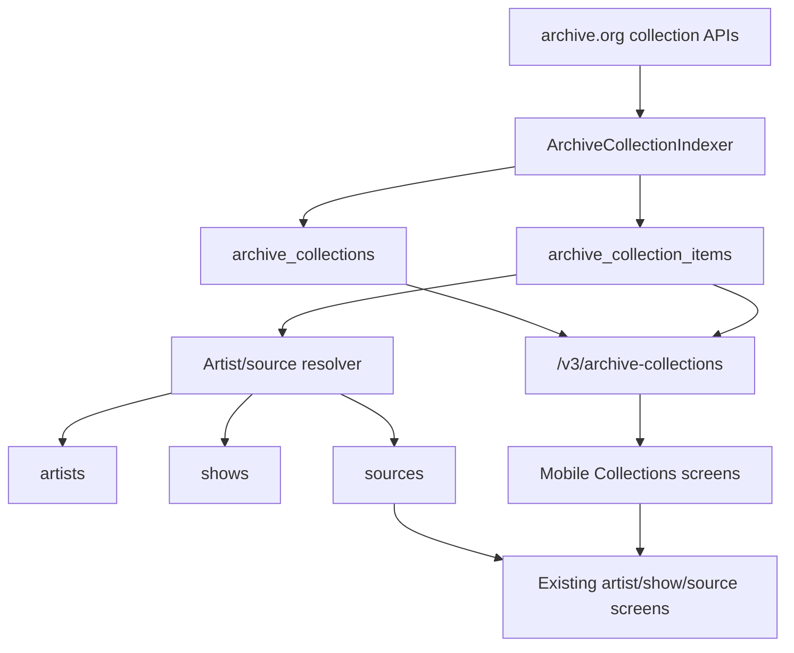
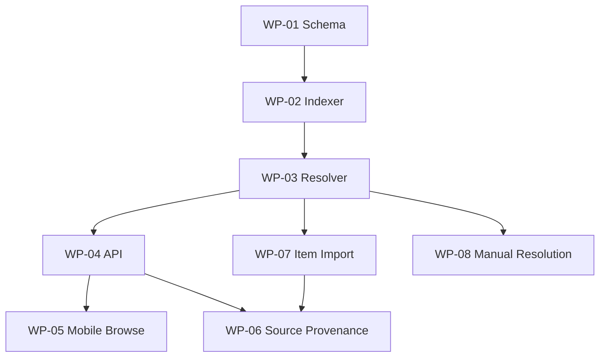

# Archive Collections Recommendation

**Created Date:** 2026-04-11

**Status:** Recommendation / implementation guide

---

## 0. Context
Relisten should support large archive.org curator collections such as Aadam Jacobs and Taper's Section without forcing them into the normal artist -> year -> show -> source hierarchy. The recommended model is a first-class collection browse layer that indexes archive.org collection membership, links items to canonical Relisten sources when possible, and keeps unresolved collection-only items visible without pretending they are normal artists.

---

## 1. Problem & Scope

### Problem
The current Relisten model is artist-heavy: artists own years, years own shows, shows own sources, and playback starts from a source track. Archive.org collections can cut across that model:

- Aadam Jacobs is a curator/taper collection. Some items already belong to regular Live Music Archive artist collections and therefore already show up in Relisten under real artists.
- Taper's Section is closer to a cross-artist holding area. Many items have no dedicated archive.org artist collection, and the archive.org `creator` field is inconsistent enough that it cannot be blindly treated as the artist.

Today there is no `collection` table in production. The API already has archive.org artist auto-indexing, but that indexes Live Music Archive artist collections, not curator collections or collection-item membership.

### In Scope
- Add collection browsing for selected archive.org collections.
- Preserve canonical artist/show/source behavior.
- Store archive.org collection metadata and item membership.
- Link collection items to existing Relisten sources by archive.org identifier.
- Resolve collection items to artists with confidence and manual overrides.
- Define mobile UI surfaces for browsing collections and seeing collection provenance.
- Define API, database, importer, and rollout work packages.

### Out of Scope
- Replacing artist/year/show/source navigation.
- Importing all Taper's Section items into one pseudo artist.
- Auto-creating thousands of artists from untrusted `creator` strings.
- Building a full human moderation console in the first milestone.
- Deduplicating audio content across different archive.org identifiers.

---

## 2. Evidence

### Existing Relisten Shape
- API models expose `Artist`, `Show`, `Source`, and `SourceTrack`; no collection model exists today.
- Production has no collection table among the relevant public tables. Relevant tables are `artists`, `artists_upstream_sources`, `features`, `shows`, `sources`, `source_tracks`, `upstream_sources`, `venues`, and `years`.
- Production has 4,230 artists, 210,283 shows, and 284,858 sources as sampled on 2026-04-11.
- `archive.org` is `upstream_sources.id = 1` and has 4,228 artist upstream mappings.
- 4,004 artists have the `AutoCreated` bit set, which means the artist auto-indexing path is already live in production.
- `sources` is unique by `(artist_id, upstream_identifier)`, and `shows` is unique by `(artist_id, display_date)`. Collection membership needs a separate table so the same canonical source can belong to one or more collections without duplicating sources.

### Archive.org Sample
Counts below were sampled from archive.org on 2026-04-11. They will drift as archive.org changes.

| Collection | Archive item count | Years | `collection:etree` overlap | Existing Relisten exact source matches | Matched Relisten artists | Interpretation |
| --- | ---: | --- | ---: | ---: | ---: | --- |
| `aadamjacobs` | 2,458 | 1984-2019 | 354 | 351 | 85 | Good candidate for collection browse plus source links. Many items already fit the current model. |
| `taperssection` | 21,265 | 1965-2026 | 0 | 1 | 1 | Needs collection-first browsing. Exact source reuse is basically absent today. |

Top sampled creators:

| Collection | Top creators |
| --- | --- |
| `aadamjacobs` | Jon Langford, Mekons, Eleventh Dream Day, Sally Timms, Ashtray Boy, Waco Brothers, Cheer-Accident |
| `taperssection` | Phish, Jerry Garcia, Gov't Mule, Jamie Burks, Bob Jacobson / NYLifer / Jake, The Cure, Dave Matthews Band |

Important data-quality observation: Taper's Section `creator` is not always the performing artist. Examples sampled from archive.org:

- `theblackkeys20191012dpa4060`: title is `The Black Keys 2019-10-12 dpa4060`, creator is `Bob Jacobson, NYLifer, Jake`.
- `2020-10-04-short-hill-mountain-boys`: title is `2020 10 04 Short Hill Mountain Boys`, creator is `Jamie Burks`.
- `phish2018-11-03.143596.lasvegas.ca14.logrippo.flac2448`: title and creator both identify Phish.

### Practical Conclusion
Aadam Jacobs can feel integrated quickly because many source identifiers already exist in Relisten. Taper's Section should first ship as a collection catalog and discovery surface, with selective import/resolution later. The user experience is weaker if unresolved Taper's Section items are hidden, but the data model is weaker if they are imported as a fake artist.

---

## 3. Recommendation

### Product Decision
Add an archive collection browse surface, not a new artist type.

Collections should answer: "What is in this archive.org collection?" Artists should continue to answer: "What shows and sources do we have for this artist?" A collection item can link to a canonical source when Relisten knows the artist/show/source. If Relisten does not know it yet, the collection item remains visible with archive.org metadata, a source link, and a resolution/import status.

### Data Decision
Store archive collection membership independently from sources.

Do not infer collection membership from artist upstream mappings. Store collection item rows keyed by archive.org collection identifier and item identifier. Link to `sources.id`, `shows.id`, and `artists.id` opportunistically.

### Import Decision
Split collection indexing from source importing.

Collection indexing is cheap and safe: fetch archive.org item metadata, update membership rows, and link to existing sources. Source importing is expensive and semantically risky: it needs a resolved canonical artist and must not trigger artist-wide delete behavior.

---

## 4. Constants and Types

### Constants
- API repo: `/Users/alecgorge/code/relisten/RelistenApi`
- Mobile repo: `/Users/alecgorge/code/relisten/relisten-mobile`
- Archive source id: `upstream_sources.id = 1`
- Existing artist auto-created bit: `ArtistFeaturedFlags.AutoCreated = 1 << 1`
- Initial collections: `aadamjacobs`, `taperssection`

### API Types

```csharp
public enum ArchiveCollectionItemResolutionStatus
{
    Unresolved = 0,
    LinkedExistingSource = 1,
    ResolvedArtistOnly = 2,
    ImportedSource = 3,
    Hidden = 4
}

public sealed class ArchiveCollection
{
    public Guid uuid { get; set; }
    public string slug { get; set; } = null!;
    public string upstream_identifier { get; set; } = null!;
    public string title { get; set; } = null!;
    public string? description_html { get; set; }
    public int item_count { get; set; }
    public DateTime indexed_at { get; set; }
}

public sealed class ArchiveCollectionItem
{
    public Guid collection_uuid { get; set; }
    public string upstream_identifier { get; set; } = null!;
    public string title { get; set; } = null!;
    public string? creator_raw { get; set; }
    public string? candidate_artist_name { get; set; }
    public string? display_date { get; set; }
    public int? year { get; set; }
    public Guid? artist_uuid { get; set; }
    public Guid? show_uuid { get; set; }
    public Guid? source_uuid { get; set; }
    [JsonConverter(typeof(StringEnumConverter))]
    public ArchiveCollectionItemResolutionStatus resolution_status { get; set; }
}
```

Serialize `resolution_status` as lower snake case in API responses (`linked_existing_source`, not `1`). Keep the database representation integer-backed for compact indexes and stable enum migrations.

### Mobile Types

```ts
export interface ArchiveCollection {
  uuid: string;
  slug: string;
  upstream_identifier: string;
  title: string;
  description_html?: string;
  item_count: number;
  indexed_at: string;
}

export interface ArchiveCollectionItem {
  collection_uuid: string;
  upstream_identifier: string;
  title: string;
  creator_raw?: string;
  candidate_artist_name?: string;
  display_date?: string;
  year?: number;
  artist_uuid?: string;
  show_uuid?: string;
  source_uuid?: string;
  resolution_status: 'unresolved' | 'linked_existing_source' | 'resolved_artist_only' | 'imported_source' | 'hidden';
}
```

---

## 5. Architecture

**High-Level Diagram**



### Key Components

- `ArchiveCollectionIndexer`: fetches selected collection metadata and item lists from archive.org.
- `ArchiveCollectionRepository`: upserts collection and item rows.
- `ArchiveCollectionResolver`: links item identifiers to existing `sources`, derives candidate artists, and applies manual aliases.
- `ArchiveCollectionController`: exposes collection summary, item lists, artist facets, year facets, and item detail.
- Mobile collection Realm models and repositories: cache collection summaries and paginated item lists.
- Mobile collection screens: browse collections, collection detail, item rows, filters, and source deep-links.

### Key Flows

#### Flow 1: Collection Index
1. Fetch collection metadata from `https://archive.org/metadata/{collectionIdentifier}`.
2. Fetch item docs from archive.org advanced search with fields: `identifier`, `title`, `creator`, `date`, `year`, `collection`, `downloads`, `item_size`, `publicdate`.
3. Upsert `archive_collections`.
4. Upsert `archive_collection_items`.
5. Link rows to existing Relisten sources by `sources.upstream_identifier = item.identifier`.
6. Link rows to artists when source links exist.
7. Run resolver for unresolved rows, storing candidate artist and confidence.

#### Flow 2: Collection Browse
1. Mobile fetches `/v3/archive-collections`.
2. User opens Aadam Jacobs or Taper's Section.
3. Mobile fetches paginated `/v3/archive-collections/{collectionUuid}/items`.
4. Linked rows navigate into existing source/show routes.
5. Unresolved rows open a collection item detail page with archive.org provenance and "Open on archive.org".

#### Flow 3: Selective Import
1. Resolver or admin marks an item with a canonical artist.
2. A new item-specific archive importer fetches `https://archive.org/metadata/{itemIdentifier}` directly.
3. The importer writes a source under the resolved artist without doing artist-wide source deletion.
4. The collection item links to the new source.

### Boundaries
- Collections own browse grouping and archive.org collection membership.
- Artists own canonical Relisten identity.
- Shows own date/year grouping for a single artist.
- Sources own playable tracks and source metadata.
- Collection indexing must not delete sources.
- Source importing must require a resolved artist.

---

## 6. API / Interface

Interface type: REST

### Endpoints

```text
GET /api/v3/archive-collections
GET /api/v3/archive-collections/{collectionUuidOrSlug}
GET /api/v3/archive-collections/{collectionUuidOrSlug}/items
GET /api/v3/archive-collections/{collectionUuidOrSlug}/artists
GET /api/v3/archive-collections/{collectionUuidOrSlug}/years
GET /api/v3/archive-collections/{collectionUuidOrSlug}/items/{archiveIdentifier}
```

### Item Query Parameters

```text
status=all|linked|unresolved|importable
artistUuid={uuid}
year={yyyy}
creator={raw creator}
search={text}
sort=publicdate_desc|date_asc|date_desc|artist_asc|title_asc
limit=50
cursor={opaque cursor}
```

### Response Notes
- Return linked source/show/artist UUIDs, not full nested source graphs, on item list responses.
- Return source/show summary fields needed for rows: artist name, display date, venue, source count, soundboard flag, collection status.
- Keep full source track data behind existing `/v3/shows/{showUuid}`.
- Do not modify existing artist/show/source payloads in the first milestone.
- Add optional `collections` provenance to source detail responses later.

### Error Semantics
- Unknown collection: 404.
- Unknown item in known collection: 404.
- Archive.org unavailable during indexing: job failure and retained stale data; API keeps serving last indexed rows.
- Unresolved item detail: 200 with `resolution_status = unresolved`.

---

## 7. Data & State

### Proposed Tables

```sql
create table archive_collections (
    id bigserial primary key,
    uuid uuid not null unique,
    slug text not null unique,
    upstream_source_id integer not null references upstream_sources(id),
    upstream_identifier text not null unique,
    title text not null,
    description_html text,
    item_count integer not null default 0,
    indexed_at timestamptz,
    created_at timestamptz not null default timezone('utc', now()),
    updated_at timestamptz not null default timezone('utc', now())
);

create table archive_collection_items (
    collection_id bigint not null references archive_collections(id) on delete cascade,
    upstream_identifier text not null,
    title text not null,
    creator_raw text,
    candidate_artist_name text,
    date_raw text,
    display_date text,
    year integer,
    publicdate timestamptz,
    item_size bigint,
    downloads integer,
    archive_collection_identifiers jsonb not null default '[]'::jsonb,
    artist_id integer references artists(id) on delete set null,
    show_id bigint references shows(id) on delete set null,
    source_id bigint references sources(id) on delete set null,
    resolution_status integer not null default 0,
    resolution_confidence real,
    resolution_note text,
    last_seen_at timestamptz not null default timezone('utc', now()),
    created_at timestamptz not null default timezone('utc', now()),
    updated_at timestamptz not null default timezone('utc', now()),
    primary key (collection_id, upstream_identifier)
);

create index archive_collection_items_collection_status_idx
    on archive_collection_items(collection_id, resolution_status, publicdate desc);

create index archive_collection_items_collection_year_idx
    on archive_collection_items(collection_id, year);

create index archive_collection_items_source_idx
    on archive_collection_items(source_id)
    where source_id is not null;

create index archive_collection_items_artist_idx
    on archive_collection_items(artist_id)
    where artist_id is not null;
```

### Optional Tables

```sql
create table archive_artist_aliases (
    id bigserial primary key,
    upstream_source_id integer not null references upstream_sources(id),
    raw_name text not null,
    artist_id integer references artists(id) on delete set null,
    normalized_name text not null,
    confidence real not null default 1,
    created_at timestamptz not null default timezone('utc', now()),
    updated_at timestamptz not null default timezone('utc', now()),
    unique (upstream_source_id, raw_name)
);
```

Use `archive_artist_aliases` only after the resolver needs durable manual overrides. The MVP can start with code/config aliases for the first two collections.

### Source of Truth
- Archive.org remains the source of truth for collection membership.
- Relisten remains the source of truth for canonical artist/show/source identities.
- Collection item links are derived state and can be recomputed.

### Retention / Deletion
- Soft-hide missing archive.org items for at least one index cycle before deletion.
- Do not delete Relisten sources when a collection membership disappears.
- If a source is deleted, keep the item row and clear `source_id` through FK `on delete set null`.

---

## 8. UI Recommendation

### Information Architecture
Add Collections as a browse surface under the Relisten tab or a secondary entry from the Artists root. Do not add Aadam Jacobs or Taper's Section to the Featured Artists list as normal artists.

Recommended entry points:

- Relisten tab section: "Archive Collections"
- Search result group: "Collections"
- Source detail provenance chip: "Aadam Jacobs Collection" / "Taper's Section"

### Collection List Screen
Each row should show:

- Collection title.
- Short collection description.
- Item count.
- Linked/imported count and unresolved count.
- Most recent public date.

Copy should be concrete:

- "Aadam Jacobs Collection"
- "2,458 recordings, 351 already in Relisten"
- "Taper's Section"
- "21,265 recordings, catalog indexed"

### Collection Detail Screen
Use the same list mechanics as show/year lists: stable rows, filters, search, and no embedded card shell.

Recommended tabs or segmented filters:

- `Recordings`: all collection items.
- `Artists`: grouped by resolved artist and candidate artist.
- `Years`: year histogram/list.
- `In Relisten`: items linked to source/show.
- `Needs Match`: unresolved items.

For Aadam Jacobs, default to `In Relisten` or `Recordings` with linked items elevated because the value is immediate.

For Taper's Section, default to `Artists` or `Recordings` with a clear unresolved/import status because exact source links are absent.

### Item Row
Linked row:

- Title or artist/date line.
- Artist name.
- Date/year.
- Badges: `In Relisten`, `SBD`, `FLAC`, collection name.
- Tap navigates to existing source or show route.

Unresolved row:

- Title.
- Raw creator or candidate artist.
- Date/year.
- Badge: `Archive only`.
- Tap opens collection item detail with an archive.org link.

### Existing Artist Pages
Do not add collection items to artist pages until they are linked to canonical sources. For linked sources, add a small provenance chip on source detail and source list overflow/details:

- "From Aadam Jacobs Collection"
- "Also in Taper's Section"

Avoid showing unresolved collection rows on normal artist pages. That would weaken the artist contract and create confusing "not playable here" rows.

---

## 9. Implementation Notes

### Archive Item Resolution
Resolution should run in ordered passes:

1. Exact source match: `sources.upstream_identifier = item.identifier`.
2. Exact artist match from existing linked source.
3. Exact normalized artist name match from trusted `creator`.
4. Configured alias match.
5. Title-derived candidate artist with low confidence.
6. Unresolved.

For Taper's Section, title-derived parsing is necessary but should not auto-import by default. The sampled `creator` values include tapers and uploader names, not only artists.

### Existing Importer Constraint
`ArchiveOrgImporter.ImportSpecificShowDataForArtist` currently starts from the artist's archive.org collection search URL and filters down to the requested identifier. That does not work for a Taper's Section item that is not in the artist's own archive.org collection.

Add an item-specific import path that fetches `https://archive.org/metadata/{identifier}` directly and writes a single source under an already-resolved artist. This path must not compute "sources to delete" from a collection-wide search result.

### Identity Rules
- One archive.org item should resolve to one canonical Relisten artist before import.
- Collection membership can be many-to-many.
- `source.uuid` currently depends on `artist_id` and `upstream_identifier`; changing the resolved artist for an imported item changes source identity. Avoid automatic reassignment after import unless a migration is explicitly designed.

### Mobile Cache Shape
Use new Realm models for collection summaries and collection items. Do not overload `Artist`, `Show`, or `Source` Realm objects for unresolved items. For linked items, store only UUID references and derive navigation into existing models when present.

---

## 10. Feasibility Assessment

### Practical
The MVP is practical if it indexes collection membership first and imports selectively. Aadam Jacobs will provide immediate value because many items already link to existing sources. Taper's Section is practical as a catalog/discovery surface, but full native Relisten playback for all items requires an artist-resolution pipeline and item-specific archive importer.

### Good User Experience
This is a good UX if the UI is honest about state:

- "In Relisten" means playable through normal source screens.
- "Archive only" means visible, searchable, and externally linkable, but not imported yet.
- "Needs match" means Relisten cannot yet confidently attach the recording to an artist.

It is a poor UX if every collection item is forced into All Artists, or if Taper's Section is represented as one massive pseudo artist with 21,000 cross-artist sources.

### Main Risks
- Archive.org metadata is inconsistent.
- Taper's Section title parsing can produce false artist matches.
- Full import can create duplicate shows/sources for artists already covered by another upstream.
- Large item lists need pagination and careful mobile caching.
- Current archive importer has artist-wide deletion semantics that are unsafe for collection-only imports.

---

## 11. Work Packages

### WP-01: Collection Schema
**In Scope:** Add `archive_collections`, `archive_collection_items`, indexes, API models, and repository classes.

**Out of Scope:** Importing source tracks or resolving artists automatically.

**Acceptance Criteria:**
- Migrations apply cleanly.
- Repository can upsert collection metadata and item rows idempotently.
- Item rows can link to existing source/show/artist IDs.
- Existing artist/show/source API responses are unchanged.

**Dependencies:** None.

### WP-02: Archive Collection Indexer
**In Scope:** Fetch selected collection metadata and item lists; upsert rows; exact-match existing sources by identifier.

**Out of Scope:** New source import and manual admin tools.

**Acceptance Criteria:**
- Indexing `aadamjacobs` stores all item identifiers from the archive.org response.
- Indexing `taperssection` handles at least 21,000 rows without timeouts in a background job.
- Re-running the indexer is idempotent.
- Missing/removed archive.org items do not delete Relisten sources.

**Dependencies:** WP-01.

### WP-03: Resolver
**In Scope:** Add deterministic resolver passes for existing source links, exact artist names, configured aliases, and candidate title parsing.

**Out of Scope:** Fully automated import for low-confidence matches.

**Acceptance Criteria:**
- Existing source links set `resolution_status = LinkedExistingSource`.
- Resolved artist-only rows are distinguishable from imported/linked source rows.
- Low-confidence matches remain unresolved or candidate-only.
- Resolver decisions are reproducible in tests.

**Dependencies:** WP-01, WP-02.

### WP-04: Collection API
**In Scope:** Add collection list/detail/items/artists/years endpoints with pagination and filters.

**Out of Scope:** Mutating admin endpoints.

**Acceptance Criteria:**
- Mobile can fetch collection summaries.
- Mobile can fetch paginated item rows by status, artist, year, and search.
- Linked rows include enough UUIDs to navigate to existing source/show screens.
- Unresolved rows return archive.org detail/link metadata.

**Dependencies:** WP-01, WP-02, WP-03.

### WP-05: Mobile Collection Browse
**In Scope:** Add collection list and detail screens, collection item rows, filters, and linked navigation.

**Out of Scope:** Offline downloads for unresolved archive-only rows.

**Acceptance Criteria:**
- Aadam Jacobs shows linked items and can navigate into existing source screens.
- Taper's Section shows archive-only rows without crashing or polluting artist lists.
- Filters/search work on cached data or paginated API data.
- Existing Artists tab behavior is unchanged.

**Dependencies:** WP-04.

### WP-06: Source Provenance
**In Scope:** Show collection chips on linked source detail/list rows and optional source API provenance.

**Out of Scope:** Collection membership editing.

**Acceptance Criteria:**
- A source linked to Aadam Jacobs displays collection provenance.
- Multiple collection memberships can render without layout instability.
- Existing source playback/download flows are unchanged.

**Dependencies:** WP-04, WP-05.

### WP-07: Item-Specific Import
**In Scope:** Add a safe importer path for one archive.org identifier under a resolved artist.

**Out of Scope:** Bulk auto-importing all unresolved Taper's Section items.

**Acceptance Criteria:**
- Import fetches `archive.org/metadata/{identifier}` directly.
- Import writes one source and tracks under the resolved artist.
- Import does not run artist-wide deletion.
- Collection item links to the created source.

**Dependencies:** WP-01, WP-03.

### WP-08: Manual Resolution Workflow
**In Scope:** Add a small internal/scripted way to set artist resolution and aliases.

**Out of Scope:** Polished public moderation UI.

**Acceptance Criteria:**
- A maintainer can map raw names or item identifiers to artists.
- Mappings are auditable.
- Resolver can re-run after mappings change.

**Dependencies:** WP-03.

### Milestone Dependencies



### Handoff Manifest

```yaml
version: 1
project: archive-collections
recommended_order:
  - WP-01
  - WP-02
  - WP-03
  - WP-04
  - WP-05
  - WP-06
  - WP-08
  - WP-07
work_packages:
  WP-01:
    repo: /Users/alecgorge/code/relisten/RelistenApi
    area: database
    deliverable: archive collection schema and repository
    verification:
      - dotnet build RelistenApi.sln
      - dotnet test RelistenApiTests/RelistenApiTests.csproj --filter Archive
  WP-02:
    repo: /Users/alecgorge/code/relisten/RelistenApi
    area: archive indexer
    deliverable: idempotent collection metadata and item indexing
    verification:
      - dotnet test RelistenApiTests/RelistenApiTests.csproj --filter Archive
  WP-03:
    repo: /Users/alecgorge/code/relisten/RelistenApi
    area: resolver
    deliverable: source and artist resolution statuses
    verification:
      - dotnet test RelistenApiTests/RelistenApiTests.csproj --filter Archive
  WP-04:
    repo: /Users/alecgorge/code/relisten/RelistenApi
    area: REST API
    deliverable: /v3/archive-collections endpoints
    verification:
      - dotnet build RelistenApi.sln
      - targeted API tests for pagination and filters
  WP-05:
    repo: /Users/alecgorge/code/relisten/relisten-mobile
    area: mobile UI
    deliverable: collection list/detail/item screens
    verification:
      - yarn lint
      - yarn ts:check
  WP-06:
    repo: /Users/alecgorge/code/relisten/relisten-mobile
    area: mobile source UI
    deliverable: collection provenance chips
    verification:
      - yarn lint
      - yarn ts:check
  WP-07:
    repo: /Users/alecgorge/code/relisten/RelistenApi
    area: importer
    deliverable: item-specific archive.org source import
    verification:
      - importer unit tests with archive.org metadata fixtures
      - dotnet test RelistenApiTests/RelistenApiTests.csproj --filter Archive
  WP-08:
    repo: /Users/alecgorge/code/relisten/RelistenApi
    area: internal tooling
    deliverable: manual alias/resolution workflow
    verification:
      - resolver tests covering alias remap
```

---

## 12. Planning & Milestones

### Milestone 1: Indexed Catalog
**Shipped functionality:** API stores Aadam Jacobs and Taper's Section collection membership and links exact existing sources.

Tasks:
- Add collection schema.
- Add collection indexer.
- Add exact source-linking pass.
- Add basic collection summary endpoint.

Verification:
- Index both collections in a local/dev database.
- Confirm Aadam links hundreds of existing source rows.
- Confirm Taper's Section indexes without source duplication.

### Milestone 2: Browse API
**Shipped functionality:** API returns paginated collection item lists and facets for mobile.

Tasks:
- Add item list endpoint.
- Add status/year/artist/search filters.
- Add artists and years facet endpoints.
- Add stale-data behavior when archive.org is unavailable.

Verification:
- API tests for pagination, status filters, and linked/unresolved rows.
- Query-performance checks with production-like row counts.

### Milestone 3: Mobile Collection Browse
**Shipped functionality:** Users can browse Aadam Jacobs and Taper's Section from mobile without changing artist navigation.

Tasks:
- Add collection API client models.
- Add Realm collection models.
- Add collection list and detail routes.
- Add linked/unresolved item row rendering.

Verification:
- `yarn lint`.
- `yarn ts:check`.
- Manual mobile check for Aadam linked navigation and Taper's unresolved rows.

### Milestone 4: Provenance and Resolution
**Shipped functionality:** Linked sources show collection provenance and maintainers can improve artist matches.

Tasks:
- Add optional source collection provenance endpoint or payload.
- Add mobile provenance chips.
- Add alias/resolution storage.
- Add resolver re-run job/script.

Verification:
- Source linked to Aadam displays provenance.
- Alias remap changes item resolution on re-run.

### Milestone 5: Selective Import
**Shipped functionality:** A resolved collection-only item can become a playable Relisten source without artist-wide importer side effects.

Tasks:
- Add item-specific import path.
- Add tests with archive.org metadata fixtures.
- Link imported source back to collection item.
- Add safe admin/script entrypoint.

Verification:
- Import one fixture item into a test artist.
- Confirm no unrelated sources are deleted.
- Confirm mobile navigation works through the created source.

---

## 13. Testing

### API Tests
- Parser fixture for collection metadata and advanced-search item rows.
- Indexer fixture for Aadam-like overlap and Taper-like unresolved rows.
- Repository tests for idempotent upsert and source link recomputation.
- Resolver tests for exact source match, exact artist match, alias match, title candidate, and unresolved fallback.
- Controller tests for item pagination and filters.

### Database Checks
- `EXPLAIN (ANALYZE, BUFFERS)` for item list queries against production-like row counts.
- Index coverage for collection/status/publicdate and collection/year filters.
- FK behavior when a linked source is deleted.

### Mobile Checks
- `yarn lint`.
- `yarn ts:check`.
- Manual navigation:
  - Open Collections.
  - Open Aadam Jacobs.
  - Tap linked item into existing source screen.
  - Open Taper's Section.
  - Search for Phish and open archive-only row.
  - Verify All Artists and Featured Artists remain unchanged.

---

## 14. FAQ

### Should these collections be artists?
No. A collection is a browse lens over archive.org membership. Treating Taper's Section as an artist would make source/year/show counts meaningless and would degrade artist navigation.

### Should every collection item be imported?
No. Index everything, import selectively. Import requires a resolved canonical artist and safe item-specific importer path.

### Can Aadam Jacobs show up inside existing artist pages?
Only after a collection item links to an existing source. Then the source can display collection provenance. Unresolved collection items should stay in collection browse.

### Can Taper's Section derive artists from `creator`?
Sometimes, but not safely enough for automatic artist creation/import. Use `creator` as a candidate field, then combine exact source links, aliases, known artists, and title parsing.

### What is the smallest useful version?
Index both collections, expose collection browse API, and ship mobile collection screens where linked items navigate into Relisten and unresolved items link to archive.org.

---

## Appendix

### Evidence Commands
Representative commands used while drafting:

```bash
curl -sS 'https://archive.org/advancedsearch.php?q=collection%3Aaadamjacobs&fl%5B%5D=identifier&fl%5B%5D=creator&fl%5B%5D=year&fl%5B%5D=collection&rows=50000&page=1&output=json'
curl -sS 'https://archive.org/advancedsearch.php?q=collection%3Ataperssection&fl%5B%5D=identifier&fl%5B%5D=creator&fl%5B%5D=year&fl%5B%5D=collection&rows=50000&page=1&output=json'
PGPASSWORD="$(kubectl -n default get secret relisten-db-app -o jsonpath='{.data.password}' | base64 --decode)" psql -h relisten2.tail09dbf.ts.net -p 32095 -U app -d app
```

### Relevant Existing Files
- `RelistenApi/Models/Artist.cs`
- `RelistenApi/Models/Show.cs`
- `RelistenApi/Models/Source.cs`
- `RelistenApi/Services/Importers/ArchiveOrgImporter.cs`
- `RelistenApi/Services/Indexing/ArchiveOrgArtistIndexer.cs`
- `RelistenApi/Vendor/ArchiveOrg/CollectionIndexClient.cs`
- `/Users/alecgorge/code/relisten/relisten-mobile/relisten/api/client.ts`
- `/Users/alecgorge/code/relisten/relisten-mobile/relisten/realm/models/artist_repo.ts`
- `/Users/alecgorge/code/relisten/relisten-mobile/relisten/pages/tab_roots/ArtistsTabRootPage.tsx`

## Manual Notes 

[keep this for the user to add notes. do not change between edits]

## Changelog
- 2026-04-11: Initial recommendation, PRD, and implementation guide for archive.org collection browsing. (019d7d01-4caa-7ca1-b628-69475d4d2cc9)
