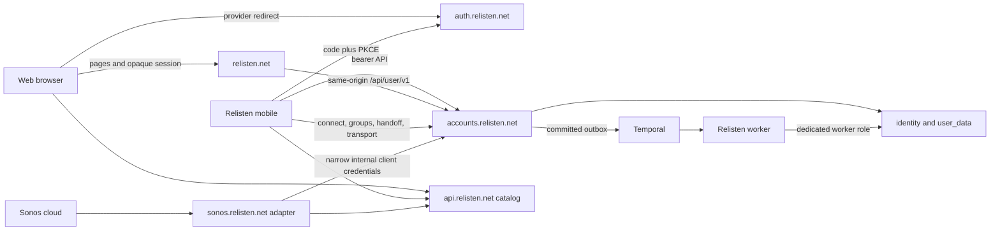
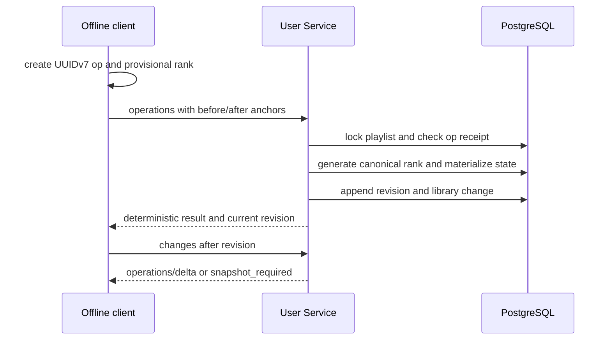
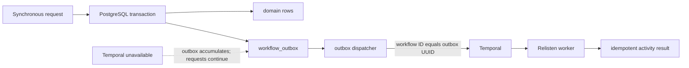
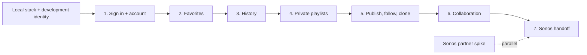

# Build Relisten identity, user data, offline sync, history, and Sonos handoff

This ExecPlan is a living document. Keep `Progress`, `Surprises & Discoveries`, `Decision Log`, and `Outcomes & Retrospective` current while implementation proceeds.

The architecture contract for this work is [Relisten identity, user data, and Sonos architecture](../../architecture/2026-07-18-relisten-identity-user-data-and-sonos-architecture.md). [Deliver Relisten accounts from API to TestFlight](./2026-07-18-relisten-mobile-first-account-delivery-plan.md) is the execution source of truth for ordering work across `RelistenApi` and `relisten-mobile`, deciding what blocks a TestFlight build, and defining the testing and rollout policy. The mobile-specific implementation contract is [Relisten mobile accounts, library sync, and Sonos implementation](../../../../relisten-mobile/docs/plans/active/2026-07-18-relisten-mobile-accounts-library-sync-and-sonos-implementation.md). This file supplies the detailed server work within those vertical slices. If the documents disagree about delivery order or initial scope, the mobile-first delivery plan wins. If implementation changes a durable architecture decision, update the relevant architecture document and this plan in the same pull request and record the reason below.

## Purpose / Big Picture

After this work, a listener can continue with Apple or Google on Relisten web or mobile and receive one stable Relisten user UUID. Favorites, private playlists, followed public playlists, and qualified listening history synchronize across signed-in clients. Mobile remains useful offline: favorites and collaborative playlist edits enter a durable local outbox and converge after reconnecting. A listener who never signs in can still browse, download, and play the anonymous catalog.

A playlist can be private, published at a stable public URL, followed by a signed-in listener, collaboratively edited through a separate one-time invitation, or cloned into an independent private copy. Playlist order preserves duplicate tracks and explicit source-run segments. Playlist detail APIs return one complete normalized projection: structure plus de-duplicated catalog arrays. Mobile does not collect playlist UUIDs, split resolver batches, or reconcile catalog revisions across several requests.

Mobile can separately connect a Sonos account, choose a group, and hand its current queue to Sonos. The handoff creates an immutable, expiring Cloud Queue transport snapshot. It does not create a universal Relisten queue, synchronize queues across clients, or turn the web app into a Sonos remote.

The work adds one ASP.NET Core `RelistenUserService` project to `RelistenApi`. The process serves `auth.relisten.net` and `accounts.relisten.net`, plus only the callback and anonymous `relisten.net` paths required by the current mobile slice. It reserves the canonical `relisten.net/api/user/v1/*` boundary for a later credentialed web slice and owns PostgreSQL `identity` and `user_data`. The existing catalog API remains anonymous and owns catalog resolution. Temporal joins before the external-beta deletion gate; synchronous account and library writes remain ordinary PostgreSQL transactions and continue when Temporal is unavailable. The existing two-instance CloudNativePG cluster holds `app`, `temporal`, and `temporal_visibility`; this work does not create another CloudNativePG cluster or PostgreSQL pods.

Success is visible without inspecting implementation details:

- stopping the User Service does not stop anonymous catalog browsing or playback;
- when a credentialed web slice eventually ships, web login ends with an opaque, host-only, HttpOnly `relisten.net` session cookie and no browser-visible bearer token;
- mobile login uses the system browser with authorization code and PKCE, then rotates a SecureStore refresh token;
- all sync-visible identity and user-domain rows have explicit UUIDv7 identities plus natural unique constraints; the Timescale fact uses physical `(qualified_at, event_uuid)` while its ordinary receipt owns the global UUIDv7 primary key, and catalog references cross boundaries only as UUIDs without requiring favorite targets to resolve at write time;
- two offline collaborators can reconnect and converge without replacing the whole playlist;
- unpublishing stops public reads and makes playlist-bound follows unavailable; republishing restores the same URL and follows;
- a 5,000-occurrence playlist initially loads through one compressed response containing complete structure and de-duplicated catalog records, without repeating show or venue graphs per occurrence;
- a removed catalog track disappears from future server-rendered playlist order and cannot start a new stream, download, Cast session, or Sonos session, while a file already present on a device remains playable there;
- a qualified listen is recorded exactly once only after 240 seconds or 50 percent of the catalog duration, with no skip or exact-listened-duration claim;
- a Temporal outage accumulates outbox work without breaking login, favorite, playlist, history-ingest, or sync requests;
- a mobile Sonos handoff keeps playing after the phone leaves the network, and later mobile queue edits do not silently mutate the active Sonos queue.

## Progress

- [x] (2026-07-18) Audited the API, web, mobile, Sonos, database, and deployment repositories and documented their current constraints.
- [x] (2026-07-18) Chose one User Service, Apple/Google-only login, UUIDv7 user data, separate catalog ownership, and web/mobile session models.
- [x] (2026-07-18) Resolved launch product behavior for collaboration, public publishing, follows, clones, offline edits, explicit segments, unavailable catalog media, playback history, Temporal, and mobile-only Sonos handoff.
- [x] (2026-07-18) Reworked this ExecPlan around operation-based library sync, normalized hydration, TimescaleDB qualified-listen facts, and Temporal-backed background workflows.
- [x] (2026-07-19) Simplified favorite references so membership outlives catalog availability, favorite writes never query the catalog, resolver status is derived from hydrated DTOs, and mobile retries only active favorites.
- [ ] Finish the local User Service, one-role database bootstrap, OpenIddict development identities, public mobile clients, and optional Temporal process setup.
- [ ] Slice 1: ship sign-in, username review, account switching, sign-out, and the minimum account lifecycle across API and mobile.
- [ ] Slice 2: ship UUIDv7 favorites, scoped sync, anonymous import choice, My Library, and CarPlay scoping across API and mobile.
- [ ] Slice 3: ship qualified history, history state/clear/import, Recently Played, and CarPlay history without waiting for Queue V2.
- [ ] Slice 4: ship owner-only segmented playlists, automatic normalized hydration, offline commands, archive/unarchive, and playback.
- [ ] Slice 5: ship public-code publishing, follows, cloning, cold/warm links, and the minimal public web fallback.
- [ ] Slice 6: ship viewer/editor/manager collaboration, invitations, revocation, and multi-device offline convergence.
- [ ] Slice 7: replace or evolve the Sonos adapter and ship the mobile-only immutable queue handoff after the partner contract is confirmed.
- [ ] Complete production-only roles, grants, recovery, privacy, load, and provider hardening before broad public rollout; do not make that work a prerequisite for earlier internal TestFlight feedback.
- [ ] Move this file to `docs/plans/completed/` and fill in `Outcomes & Retrospective` after production rollout.

## Surprises & Discoveries

- Observation: the catalog currently lives in PostgreSQL `public` and application SQL commonly uses unqualified names. Evidence: the existing migrations and Dapper services. Consequence: this project adds `identity` and `user_data`; it does not move catalog tables as incidental work.
- Observation: PostgreSQL 17 can inspect a UUID's version but does not generate UUIDv7. Evidence: the target database and .NET runtime support `Guid.CreateVersion7()`. Consequence: application code generates every new user-domain surrogate ID and migrations add null-safe version checks.
- Observation: current mobile playback already considers a track listened at `elapsed >= 240` seconds or `percent >= 0.5`. Evidence: `../relisten-mobile/relisten/player/relisten_player.tsx`. Consequence: cloud history standardizes that rule rather than inventing completion or skip semantics.
- Observation: current mobile history is device-global and anonymous. Consequence: a first-account upload requires explicit confirmation and bounded claim semantics; it cannot be silently assigned to whichever account signs in first.
- Observation: mobile already stores catalog entities separately by UUID. Evidence: `../relisten-mobile/relisten/realm/repository.ts` and the model repositories. Consequence: a server-hydrated playlist response can upsert de-duplicated arrays through the existing cache shape without adding playlist-specific batching logic.
- Observation: a real Grateful Dead show can expose dozens of sources and hundreds of tracks in a large show response. Consequence: the User Service playlist projection reads only the selected source-track UUIDs and never expands every alternate recording for the show.
- Observation: the User Service and catalog initially share the `app` database. Consequence: playlist reads use a narrow catalog-owned SQL projection and set-based reads inside the playlist transaction. An internal projection-reader interface preserves a future service split without making mobile orchestrate it now.
- Observation: current playlist-style snapshots would make offline collaboration overwrite unrelated changes. Consequence: playlist synchronization uses idempotent domain operations plus materialized state; this is not a generic sync engine or a claim that the entire application is event sourced.
- Observation: Timescale hypertable uniqueness must include the partitioning column. Consequence: an ordinary PostgreSQL receipt table owns global `event_uuid` idempotency while the hypertable stores time-partitioned facts in the same transaction.
- Observation: current background import jobs use Hangfire with Redis storage, and production Redis is not durable enough to become a new account correctness boundary. Consequence: Temporal is installed now with PostgreSQL persistence; importers migrate later, one workflow at a time.
- Observation: production has one two-instance CloudNativePG `relisten-db-target` cluster, currently with only the `app` database, and CloudNativePG 1.30 supplies standalone `DatabaseRole` and `Database` resources. Consequence: add `temporal` and `temporal_visibility` as logical databases in that cluster rather than operating a second PostgreSQL deployment.
- Observation: current backup Deployments run logical dumps against `app`; a `pg_dump` does not include another logical database, while a CloudNativePG physical backup restores the whole cluster. Consequence: backup and restore plans must name which artifact they mean and cannot claim independent physical PITR for Temporal.
- Observation: a Kubernetes principal that can patch a workload can indirectly mount Secrets in that namespace even if RBAC denies direct Secret reads. Consequence: keeping the User Service in `default` requires an operator-owned admission allowlist for every account-sensitive Secret; RBAC alone is not that boundary, and the trusted User Service deployer remains Secret-capable for its own workload.
- Observation: namespace-wide default-deny policy would risk unrelated workloads in `default`. Consequence: User Service and Temporal policies select only their labeled pods.
- Observation: current Sonos is anonymous SMAPI. Cloud Queue and remote Control require external Sonos capabilities and version negotiation. Consequence: implementation starts with compatibility fixtures and a partner spike; it must not assume that every account has the same Cloud Queue reporting version.
- Observation: Sonos documents a v2.1 play-audio baseline while later endpoint/reporting documentation exists, including `reportId` behavior in v2.3. Consequence: implement the approved negotiated contract, baseline the required context/item-window/version surface, and enable later reporting semantics only when the Relisten service registration supports them.
- Constraint: Apple web sign-in requires registered HTTPS domains. Daily local work uses a development-only provider; Apple is exercised in preview.
- Constraint: the current cluster's duplicate pods cover process failure and rolling updates, not loss of the cluster ingress/control-plane host. Availability statements and tests must stay within that boundary.

## Decision Log

- Decision: `auth.relisten.net` and `accounts.relisten.net` are protocol boundaries backed initially by one ASP.NET Core deployable. Rationale: one service is easier to operate while separate hosts keep cookies, tokens, and future extraction clear. Date/Author: 2026-07-18 / architecture review.
- Decision: use OpenIddict with a small Relisten membership model and Apple/Google upstream providers; do not launch passwords. Rationale: standards-compliant OIDC is required, while password reset, mail delivery, and password breach response are not useful launch scope. Date/Author: 2026-07-18 / architecture review.
- Decision: generate every new identity and user-data surrogate key as UUIDv7 and reference catalog entities only by their existing UUIDs. Rationale: stable cross-client identity without exposing catalog-local numeric IDs. Date/Author: 2026-07-18 / architecture review.
- Decision: deploy the User Service and Temporal components in the existing `default` namespace with an operator-owned sensitive-Secret admission allowlist. Rationale: a separate user-service namespace is not wanted at this scale; admission prevents unrelated workload identities from mounting account Secrets, while the trusted User Service deployer, cluster administrators, and nodes remain inside the explicit trust boundary. Date/Author: 2026-07-18 / product and operations review.
- Decision: retain the separately operator-owned `relisten-backups` namespace. Rationale: database-wide read and object-store write credentials do not need to share the runtime deployer's blast radius. Date/Author: 2026-07-18 / recovery review.
- Decision: use domain-specific idempotent playlist operations, materialized current state, monotonic per-playlist revisions, a delta feed, and full-snapshot fallback. Rationale: offline collaboration needs mergeable intent; whole-aggregate replacement loses independent edits. Date/Author: 2026-07-18 / playlist review.
- Decision: model every playlist top-level unit as an explicit segment and order both segments and occurrences with fractional ranks generated canonically by the server. Rationale: source runs, duplicates, and segment-preserving shuffle must be stable instead of inferred from `show_uuid`; dedicated split/merge commands can wait for exercised UX. Date/Author: 2026-07-18 / playlist review.
- Decision: playlist snapshot and public-playlist APIs hydrate automatically and return complete structure plus de-duplicated catalog arrays in one response. The User Service initially reads a narrow catalog-owned SQL projection in the shared database. Rationale: one consistency boundary and retry are easier to implement and operate than client-side UUID collection, batching, and revision pinning; normalization still prevents repeated show and venue graphs. Date/Author: 2026-07-18 / delivery review.
- Decision: combine playlist content revision with catalog `availability_revision` in an opaque projection revision and poll followed-playlist heads without per-follower fan-out. Rationale: licensing changes and silent follows must invalidate rendered state without rewriting authorship or multiplying writes by follower count. Date/Author: 2026-07-18 / sync review.
- Decision: private is the default; publishing assigns one stable 12-letter Base52 `public_code`; follows bind to the playlist; collaborator invitations are separate, one-time, and sign-in-required. Rationale: public reading needs no secret, while accepting a collaborator invitation creates membership and therefore requires a one-use credential. Date/Author: 2026-07-18 / product review.
- Decision: playlist memberships have viewer, editor, and manager roles. Only the owner archives or unarchives; archived playlists disappear from every normal read and return with the same state when unarchived. Ordinary playlist deletion does not exist. Rationale: one reversible lifecycle action is easier to explain and operate. Date/Author: 2026-07-18 / product review.
- Decision: account deletion is the sole exceptional playlist purge and permanently removes every playlist the account owns after an explicit impact warning. Rationale: account privacy wins over collaborator continuity during account deletion without adding an ordinary destructive playlist UI. Date/Author: 2026-07-18 / product review.
- Decision: assign a globally unique lowercase `@username` in the first account transaction, show nonblocking review, and never use it for login. Rationale: attribution needs a stable public name without making email or username part of identity proof. Date/Author: 2026-07-18 / product review.
- Decision: retain operation/revision data now but defer revision-restore UI. Rationale: durable audit and future recovery are cheap to preserve now; a good restore interface is not launch-critical. Date/Author: 2026-07-18 / product review.
- Decision: filter catalog-unavailable occurrences from the active server projection without a user-facing placeholder. Rationale: future use is blocked, while internally retaining UUID and operation history avoids referential breakage. Automatic behavior if a catalog item later reappears is intentionally unspecified. Date/Author: 2026-07-18 / product review.
- Decision: files already downloaded remain device-global and playable until the user deletes them, even after licensing removal. Rationale: removal blocks future server uses; it does not remotely purge a listener's device. Date/Author: 2026-07-18 / product review.
- Decision: cloud listening history is on by default with clear disclosure and an off switch. Store one immutable `qualified_listen` at the existing 240-second-or-50-percent threshold, with no skip or exact-duration event. Rationale: this supports history and future recommendations without overstating what the client observed. Date/Author: 2026-07-18 / product review.
- Decision: gate history ingestion with a server-issued generation that advances on disable and clear. Rationale: an offline stale batch must not defeat privacy state, and client clocks are not an authorization boundary. Date/Author: 2026-07-18 / privacy review.
- Decision: store qualified-listen facts in TimescaleDB from launch, use ordinary receipt and rollup tables, and call duration-derived summaries “Estimated listening time.” Rationale: append-heavy facts benefit from time partitioning; user deletion and correction remain simpler outside continuous aggregates. Date/Author: 2026-07-18 / data review.
- Decision: commit to Temporal now with `temporal` and `temporal_visibility` in the existing two-instance CloudNativePG cluster and an application outbox; keep Temporal off synchronous API paths. Rationale: durable workflows will outgrow Hangfire, the database outbox keeps requests available during a Temporal outage, and this scale does not justify another PostgreSQL deployment. Date/Author: 2026-07-18 / operations review.
- Decision: use standalone CloudNativePG `DatabaseRole` and `Database` resources for production role/database existence; use EF Core and Temporal's schema jobs for database contents, plus versioned SQL for grants CloudNativePG cannot express. Local development uses one `relisten` login role for all three databases and does not reproduce production grants. Rationale: each object has one owner while local setup remains small. Date/Author: 2026-07-18 / database review.
- Decision: the first Sonos slice is a mobile-only, one-way handoff of an immutable queue snapshot plus remote control, with no Sonos-derived listening history. Rationale: the desired first product is “play this mobile queue on Sonos,” while Sonos history needs independent evidence and privacy design after real-speaker behavior is understood. Date/Author: 2026-07-18 / Sonos review.
- Decision: add hooks only when a current implementation needs them; smart playlists, account export, provider-linking UI, session inventory, revision restore, and generalized synchronization wait for a concrete consumer. Rationale: these features have high implementation and UI cost and do not help validate the first account slices. Date/Author: 2026-07-18 / scope review.
- Decision: launch with favorites and playlists only as organization primitives. Rationale: folders, tags, discovery, public profiles, and general import/export would broaden the first account release. Self-service account export is reconsidered when a product or regulatory need makes it concrete. Date/Author: 2026-07-18 / scope review.
- Decision: every completed feature in a TestFlight build is on by default. Do not add Statsig cohorts or a remote mobile flag matrix. Keep only narrow, default-on server switches for emergency containment of account registration, history writes, and Sonos handoff. Date/Author: 2026-07-18 / delivery review.
- Decision: add two to five high-value automated cases per delivery slice, centered on authorization, data loss, idempotency, and domain invariants. Use real PostgreSQL for persistence boundaries and manual device testing for mobile UI and platform behavior. Rationale: a small contributor group gains more confidence from focused invariants and hands-on product testing than from broad mocks or mobile UI automation. Date/Author: 2026-07-18 / delivery review.
- Decision: favorite membership is durable user intent and is never validated against current catalog contents. The standalone resolver performs only its targeted hydration reads and derives `available` or `unavailable` from the target DTOs returned; mobile retains cached objects and retries unresolved references only while the favorite is active. Rationale: catalog absence is rare and reversible, duplicated graph-validation SQL adds latency and coupling, and unfavorite synchronization must not depend on hydration. Date/Author: 2026-07-19 / catalog simplification review.

## Outcomes & Retrospective

Implementation has not started. On completion, record:

- production dates and adoption by anonymous, web-account, mobile-account, collaborative-playlist, history, and Sonos users;
- p50/p95/p99 latency, sync batch sizes, playlist operation conflict rates, hydrated-playlist payload size, pool waits, workflow backlog age, and database growth;
- whether offline operation sync and explicit segments were understandable in real use;
- the actual Timescale chunk/columnstore settings chosen from measurement;
- Temporal outage and PostgreSQL restore results;
- Sonos's approved Cloud Queue version and any protocol differences from this plan;
- incidents or near misses involving refresh replay, cross-account Realm data, invitation-secret leakage, collaborator authorization, catalog removals, or queue credentials;
- decisions to revisit before revision restore, recommendations, automatic playlists, tags/collections, or public discovery.

## Context and Orientation

This is coordinated work across five sibling repositories:

- `/Users/alecgorge/code/relisten/RelistenApi` contains the anonymous .NET catalog API and will contain `RelistenUserService`, its tests, EF Core migrations, API contracts, workflow activities, and architecture/runbook documentation.
- `/Users/alecgorge/code/relisten/relisten-web` is the Next.js web app. It renders public playlist URLs first; a later credentialed web slice calls same-origin `relisten.net/api/user/v1/*` and never stores a Relisten bearer token.
- `/Users/alecgorge/code/relisten/relisten-mobile` is the Expo/React Native app. It is the public OIDC client, owns the offline outbox and one Realm file, and is the only Sonos control UI. Its detailed implementation belongs in the companion mobile plan.
- `/Users/alecgorge/code/relisten/relisten-sonos` is the replaceable TypeScript Sonos protocol adapter. It translates authenticated SMAPI and negotiated Cloud Queue HTTP; it owns no Relisten users or durable business state.
- `/Users/alecgorge/code/relisten/relisten-flux` contains the k3s, CloudNativePG, ingress, Temporal, backup, and application deployment source of truth.

`identity` is the schema for memberships, external identities, sessions, OpenIddict, Data Protection, and account-lifecycle state. `user_data` is the schema for favorites, library changes, playlists, operations, history, Sonos grants, queue transport snapshots, and the workflow outbox. `catalog UUID` means the existing UUID on a catalog-owned row; a numeric catalog key never crosses the boundary.

The target runtime topology is below. The credentialed browser-to-Accounts edge is absent during the mobile-first slices and appears only with the later credentialed web product.

Playlist writes are not aggregate replacement:

Background work is asynchronous by construction:

## Plan of Work

The mobile-first delivery plan controls sequencing. For each slice, freeze one small wire contract, implement its schema/domain/API, prove a few invariants against real PostgreSQL, add only that slice's Realm state, build its UI, exercise the real local stack, and ship a TestFlight build with the feature on. Do not finish all server milestones and integrate mobile afterward.

The milestones below are detailed work packets, not a second release sequence. Their mapping is:

| Delivery slice | Server work in this plan |
| --- | --- |
| Local setup | Minimum parts of Milestones 0–2 needed for a local User Service, OpenIddict, database, and mobile client; Temporal may remain stopped |
| 1. Sign in and account | Milestones 1–2, limited to account creation, username, sessions, `/v1/me`, refresh/revoke/sign-out, and scope fencing; add deletion and Temporal before external beta, not before the first internal build |
| 2. Favorites | The favorite-resolver and library-sync portions of Milestone 3, plus Milestone 4; do not build playlist projection or hydration yet |
| 3. History | Milestone 5; a `playback_instance_uuid` is sufficient and Queue V2 is not a prerequisite |
| 4. Private playlists | The playlist-projection portion of Milestone 3, the owner-only core of the playlist contract, and Milestone 6, including automatic server hydration |
| 5. Publish, follow, clone | Milestone 7 and the minimal public web page |
| 6. Collaboration | Milestone 8 |
| 7. Sonos | Milestone 10 after the partner/API contract is confirmed |

Identity and catalog remain separate ownership domains even while they share PostgreSQL. Temporal starts with one namespace, dispatcher, worker, and durable business outbox; no synchronous user request depends on it. Sonos capability work may run in parallel, but Sonos remains the last user-facing slice.

### Initial complexity budget

Do not make these high-lift capabilities prerequisites for early TestFlight feedback:

- self-service account export, provider-linking UI, session inventory, and logout-all UI;
- additional recovery services, advanced Temporal migration/recovery controls, Temporal archival, importer migration, or complex worker routing;
- revision browser/restore, a generic sync framework, public discovery/search/profiles, or smart-playlist rules;
- collaboration before owner-only playlists have been exercised by testers;
- Queue V2 before playlist playback or Sonos demonstrates that the current player model is insufficient;
- production Apple configuration, final grants/NetworkPolicies/backups/alerts, and full disaster-recovery rehearsal before local development or an internal TestFlight.

Preserve the data identities and narrow interfaces that make these additions possible later. Do not build dormant tables, Realm models, workflow state machines, screens, or flag branches for them now.

### Implementation discipline

Organize code by feature and responsibility. Controllers translate HTTP. Domain services enforce authorization and invariants. Repositories own SQL/EF persistence. Mobile coordinators own synchronization. Screens render state and send user intent. A controller, screen, or Realm model must not become a second domain service.

A handwritten source file crossing roughly 300 lines triggers a decomposition review. A file over 500 lines must be split unless it is generated code, a migration, a declarative fixture, or has a short written reason that splitting would make the result harder to understand. Prefer cohesive classes and direct data flow. Add an interface only when it protects an ownership boundary, invariant, lifecycle, or useful test seam.

Write comments for a capable contributor who opens the file six months later without this architecture in working memory. Explain why a transaction or ordering boundary must not change, which retry/privacy invariant a surprising branch protects, or why a platform workaround exists and when it can be removed. Do not narrate syntax or repeat method names.

After focused checks pass for a nontrivial slice:

1. run a behavior-preserving `code-simplifier` review over only changed code and tests;
2. rerun the focused checks;
3. run `deslop` over changed documentation, UI copy, error text, and important comments;
4. inspect the diff for duplicated logic, speculative layers, stale flags, and comments that explain what the code already says.

### Milestone 0: establish external and production-readiness prerequisites in parallel

Only local issuer/client configuration and a working database block Slice 1 development. Provider registrations, Sonos approval, production grants, backup rehearsal, and alerting proceed in parallel and become gates only for the environment that needs them. An internal TestFlight uses an isolated preview issuer and preview database with real Google sign-in; it never points at a developer laptop or production data. Fixed development identities exist only on a localhost issuer in `Development`. Real Apple proof becomes mandatory before external TestFlight.

Record owners and exact production/preview redirect URIs for Apple, Google, and Sonos without committing secret values. Confirm `relisten.net` as canonical and redirect `www.relisten.net` before setting a session. Register separate public iOS and Android clients, a confidential web client, and an internal Sonos-adapter client.

The initial production identity registrations are Google web client `403146132454-qg2pm8eofsidj29tkqaldclvn2pjm88p.apps.googleusercontent.com` with callback `https://auth.relisten.net/signin-google`, and Apple Services ID `net.relisten.auth`, Team ID `HT7ELV3Q35`, Key ID `379MK9D59A`, with callback `https://auth.relisten.net/signin-apple`. Those identifiers are non-secret. The Google client secret and Apple `.p8` remain mounted runtime secrets. The initial iOS OpenIddict client is `relisten-mobile-ios` with `net.relisten.mobile:/oauth2redirect/ios`; the universal-link callback is intentionally deferred.

In the Sonos Dev Portal, record the active service ID, test service ID, partner contact, authenticated-SMAPI/account-matching access, Direct Control access, Cloud Queue version, reporting support, and upgrade protocol. Treat the official v2.1 play-audio endpoints as the minimum shape to investigate; target v2.3 `reportId` reporting only if approved for Relisten. No production date may assume an unresolved capability.

Create an external inventory for OpenIddict signing/encryption certificates, Data Protection wrapping material, Apple/Google credentials, Sonos credentials, and token-envelope keys. Document owners, versions, rotation, and recovery locations, never values.

Keep `relisten-backups` operator-owned. Before broad public rollout, verify that the existing backup method covers `app`, `temporal`, and `temporal_visibility`, document whether each artifact is logical or physical, and run one clean-cluster restore. Treat business tables plus `workflow_outbox` as authoritative. The initial deletion workflow keeps a durable no-user-FK job and writes a create-only object-storage tombstone before purge. The restore runbook loads those tombstones and removes matching restored accounts before traffic opens.

Split the catalog runtime and migration database roles if they still share ownership. Prove the catalog runtime cannot read `identity` or `user_data`; prove the User Service runtime can read only the catalog UUID/availability data explicitly granted.

Proof before internal TestFlight: local client registrations and the development identity flow are documented and repeatable, the signed build reaches the isolated preview issuer, and real Google sign-in completes there. Proof before external TestFlight: real Apple and Google callbacks work from a release-signed build. Proof before broad public rollout: an operator who did not author the feature can locate every non-secret registration and recovery source, a clean-cluster restore passes, provider and Sonos gates have named owners and explicit states, and anonymous catalog smoke tests pass throughout.

### Milestone 1: create the User Service and database; add Temporal for the deletion gate

In `RelistenApi`, add `RelistenUserService/`, `RelistenUserServiceTests/`, solution entries, a service Dockerfile, and a local HTTPS proxy. Use EF Core for `identity` and `user_data`; keep catalog Dapper/Simple.Migrations unchanged. Add one UUIDv7 generator based on `Guid.CreateVersion7()` and database checks that reject nil, UUIDv4, and other wrong-version surrogate IDs. EF Core owns creation and evolution of `identity`, `user_data`, and their objects; do not also declare those schemas through CloudNativePG.

In `relisten-flux`, add standalone CloudNativePG `DatabaseRole` resources for production roles and `Database` resources for `app`, `temporal`, and `temporal_visibility`, all targeting the existing `relisten-db-target` cluster with retain reclaim policies. Audit the existing `app` role before adopting it. Use one `temporal_server` login role to own and access both Temporal databases. Do not add another CloudNativePG `Cluster`, PostgreSQL workload, primary/replica pair, or storage set. CloudNativePG owns role and database existence only.

Before broad public rollout, use separate owner/migrator, API runtime, Temporal worker, backup, and read-only diagnostics roles. Declare each as a standalone `DatabaseRole`, not inline `Cluster.spec.managed.roles`. The API runtime gets explicit schema/table/sequence access and selected catalog projection reads. `user_service_worker` gets only the business tables required by deployed activities; it cannot issue tokens or read OpenIddict signing material. The migrator alone creates cross-schema foreign keys and Timescale objects. A reviewed, versioned production SQL step applies table, sequence, function, `REFERENCES`, and default-privilege grants that CloudNativePG cannot express. The initial one-replica internal TestFlight deployment may use the existing `app` owner credential and startup migrations; replace that explicit beta compromise with the role split and migration Job before scaling or broad public traffic. Do not create roles for deferred services.

Local development has a different credential topology by design: one TimescaleDB/PostgreSQL container, one `relisten` login role, and three databases named `relisten_db`, `temporal`, and `temporal_visibility`. The repeatable local bootstrap ensures those databases exist and are owned by `relisten`. EF Core, catalog migrations, and Temporal schema jobs all connect as `relisten`; local setup creates no production roles and runs no production grants. Remove the legacy local `CREATE ROLE app` step after a restore test proves `--no-owner --no-acl` restores cleanly.

Add liveness, readiness, problem details, OpenTelemetry, request limits, host filtering, and three route groups:

- `auth.relisten.net` for discovery, authorization, providers, and callbacks;
- `accounts.relisten.net` for bearer `/v1/*` resources plus one public-playlist read and the explicitly anonymous, no-store collaborator-invitation exchange;
- `relisten.net` as a reserved future User Service path boundary. Mobile initially returns through its custom OAuth scheme, so Slice 5's public-playlist path is the first required route there. `/auth/session/*` and allowlisted `/api/user/v1/*` session-backed adapters wait for the first credentialed web product slice.

In Development only, the configured loopback origin such as `http://localhost:5443` exposes both the auth routes and bearer Accounts API routes needed by simulator/emulator clients. It does not expose the `relisten.net` browser-session facade. Keep the loopback host and port on an explicit allowlist and keep production host routing unchanged; do not make local development work by disabling host filtering globally. A developer testing the web facade instead uses the local HTTPS proxy with explicit development auth, accounts, and web hostnames.

In `relisten-flux`, place the Deployment, Service, ConfigMap, Ingress, PodDisruptionBudget, pod-selected NetworkPolicies, and ServiceAccount in `clusters/relisten3-k3s/apps/` under the existing `default` namespace conventions. Do not create `relisten-accounts`. Do not apply namespace-wide default deny. Add only policies selecting User Service and Temporal pods. Give ordinary User Service traffic the transaction-mode PgBouncer connection string and a separately named direct-primary connection string for the two-connection refresh-token lock pool; the latter holds transaction advisory locks and must not be routed through transaction-mode PgBouncer. Permit that narrow direct-primary edge in the User Service policy and budget its connections separately. Standard Kubernetes NetworkPolicy can select internal pods/namespaces and destination IP blocks/ports, not provider FQDNs. Unless the cluster adds an egress proxy or FQDN-aware CNI, external Google, Apple, Sonos, and OTLP/object-store calls therefore share a documented outbound TCP 443 allowance; application host allowlists, DNS/TLS validation, OAuth redirect checks, and narrow credentials enforce the finer boundary. Do not claim that a policy names an external SaaS hostname when it cannot.

Because the User Service remains in `default`, review the cluster's Secret-mount boundary before broad public account traffic. If unrelated workload identities can mount account Secrets, add a cluster-operator-owned `ValidatingAdmissionPolicy` and binding, or the installed equivalent, for the exact production workloads and ServiceAccounts. Application CI cannot mutate that policy or create a bypass workload. This production control does not need to be reproduced by the one-role local environment.

Document the remaining boundary honestly: an admission policy can prevent unrelated `default` workloads from referencing account Secrets, but the trusted User Service deployer for its own allowlisted workload, cluster administrators, and nodes remain Secret-capable. Keep backup credentials out of `default`. For the internal TestFlight rollout, keep exactly one User Service replica, disable rollout surge, and let that pod migrate directly before listening. Current CI may restart the Deployment but cannot create arbitrary Jobs or read Secrets. Before replicas increase, replace startup migration with the operator-gated two-promotion flow: run the reviewed migration Job using the candidate digest, record success, then promote that byte-for-byte digest to the Deployment.

Temporal is not on the critical path for local sign-in, favorites, history, private playlists, or the first internal TestFlight builds. First land the User Service, OpenIddict, the business schemas, and their normal request path with Temporal stopped. The local bootstrap may create `temporal` and `temporal_visibility` so later setup is repeatable, but it does not have to start Temporal. Install and prove Temporal only before enabling account deletion for external testers.

For that deletion gate, install Temporal in `default` from the official chart with internal-only frontend access, PostgreSQL visibility, no Elasticsearch, and the two logical databases in the existing CloudNativePG cluster. Both SQL stores use the same `temporal_server` role and existing CloudNativePG primary address. Set `createDatabase: false` and `manageSchema: true` for both stores, and set `schema.useHelmHooks: false` so Flux sees ordinary schema resources. Resource ordering is explicit: CloudNativePG cluster ready; `DatabaseRole` and both `Database` resources applied; pinned Temporal schema Job complete; Temporal services start or upgrade. An operational spike chooses and pins a mutually compatible chart, server image, PostgreSQL schema tooling, and .NET SDK. Choose and record `numHistoryShards` before the first production bootstrap. Start with one replica of each required Temporal service, one Relisten worker/dispatcher, and namespace `relisten-user` with 30-day history retention and no archival. Keep the frontend internal behind pod-selected NetworkPolicy and the chart's supported workload authentication. Do not build custom claim mapping, per-task-queue authorization, archival, or a versioned namespace scheme before more than one trusted worker boundary or a long-lived incompatible workflow makes it necessary.

Add `user_data.workflow_outbox` with a UUIDv7 primary key, workflow type and input version, small business-reference payload, state, attempt/next-attempt fields, a short claim lease, Temporal run identity, bounded error code, and completion time. Payloads contain identifiers and small immutable facts, never credentials or full user documents. A business transaction writes domain state and one pending outbox row. The dispatcher claims due rows, starts a workflow whose ID is the outbox UUID, and records the run. If it dies between Temporal accepting the start and that record, the next attempt treats the known duplicate as reconciliation, not a second execution. Keep states and code proportional to that requirement; do not build a general workflow control plane. Activities use stable idempotency keys and confirm business or external receipts before marking the job complete.

Relisten activity workers reference the same versioned domain/application library as controllers and access PostgreSQL directly with `user_service_worker`; they do not call the User Service over internal HTTP to mutate or re-read business state. This keeps authorization, lifecycle generations, and transactional invariants in one implementation without creating a loopback availability dependency. The public Sonos adapter remains the only internal-HTTP client described later.

Start with one application worker and the account-deletion workflow. Add Sonos revocation and subscription renewal only with the Sonos slice. Add coalesced history rollups only when a user-facing summary consumes them; a qualified listen never starts one workflow. Defer importer migration, complex task-queue routing, archival, and advanced recovery controls. Introduce Temporal Worker Versioning and captured-history replay before the first workflow change that can overlap an incompatible deployed execution; do not build that machinery for a single short-lived development workflow with no retained production history.

Proof for early local slices: a blank local container reaches exactly the three expected databases under the one `relisten` login role; the catalog and User Service schema toolchains migrate; wrong-host routes return 404; and the User Service remains healthy with Temporal stopped. The initial production proof is one no-surge pod applying the pending EF migrations against the direct primary, becoming ready, and retaining refresh/session behavior across a restart. Before account deletion reaches external testers, prove the Temporal schema and business migrations plus a crash immediately after Temporal accepts an account-deletion start reconciles one execution. Before public rollout or multi-replica User Service, production `DatabaseRole`/`Database` resources report applied, the operator migration Job succeeds before the same digest is promoted, the Temporal schema Job completes before Temporal starts, and focused RBAC/connectivity checks cover the deployed identities.

### Milestone 2: implement OIDC, providers, sessions, and account lifecycle

Pin one compatible OpenIddict package family. Support authorization code for interactive clients, PKCE for every interactive flow, client credentials for the Sonos adapter, durable signing/encryption certificates, exact redirect URIs, and rotating native refresh tokens. Apple and Google are upstream providers; identity resolution uses allowlisted issuer plus immutable provider subject and never email. `identity.external_identities` has a UUIDv7 primary key, unique `(issuer, provider_subject)`, unique `(user_id, issuer)`, and nullable nonunique last-observed `email_at_provider`, `email_verified_at_provider`, `email_is_private_relay`, and `email_observed_at`. Email remains private provider metadata; `identity.users` has no account-email column.

Add lowercase `identity.users.username` with global case-insensitive uniqueness and allow only 3–30 ASCII letters, digits, or underscores after a server-owned reserved/system/abuse denylist. In the first account transaction, use a sanitized provider-email local part only when it passes those rules; otherwise use `listener_` plus ten random lowercase Base32 characters. Retry a bounded number of times with a random suffix on collision while keeping the result within 30 characters. `@username` is the only public account attribution and never a login identifier. Store a monotonic `username_version` plus review and last-change timestamps. Mobile shows a first-sign-in **Keep or edit** prompt, but review never gates the session or APIs; keeping or renaming there does not start the cooldown. Later renames are limited to once per 30 days. Store each voluntarily abandoned name in a UUIDv7 `identity.username_holds` row for 30 days. Account deletion immediately releases the current name and deletes that user's hold rows. Allocation, rename, hold expiry, and deletion release take transaction-scoped advisory locks for affected normalized names in sorted order, then check both the current-name and hold tables; this makes the cross-table reservation race-free.

Handle simultaneous first sign-in by catching the PostgreSQL unique violation, rolling back, and re-reading the winning identity. A provider identity already attached to another user remains attached there; matching email never moves or merges it. Missing or changed provider email never blocks login or changes ownership. Provider linking/unlinking, sign-in-method management, and its step-up intent UI are deferred until the basic sign-in flow has been exercised. Keep external-identity ownership rules compatible with adding those commands later.

When the first credentialed web product slice begins, web authorization exchanges server-side into an opaque `identity.sessions` row and a host-only `__Host-relisten_session` cookie. The callback uses the maintained OIDC client validation pipeline and accepts identity only from a signature-valid ID token with the exact Relisten issuer, confidential web client audience, nonce, authorized-code binding where supplied, and valid time window; it never treats an unvalidated decoded token or upstream Apple/Google token as a Relisten identity. It then loads the active Relisten user, creates the opaque session, and discards the bootstrap tokens. Browser JavaScript never sees a bearer or refresh token. Same-origin mutations use strict Origin validation and ASP.NET antiforgery. Do not implement this session/cookie/CSRF path for the mobile-only slices.

At that future web slice, persist a fixed capability set on each web session rather than translating every native scope. Start with only the capabilities consumed by its shipped screens; never copy the full native scope set speculatively. It excludes `sonos.control`, internal adapter scopes, group discovery, handoff, and playback commands. Route authorization checks both the capability and an explicit same-origin facade allowlist. A newly added bearer endpoint is not browser-accessible until that allowlist is reviewed and updated.

Mobile is a public client: access tokens stay in memory; one rotating refresh token is stored `AFTER_FIRST_UNLOCK_THIS_DEVICE_ONLY`; refresh replay revokes the native session/authorization with no reuse grace period. A candidate calls `/v1/me` before persistence or scope selection. Refresh is single-flight and stores the rotated token before exposing its access token; a process death in that non-atomic gap requires sign-in again. Sign-out or switch freezes scoped work, makes one bounded server-revocation attempt, deletes the local credential, and advances the local auth generation even if the service is unreachable. Do not add a retained logout-token queue.

Expose `/v1/me`, username review/rename, revoke-this-session, sign-out, and the account-lifecycle foundations. Session inventory, revoke-other-session, logout-all UI, provider linking/unlinking, and general step-up management are deferred. `GET /v1/me` returns `username_version` and an ETag. `PATCH /v1/me` accepts exactly `{contract_version, client_command_uuid, expected_username_version, username}`. Persist UUIDv7 command receipts with the normalized payload and result. Exact same-user replay returns the receipt; changed reuse conflicts. A new command locks the user row and returns `409 username_version_stale` with the current profile when its expected version is stale. At a matching version, the current assigned value records first review, a different value during pending review atomically performs the free first rename and review, and a post-review change enforces the 30-day cooldown and abandoned-name hold. Each state change advances the username version; a post-review current-value command is a stored no-op. Before external beta, add recent-auth account deletion. `GET /v1/account-deletion/impact` lists every owned playlist and highlights collaborators, followers, publication, and archive state. The confirmation says that deletion permanently removes every owned playlist for everyone. This is the only playlist purge; there is no ordinary playlist-delete endpoint. Playlist purge handlers are added with the playlist slices and history handlers with the history slice.

The client creates and persists one UUIDv7 deletion command ID before confirmation. `POST /v1/account-deletions` requires recent authentication, that command UUID, and explicit impact acknowledgement. `identity.account_deletion_jobs` stores the command UUID, lifecycle generation, bounded cleanup state and retry metadata, plus only the encrypted Sonos revocation material still needed after the user row is gone. It deliberately has no user foreign key. Once the fail-closed transaction commits, creation returns HTTP `202` with `{deletion_uuid, state:"deleting"}`. Exact retry through a still-valid request context returns the same result; changed reuse conflicts. Mobile clears scoped local data after the accepted response and returns to anonymous mode; if the response is lost and the session has already been revoked, the client performs the same local cleanup without claiming that asynchronous purge has finished.

After the impact is acknowledged, account deletion increments `lifecycle_generation`, sets status to `deleting`, increments `security_version`, disables history and advances its generation, revokes every Relisten credential, releases the username, and persists the standalone deletion job plus workflow outbox in one transaction. The workflow writes and reads back a create-only object-storage tombstone keyed by deletion UUID, then idempotently purges user-owned rows and aggregates. The no-user-FK job survives the purge. Before external beta, a focused replay loads that tombstone from a representative restored snapshot, removes the matching account, and invalidates its restored credentials before traffic opens. The complete clean-cluster recovery rehearsal waits for broad public rollout. A self-service account export and its artifact/grant workflow are deferred until a product or regulatory need justifies them.

For daily local development, run the real OpenIddict authorization-code flow, PKCE, PostgreSQL persistence, token rotation, system browser, mobile callback, and Accounts API. Replace only upstream Apple/Google proof with an environment-guarded page of fixed identities. The page must enter the same external-identity completion service as Apple and Google; it must not mint tokens directly, accept arbitrary subjects from query parameters, or bypass `/connect/authorize` and `/connect/token`. Include fixed cases for two people, the same email under different subjects, a private-relay address, and no email. Register the provider only for a loopback issuer when the environment is `Development` and an explicit local setting is enabled; startup fails in preview, TestFlight, or production if it is enabled.

Use a loopback issuer such as `http://localhost:5443` for simulator/emulator development, with HTTP allowed only for loopback in Development. Seed separate public iOS and Android clients with authorization code, PKCE, refresh, no client secret, and platform callbacks. Android uses `adb reverse`; a physical iPhone uses the preview issuer or an optional trusted tunnel. A contributor may configure a Google Web OAuth client whose exact localhost callback points to the User Service, storing its secret only in .NET user-secrets or environment variables. The stable preview issuer has its own real Google registration and database; Apple also requires registered HTTPS and is exercised through preview before external TestFlight. No Apple or Google secret enters the mobile bundle or repository.

Proof: each provider subject creates or reauthenticates one stable Relisten `sub`; email collision never merges; simultaneous account creation assigns one valid unique username; review never gates use; code and refresh replay fail; the development identity uses the real OpenIddict/code/PKCE path and is absent in production; mobile logout/switch wins over an in-flight refresh and isolates an unreachable revocation credential. Before external beta, one focused deletion test proves session revocation, durable job creation, idempotent purge, and username release.

### Milestone 3: add typed catalog reads and library sync with their consuming slices

This milestone is deliberately split across delivery slices. Slice 2 implements the favorite resolver and the minimum account-library snapshot/delta path needed by favorites. Slice 4 later implements the playlist projection, hydrated owner/member snapshot, and the 5,000-occurrence fixture. Slice 5 adds followed-playlist heads after follows and publication exist. Do not build a later slice's half while shipping favorites merely because these concerns are documented together here.

In the catalog API, add `POST https://api.relisten.net/api/v3/catalog/resolve` for standalone typed references such as favorites. The request is `{contract_version: 1, references: [{catalog_type, catalog_uuid}]}` and the launch allowlist is `artist`, `show`, `source`, `source_track`, `song`, `tour`, and `venue`. Accept at most 500 de-duplicated references. Run only the ordinary UUID-targeted hydration queries and let their inner joins omit targets or dependencies that cannot currently produce a usable DTO. After reading the normalized entity arrays, derive each requested reference's `available` or `unavailable` status in application memory from whether its target-type array contains that UUID. Do not run a separate SQL availability or graph-validation query. Return those reference statuses plus deduplicated arrays of the ordinary UUID-bearing catalog DTOs and the shallow parents required to render a requested child. Freeze collections as arrays in OpenAPI—no map representation or array-or-map union. Here `unavailable` means only “not resolved at `checked_at`”; it is not a deletion tombstone or a prediction that the UUID will remain absent. This resolver is not part of playlist reads.

For playlists, add a catalog-owned SQL projection or view that exposes only the UUIDs, availability, and shallow rendering/playback fields needed by playlist detail. The User Service extracts the unique active source-track UUID set and reads the projection with set-based SQL inside the same PostgreSQL repeatable-read transaction as playlist structure. Hide this behind a narrow `ICatalogPlaylistProjectionReader`-style boundary so a future database split can switch implementations without changing the HTTP or mobile contract.

Authenticated `GET /v1/playlists/{playlist_uuid}/snapshot` returns one complete normalized response containing playlist metadata, every authored segment and occurrence, typed availability, and shallow de-duplicated `catalog` arrays for selected source tracks, sources, shows, artists, and venues. Preserve unavailable occurrences there with `removed`, `upstream_missing`, or `not_found`; exclude them from active counts and new queues. Anonymous `GET /v1/public-playlists/{public_code}` uses the same sidecar shape but returns active structure only plus the unavailable count, so it exposes no removed UUIDs or edit tombstones. Add songs, tours, or source sets only when a current screen or player consumes them. List endpoints remain summary-only. Use HTTP compression and the existing 5,000-occurrence limit. Add server-driven pages, a structure-only mode, or a full-representation ETag only after a representative device measurement shows an unacceptable compressed size, parse-memory cost, Realm transaction time, first-useful-render delay, or caching need.

The sole bounded numeric-ID exception is an inbound decoder in the Sonos adapter for already-deployed legacy SMAPI object IDs. It accepts only the captured legacy object-ID shapes on the specific compatibility methods, resolves them immediately to catalog UUIDs, records bounded migration telemetry, and never emits a numeric ID into a new account, resolver, playlist, history, Cloud Queue, or mobile response. No User Service endpoint accepts that exception. Give the decoder a reviewed removal gate after the Sonos registration migration rather than treating it as a second identity scheme.

Slice 2 does not build a global catalog availability clock merely for favorites. Its resolver reports status at `checked_at`; mobile retains unavailable membership and any cached catalog object. Missing metadata does not create an account warning. The hydrator rechecks unresolved references on its bounded freshness interval only while they belong to an active favorite; unfavorite stops hydration without deleting the shared catalog cache, and a later refavorite makes the reference eligible again. Slice 4 introduces the monotonic global `availability_revision` when hydrated playlist projections need one token that invalidates many cached occurrences without user-data fan-out. A playlist snapshot then includes both its content revision and `availability_revision`, and its opaque `projection_revision` encodes the pair for sync freshness. Playlist deltas advance only the playlist revision. Add a full-representation ETag only if caching measurements later justify a referenced-entity digest or catalog projection version.

In the User Service, add a monotonic per-user library revision and `user_data.library_changes`. Every change row has a UUIDv7 primary key and unique `(user_id, revision)`. Snapshots and deltas carry stable UUIDs only for row types implemented so far: favorites in Slice 2, owned playlists in Slice 4, follows and unavailable entries in Slice 5, and memberships in Slice 6. `GET /v1/library/snapshot` bootstraps the complete currently supported account-scoped library. `GET /v1/library/changes?after=<opaque_cursor>` returns bounded changes and tombstones. The cursor is a protected opaque encoding of scope, revision, and protocol version; clients never parse it or substitute a bare revision. An expired or invalid-for-retention cursor returns HTTP `410` with RFC 9457 code `sync_cursor_expired` and an instruction to fetch a full snapshot, never a successful empty delta.

Starting in Slice 5, both library responses also return current followed-playlist heads, each containing follow UUID, playlist UUID, playlist revision, availability revision, opaque projection revision, and available/unavailable state. Compute those heads by joining `playlist_follows` directly to playlist publication and revision state. Do not append one `library_changes` row per follower for every playlist edit. A client silently compares heads and fetches only a changed available playlist; unpublish or archive yields an unavailable head, and republish or unarchive restores it when both visibility conditions are true. Mutations carry a UUIDv7 operation/event ID. The server canonicalizes the semantic payload and stores its hash; clients never compute or submit that hash. Identical retries return their original result; reuse with a changed payload returns conflict.

Use bounded tombstone retention based on measured offline intervals, with a documented initial policy and snapshot fallback. Do not build one generic merge engine. Favorites use desired-state mutations. Playlists use playlist operations. History is append-only qualified-listen ingestion. They share only authentication, idempotency helpers, cursor encoding, transaction/outbox conventions, and error shapes.

Add one representative favorite resolver fixture in Slice 2 and one 5,000-occurrence playlist fixture with heavy source-track duplication in Slice 4. A schema check rejects ambiguous `id` fields and catalog numeric keys at service boundaries.

Slice 2 proof: duplicate favorite references do not amplify resolver output; an expired library cursor returns exact `410 sync_cursor_expired`; exact mutation retry is stable; and no new JSON boundary contains a catalog numeric ID. Slice 4 proof: one hydrated playlist request returns complete structure and each shallow catalog entity once, while unavailable occurrences remain identifiable.

### Milestone 4: ship favorites and scoped account migration

Create `user_data.favorites`, `favorite_mutation_receipts`, and corresponding `library_changes`. Every favorite has a UUIDv7 primary key plus unique `(user_id, catalog_type, catalog_uuid)`. `POST /v1/library/favorite-mutations:batch` accepts bounded desired-state operations (`favorite` or `not_favorite`) keyed by UUIDv7 operation ID, catalog type, and catalog UUID; an add also carries the client's provisional UUIDv7 `favorite_uuid`. Validate the type allowlist and UUID syntax but never read catalog tables or reject a reference because it is currently missing. Server receipt order wins concurrent desired-state writes. If two clients add the same natural target, the first committed row ID is canonical; both responses and deltas return it, and the losing client remaps its provisional local ID before acknowledging the outbox item. Removal uses only the natural target, remains valid while catalog hydration is failing, and returns the canonical row ID it removed, if any. A retry returns the original revision/result.

In mobile, replace catalog-object favorite booleans as account truth with account/anonymous-scoped membership rows and a per-scope outbox. My Library, CarPlay, playlist pickers, and offline screens query the active scope's favorites while download availability remains device-global. Account switch stops playback, clears all queues, increments the auth generation, changes scope, then resumes sync; it never rewrites or removes shared downloads.

On first sign-in, offer explicit migration of anonymous favorites. Record claimed, declined, and completed receipts so the same anonymous partition cannot be imported repeatedly or silently into another account. Keep the app usable anonymously if migration is declined.

Proof: two devices edit one favorite offline and converge in server receipt order; exact retries do not create extra changes; account A data is invisible under account B; shared downloaded media remains in Offline Library after logout or switch.

### Playlist contracts for Milestones 6–8

Freeze these contracts early, then enable them in three production slices after history: Milestone 6 exposes owner-only private playlists; Milestone 7 adds public publishing, follows, cloning, and the minimal public web fallback; Milestone 8 adds viewer/editor/manager membership, invitations, and multiuser offline convergence. A later slice must not block an earlier one.

Add playlist storage only when its slice uses it:

- Slice 4 creates `playlists`, `playlist_segments`, `playlist_items`, `playlist_operations`, `playlist_revisions`, revision checkpoints, and `playlist_command_receipts`. It adds `owner_user_id` and nullable `archived_at` to `playlists`. The owner is the only principal in this slice.
- Slice 5 adds `playlist_follows`, `unavailable_playlist_entries`, and nullable `published_at` and case-sensitive `public_code` columns. It also adds the publication, follow, clone, and public-read routes.
- Slice 6 adds `playlist_members` and `playlist_collaborator_invites`, then the membership, invitation, and collaborator-operation routes. `playlist_members` contains viewer, editor, or manager rows, has unique `(playlist_id, user_id)`, and must never duplicate the canonical `playlists.owner_user_id`.

Every row, command ID, and operation ID has an explicit UUIDv7 primary key; natural keys remain unique constraints. An item is an occurrence with its own UUID, so duplicate source tracks remain distinct. There is no ordinary playlist deletion state or deletion table. This sequencing avoids carrying dormant collaboration and publication state through the owner-only build while keeping later migrations additive.

Implement playlist creation as the acknowledged aggregate command `POST /v1/playlists`, never as an operation in `/operations:batch`. Version 1 accepts exactly `{contract_version, client_command_uuid, playlist_uuid, metadata, initial_segments}` with client-generated UUIDv7 command/playlist/segment/occurrence IDs, required `{name, description}` metadata, and an ordered possibly empty `initial_segments` array whose segment entries each contain a nonempty ordered occurrence list. The server assigns canonical ranks and atomically commits the private aggregate, initial revision `1`, library change, quota counters, and command receipt. The server hashes RFC 8785 canonical JSON for exactly `{contract_version, command_type:"playlist.create", playlist_uuid, metadata, initial_segments}` under `relisten-playlist-command-v1`; the receipt key `client_command_uuid` is not hash material, and mobile neither sends nor reproduces the hash. Return `201` on first success, the stored success on exact retry, and `409 idempotency_conflict` on changed reuse. A sync outbox must block dependent operation batches until this receipt is acknowledged; after a lost response it retries creation before uploading those operations.

Every top-level unit is a segment. Selecting adjacent tracks from one source creates one source-run segment; a standalone track creates a one-item segment. Slice 4 supports segment create/move/delete and occurrence insert/move/delete, plus metadata edit and archive/unarchive. Later slices add member-role, publish/unpublish, and clone commands when their UI ships. Dedicated segment split/merge commands and UI are deferred; a later implementation may compose the launch primitives or add atomic commands after the UX is exercised. Archive is the owner-only acknowledged aggregate command `PUT /v1/playlists/{playlist_uuid}/archive-state` with `{contract_version, client_command_uuid, archived}`, not an offline content operation; exact replay returns its receipt and changed command reuse conflicts. Archived playlists disappear from normal owner, collaborator, follower, and public reads. `GET /v1/playlists?view=archived` is the only list that returns them and selects only rows owned by the caller; omitted `view` means `active`. Unarchive restores contents, memberships, follows, publication state, and the same public code. Shuffle treats each segment as a unit. Never reconstruct semantic segments by grouping `show_uuid` on the client.

Clone is an online aggregate command, not a content operation. `POST /v1/playlists/{playlist_uuid}/clone` accepts exactly `{contract_version, client_command_uuid}` and stores the actor, source UUID, source content/availability revisions, generated destination identities, and response in its durable command receipt. An exact retry returns the same private destination; command reuse against another source or actor conflicts.

Use two-level fractional ranks: segment rank and item-within-segment rank. The operations route DTO has one top-level `contract_version`, and the route supplies `playlist_uuid`; each operation contains exactly its `operation_uuid`, required diagnostic `base_revision`, `operation_type`, and `payload`, without repeating contract or playlist UUID. Clients submit before/after segment or occurrence UUID anchors and may keep provisional local ranks for optimistic UI. The server locks one playlist, validates role and base revision, generates canonical ranks, applies operations in deterministic order, stores per-operation results, increments the playlist revision, and emits a library change. Rebalance overlong ranks in a system-authored revision. Base revision diagnoses concurrent edits but does not reject independent valid operations merely because it is stale.

Anchor outcomes are part of the contract. If both submitted anchors still exist in a valid order, place between them. If exactly one survives and belongs to the requested target segment/container, place immediately after or before that surviving anchor. If neither survives but the intended parent is still live, append to that parent and return the canonical rank; this deterministic fallback is part of the operation result. If the surviving anchors are inverted, belong to a different current container, or cannot bound the requested move, return `anchor_conflict`. An operation against an already deleted target is an accepted `target_deleted` no-op. Inserting or moving into a missing/deleted parent returns terminal `parent_missing`; the server never recreates the parent implicitly. An operation whose schema intentionally omits anchors uses its documented deterministic start/end default. Process a batch in order, so an earlier accepted operation can affect anchors seen by a later operation; persist the same per-operation result for retries.

Freeze concrete versioned JSON fixtures before implementing clients. They cover metadata edit; segment insert, move, and delete; occurrence insert, move, and delete; duplicate occurrences; one-survivor and both-missing anchors; wrong/inverted anchors; deleted targets and parents; target parent UUIDs; canonical ranks; and whether an empty segment survives or is deleted for each operation. The server normalizes every idempotency payload with RFC 8785 JSON Canonicalization Scheme before hashing and versions that server-side payload/hash contract. Server tests prove that ordinary JSON property order cannot change an operation's identity. Mobile fixture tests cover typed payload shape and retry persistence only; mobile does not implement JCS or reproduce hash bytes.

Expose routes with the slice that owns them:

- Slice 4: `GET /v1/playlists?view={active|archived}`, `POST /v1/playlists`, `GET /v1/playlists/{playlist_uuid}/snapshot`, `GET /v1/playlists/{playlist_uuid}/changes?after_revision=<revision>`, `POST /v1/playlists/{playlist_uuid}/operations:batch`, and `PUT /v1/playlists/{playlist_uuid}/archive-state`.
- Slice 5: `POST /v1/playlists/{playlist_uuid}/clone`, authenticated `PUT /v1/playlists/{playlist_uuid}/publication-state`, anonymous `GET /v1/public-playlists/{public_code}`, and follow routes by `playlist_uuid`.
- Slice 6: member subresources, collaborator-invite subresources, anonymous `POST /v1/playlist-collaborator-invitations/exchange` for the one-time invitation fragment secret, and authenticated `POST /v1/playlist-collaborator-invitations/{invitation_uuid}/accept`.

Store revisions and periodic checkpoints now. Do not build restore UI in this milestone. A compacted or too-old playlist revision returns exactly HTTP `409 snapshot_required`; clients fetch that playlist snapshot, keep unacknowledged operations, and rebase them. Reserve `410 sync_cursor_expired` for an expired account-library cursor and its library-snapshot fallback.

Role gates are explicit. The owner edits everything, manages collaborators, publishes, and alone archives or unarchives. A manager edits content and metadata, publishes/unpublishes, and adds or removes viewers, editors, and managers, but cannot affect the owner. An editor changes content, segments, and playlist metadata but cannot publish or administer access. A viewer can view and play the private playlist but cannot mutate it. Anyone can read and play a currently published, unarchived projection; following and cloning require sign-in. Public discovery, search, profiles, and playlist indexing do not exist.

Revision/operation actor UUIDs are nullable with `ON DELETE SET NULL` (or an equivalent retained anonymized actor marker), so another user's playlist history survives a collaborator's account deletion without retaining deleted-user profile data. Account deletion is the only destructive aggregate purge: it converts follows to UUIDv7 unavailable entries, emits library changes, and removes every playlist owned by the deleting account.

On first publication, lock the playlist and generate a uniformly random, case-sensitive 12-letter Base52 `public_code`. Insert under a unique index and regenerate after a collision. `PUT /v1/playlists/{playlist_uuid}/publication-state` sends `{contract_version, client_command_uuid, published}` and returns the stable URL, nullable `published_at`, and resulting revision. Unpublish clears `published_at` but retains `public_code`; archive retains both and merely makes the route unavailable until unarchive. There is no public secret, rotation command, grant cookie, or authorization header.

`GET /v1/public-playlists/{public_code}` is anonymous. Missing, private, and archived playlists return the same `404 playlist_not_found`. A successful response returns only the public active projection, owner `@username`, its opaque projection revision, and a conservative public cache policy. `public_code` may appear in request logs because it is an identifier, not a credential. Apply ordinary anonymous read rate limits and never use identifier entropy as authorization. Do not claim a full-representation ETag until the validator also accounts for catalog-sidecar display metadata.

Collaborator invitations are the only playlist-sharing feature with a secret. Creation accepts exact `{contract_version, invitation_uuid, role, fragment_secret}` with a client UUIDv7 and 256-bit Base64url secret held only in request memory; the server stores only its hash and returns exact secret-free `{invitation_uuid, role, expires_at}`. After success, the client constructs the complete fragment URL from its in-memory values. Same-ID, same-actor, same-role, same-secret retry returns the same metadata, changed reuse conflicts, and a secret lost across process death requires revoke-and-replace. Native anonymous exchange accepts `{invitation_uuid, fragment_secret}` and returns exact `{invitation_uuid, pending_grant, expires_at, preview:{playlist_name, role}}`. That bounded preview grants no playlist-content read and creates no membership. Exchange is retry-safe rather than command-idempotent: another valid exchange may mint another bounded short-lived grant, subject to a small live-grant cap, and first acceptance/revocation/expiry atomically invalidates every grant for the invitation. Native authenticated acceptance accepts exact `{contract_version, client_command_uuid, pending_grant}`. The client persists the command UUID with its protected grant before sending. The same-origin exchange instead puts the opaque grant in the Secure, HttpOnly, SameSite=Lax, `Path=/`, no-`Domain` `__Host-relisten_invitation` cookie and omits it from JSON; same-origin acceptance sends `{contract_version, client_command_uuid}`, and the facade injects and consumes the cookie grant under antiforgery protection. The server locks the playlist and invitation, rechecks inviter authority and active account, then consumes the invitation, creates membership, advances the library revision, and writes the exact `{playlist_uuid, membership_uuid, role, library_revision}` receipt atomically. The first signed-in account that explicitly confirms wins. Exact same-account command retry returns the stored success; any other consumed/revoked/expired attempt returns identical `404 invitation_unavailable`. Invitations, pending grants, and acceptance receipts have explicit UUIDv7 IDs, secret hashes, expiry, consumption, and revocation timestamps. No secret is stored plaintext.

Removing or demoting a manager and invalidating every unused invitation issued under that manager's authority commit in the same playlist revision. The exceptional account-deletion purge invalidates all outstanding invites on an owned playlist. Publishing and archive state never add or remove collaborators. Follows have a UUIDv7 primary key, unique `(user_id, playlist_id)`, and explicit `created_at`, `updated_at`, `unavailable_at`, `unavailable_reason`, and `dismissed_at`. `PUT` and `DELETE /v1/playlist-follows/{playlist_uuid}` change the relationship. Unpublish or archive makes it unavailable; republish or unarchive restores it when the playlist is both published and unarchived. Account deletion materializes a UUIDv7 no-playlist-FK follower tombstone, unique `(user_id, former_playlist_uuid)`, so each follower receives one unavailable library change after the aggregate is purged. Active follows synchronize silently through ordinary library polls; there is no per-edit follower fan-out, activity feed, or push notification.

Cloning any currently accessible playlist requires sign-in and creates a private independent playlist with fresh UUIDv7 playlist/segment/item IDs. Copy current active rendered order, explicit segments, duplicate occurrences, name, and description. Do not copy permissions, followers, publication state, invitations, revision history, play counts, or collaborator attribution.

If a previously synchronized offline collaborator receives stable `403 collaborator_access_revoked` while uploading, stop retries. After the listener acknowledges a plain explanation that access changed while the device was offline, discard the unsynchronized operations and local collaborator projection. Ordinary `403 permission_denied`, `404`, and authentication failures remain ordinary access failures. `/clone` always requires current read access.

When catalog availability removes an occurrence, retain enough internal UUID/rank/revision data for referential and sync integrity but exclude it from the active projection. A catalog removal advances the catalog's global `availability_revision`; it does not synthesize a user playlist operation or fan out one write to every referencing playlist. The playlist's content revision remains unchanged while its opaque projection revision changes because that token combines content and availability revisions. The occurrence does not render, count, contribute duration, clone, or enter a Sonos handoff. Empty rendered segments disappear; partially available segments retain remaining order. Do not promise whether a later catalog reappearance restores the occurrence. A user deletion remains a distinct playlist-operation tombstone and never renders.

Hydrate playlist reads automatically. The server returns complete segment/occurrence structure and de-duplicated shallow catalog arrays in one projection revision. Mobile upserts those arrays and reconstructs duplicates and segment order from occurrence rows; it does not collect UUIDs, call a playlist resolver, batch windows, or pin availability across requests. Do not repeat a nested show/venue graph for each occurrence. Keep the first implementation to one compressed response and measure the 5,000-occurrence fixture before adding pagination or a structure-only mode.

Do not add generation metadata or rule-reference columns at launch. If smart playlists become a product slice, add their rule storage then and materialize generated results through the ordinary playlist snapshot before offline or Sonos use.

Proof grows with the delivered slice. Owner-only playlists prove creation replay, fractional ordering, archive/unarchive, offline retry, unavailable occurrences, and one normalized 5,000-occurrence response. Publication proves stable public codes, uniform 404s, follow state, and independent clone. Collaboration later adds the role matrix, invitation consumption, revocation, and two-editor convergence. Do not require collaboration fixtures to ship owner-only playlists.

### Milestone 5: ship qualified listening history on TimescaleDB

Create ordinary `history_state`, `qualified_listen_receipts`, a Timescale `qualified_listens` hypertable partitioned by `qualified_at`, and ordinary `history_rollups`. `history_state` has a UUIDv7 primary key, unique `user_id`, `collection_enabled`, monotonic server-issued `history_generation`, and `visible_from_generation`. Every client-created UUIDv7 `event_uuid` is globally unique in the ordinary receipt table and is the same logical identity in mobile storage, upload, receipt, and fact. A receipt stores user, nullable `playback_instance_uuid`, submitted generation, server-computed payload hash, and `qualified_at`. Add a partial unique constraint on `(user_id, playback_instance_uuid) WHERE playback_instance_uuid IS NOT NULL`; this prevents two event UUIDs from qualifying one new local playback without adding a playback-ownership state machine. The hypertable primary key is `(qualified_at, event_uuid)`, as Timescale requires the partitioning column in unique indexes, and each fact records its accepted `history_generation` and `origin`. New playback requires a `playback_instance_uuid`; `origin=legacy_import` may omit it because the old Realm model did not retain one. Insert state validation, receipt, and fact in one PostgreSQL transaction. Index user reads by `(user_id, qualified_at DESC, event_uuid DESC)` and source-track analysis by time and UUID.

Benchmark an initial approximately 30-day chunk interval rather than treating it as permanent. Configure the cluster-supported Timescale columnstore/compression policy after the hot window and document the exact extension-version syntax in the migration. Benchmark `segmentby=user_id` against representative account reads. Do not add a retention policy: history remains until user clear/account deletion unless a later product decision changes that contract. Do not use user-bearing continuous aggregates for account-facing summaries; coalesced Temporal work builds cascade/delete-safe ordinary rollups that can be rebuilt from facts.

Emit exactly one `qualified_listen` from a shared media-position predicate, never elapsed wall time. For each stable `playback_instance_uuid`, persist `progress_ms` as the greatest valid absolute media position observed. Backward seeks, replay, pause, buffering, and clock time do not reduce or advance it. At instance creation, pin the catalog duration only when it is positive and finite; never replace that snapshot. If it is invalid or unavailable then, leave it null and disable only the percentage branch for that instance. Qualify when `progress_ms >= 240000 || (catalog_duration_ms != null && progress_ms * 2 >= catalog_duration_ms)`. Store source-track UUID, started/qualified timestamps, nullable pinned duration snapshot, platform/app/device classification, offline flag, and optional playlist/occurrence/segment/queue context. Do not store a skip, completion, periodic checkpoint, or final listened duration. Label duration-derived UI values “Estimated listening time.”

`POST /v1/history/qualified-listens:batch` accepts at most 500 events and 2 MiB. Its wire body is `{history_generation, events}`: one top-level last-server-issued generation applies to every event, and event objects do not repeat it. Mobile stores a generation per pending row and sends only same-generation rows together. Exact `event_uuid` retry succeeds. Validate the entire batch before inserting: if any `event_uuid` already belongs to another user or has a changed payload hash, or a different event already qualified the same non-null playback instance, return whole-batch `409 idempotency_conflict` with every colliding submitted event UUID in deterministic request order and create no receipt or fact for any noncolliding sibling. A noncurrent generation rejects the whole batch as `409 history_generation_stale` and returns the current generation; `collection_enabled=false` at the current generation returns `409 history_disabled`.

Freeze the typed toggle as `PUT /v1/history/state` with exactly `{contract_version, client_command_uuid, expected_history_generation, collection_enabled}`. It locks `history_state`; a stale expected generation returns `409 history_generation_stale` with current state. Otherwise a state change increments `history_generation` and stores an RFC 8785 command hash/receipt; exact retry returns its original receipt plus current `{collection_enabled, history_generation, visible_from_generation}`, and changed command reuse returns `409 idempotency_conflict`. Disabling history therefore fences already queued batches; re-enabling uses the then-current generation and never makes old events current. Do not build a general synchronized-settings document in this scope. Recent-auth `POST /v1/history-clears` carries `{contract_version, client_command_uuid}`; exact replay returns the stored receipt and changed reuse conflicts. The command increments `history_generation`, sets `visible_from_generation` to that new value, and immediately makes all earlier-generation facts/receipts/rollups unreadable before a coalesced Temporal workflow physically deletes them. Only the server generation controls stale-batch acceptance; event timestamps are descriptive. Mobile discards or explicitly reclassifies old-generation pending events after refreshing state; it must not rewrite them with the new generation.

`GET /v1/history` uses stable keyset pagination and returns `collection_enabled`, `history_generation`, and `visible_from_generation`. Cloud history is enabled by default with clear disclosure, an off switch, clear-history, and deletion behavior. Turning it off prevents new cloud writes while retaining existing visible history; local playback continues.

For the one-time legacy mobile upload, show the account, event count, and date range before confirmation. Bind its resumable receipt and every batch to the current server history generation; disable or clear makes the old import generation stale. Import at most the most recent 24 months and 25,000 events per account in resumable batches of 500 or 2 MiB. Mobile persists one UUIDv7 `event_uuid` on every legacy row that lacks one before upload; the server preserves it instead of creating another identity. One account may claim or decline a device-global legacy set. Do not project the import into catalog popularity because those historic plays were likely already reported anonymously.

For new signed-in local playback, the qualified event is the sole projector of one anonymized catalog-popularity event; signed-in clients stop parallel `/v2/live/play`. Anonymous clients keep the existing anonymous popularity path. The first Sonos handoff/control slice records no listening history or popularity event.

Proof: monotonic-position threshold boundaries emit once with valid, null, and invalid pinned durations; wall time alone never qualifies; retry inserts one fact; a second event UUID for one non-null playback instance conflicts; changed `event_uuid` collisions return every submitted UUID and no sibling receipt; typed history-toggle exact retry is stable and stale expected generation fails; disable/clear reject every stale-generation offline batch; old generations disappear immediately and purge later; legacy rows use ordinary event receipts, resume only in their bound generation, never exceed bounds, and do not reproject popularity; rollups rebuild; signed-in playback increments popularity once; anonymous playback remains unchanged.

### Milestone 6: enable private single-user playlists

Enable only owner access to playlist creation, list, snapshot, operations, archive state, and normalized hydration from the contracts above. Mobile ships Create Playlist, playlist detail/edit, add-from-show, reorder, segment editing, offline outbox state, an active Playlists list, and a separate Archived list with Unarchive. No public code, follow, clone, membership, or invitation UI is visible. Account deletion already warns about and purges these owned playlists.

Proof: a TestFlight build creates, edits, reorders, archives, unarchives, and plays a private playlist online and offline; a 5,000-occurrence playlist loads from one normalized response; archived playlists are unreachable through normal reads; no collaboration dependency is required.

### Milestone 7: enable public publishing, follows, and clones

Enable publication state, `GET /v1/public-playlists/{public_code}`, follows, and clone. Add the minimal `relisten-web` public-playlist fallback at `/p/{public_code}`; authenticated web library and editor screens remain later work. Mobile can publish/unpublish, share the stable link, open it signed in or anonymously, follow/unfollow, and clone to a new private playlist. Archive makes the public and follower views unavailable; unarchive restores the prior publication, follows, and URL.

Proof: public reads need no credential; missing/private/archived codes share one 404; follow heads update without fan-out; clone is independent; the same public link resumes after unarchive; web does not need a user-data editor to render the public page.

### Milestone 8: enable collaboration

Enable UUIDv7 membership rows with viewer, editor, and manager roles; one-time collaborator invitations; member administration; and multiuser operation synchronization. A viewer reads and plays only. An editor changes content and playlist metadata. A manager adds publication and collaborator administration. Only the owner archives or unarchives. Invitation exchange creates only a pending grant; the first signed-in account that explicitly confirms consumes it. Revoked offline access stops retries, and the client discards unsynchronized edits after acknowledgement.

Proof: one table-driven domain-policy test protects the owner/manager/editor/viewer distinctions without retesting every controller. A focused PostgreSQL integration covers concurrent invitation acceptance and idempotent operation convergence. Manually exercise two offline editors, viewer rejection, manager archive rejection, and the terminal revoked-access explanation in the mobile checklist.

### Milestone 9: apply the cross-repository loop inside every slice

This is not a later integration phase. For each of Slices 1–7, freeze the behavior and OpenAPI examples, implement and exercise the API against local PostgreSQL, add only the matching Realm models and coordinator, build the UI, run the one-screen manual checklist, and cut a TestFlight build with the completed feature on. Record the paired server/mobile commits and checklist result before starting the next slice.

Keep the User Service as the future web session authority, but do not make an authenticated web product a dependency of these mobile slices. Reserve ownership of `/auth/session/*` and reviewed `/api/user/v1/*` paths without implementing them yet. Build only the public page at `/p/{public_code}` with its `/api/public-playlists/*` path in Slice 5, the invitation fallback when Slice 6 requires it, and callback or disconnect pages that an external provider or Sonos flow strictly requires. Everything else remains Next.js or returns 404. The public page needs no cookie or grant. Do not add a browser token manager.

The future facade contract uses a fixed web-session capability and explicit route allowlist so authenticated web work cannot expose native-only routes by convention. The mobile-first phase implements only explicitly needed public, callback, and disconnect routes; it does not require profile, favorites, playlist editing, collaboration, or history screens. When the first credentialed facade route ships, add one allowlist test proving that native Sonos groups, handoffs, playback handles, commands, and future `sonos.control` endpoints remain absent. Do not enumerate every bearer route in a test before any authenticated facade exists.

In mobile, follow the companion architecture and ExecPlan. Keep one Realm file, but add scoped models one domain at a time: account/scope in Slice 1, favorite/outbox in Slice 2, history/outbox in Slice 3, playlist/operation state in Slice 4, follow/public state in Slice 5, and membership/invitation state in Slice 6. Do not ship dormant models or migrations for later slices. Device-global data includes catalog cache, every download and local media file, download queue, streaming cache, storage/cellular/audio settings, and the shared Offline Library.

Downloading from a private playlist may expose the downloaded track set, but not playlist name/order/segments, in the shared Offline Library; this is an accepted privacy tradeoff. Sign-out and account deletion do not remove downloads. A licensing-removed local file remains playable natively until deleted but cannot receive a new URL or play through Cast/Sonos.

Implement a React-independent TypeScript coordinator for each delivered domain, triggered by launch, foreground, reconnect, scope change, and local write. Do not build one generalized sync engine or claim guaranteed OS background execution. Shared helpers may own authentication generation, cursor storage, idempotent retry, and error shapes. Playlist ingestion consumes the one hydrated snapshot response. Deep-link routing grows with the slices: auth callbacks first, public playlist paths in Slice 5, and collaborator invitations in Slice 6.

History creates and persists a stable `playback_instance_uuid` in the current player model; it does not wait for Queue V2. Add stable queue-occurrence identity and explicit segment-aware queue behavior only when playlist playback or Sonos needs it. Account switch strictly stops local playback, clears local queue/Sonos state, increments auth generation, and removes the old account from active Realm/network scope before starting another login. CarPlay and Cast read active scoped library/history plus global offline availability.

Proof is recorded per slice through focused API checks and the manual simulator/device checklist. By Slice 6, cold and warm links work, offline edits converge, account switching leaks no scoped library, global downloads remain, and the public web fallback plus mobile render the same playlist revision. The native-Sonos web-session route-policy test waits until a credentialed web facade actually exists.

### Milestone 10: replace the Sonos adapter and ship mobile-only handoff

Before restructuring `relisten-sonos`, capture sanitized compatibility fixtures for WSDL, browse, search, metadata, media URI, playback reports, faults, object IDs, and service-registration quirks. Make `pnpm test` a real contract suite. Keep a decoder for production object-ID shapes after UUID-based IDs begin.

Separate `src/smapi/`, `src/cloudQueue/`, `src/clients/accounts.ts`, `src/clients/catalog.ts`, and validated configuration. The adapter owns the public Sonos protocol surface on `https://sonos.relisten.net`: SMAPI SOAP plus negotiated Cloud Queue context/version/item-window/report endpoints below `https://sonos.relisten.net/cloud-queue/{queue_uuid}/{negotiated-version}/...` called by Sonos players. Those are not User Service `/internal` routes. For durable state, the adapter uses the exact private base URL `http://relisten-user-service.default.svc.cluster.local/internal/sonos/v1`, requests audience `https://accounts.relisten.net/internal/sonos`, and receives only scopes `sonos.smapi`, `sonos.cloudqueue.read`, `sonos.playback.report`, and `sonos.events.write` as required by each named client. This plaintext in-cluster hop is an accepted launch tradeoff; short token lifetime, token-entry validation, route scopes, and pod-selected NetworkPolicy constrain it, but node/CNI compromise remains outside this boundary. The User Service rejects that token on `/v1/*`; public ingress never routes `/internal/sonos/v1/*`; NetworkPolicy admits it only from the adapter ServiceAccount/pod selector. The adapter owns no database credential or user state and remains horizontally replaceable.

Implement authenticated SMAPI/account matching and Sonos Control authorization as separate user actions. Store Control refresh tokens envelope-encrypted only in the User Service. Mobile alone starts authorization, selects a group, requests handoff, and sends transport commands. Web may host required OAuth callbacks and an account disconnect action, but no group/control UI.

`POST /v1/integrations/sonos/handoffs` has a 2 MiB and 5,000-occurrence request limit and receives UUIDv7 `client_handoff_uuid`, destination `group_id`, the mobile Queue V2 `queue_uuid`, an ordered snapshot with occurrence/segment/source-track UUIDs, required `current_occurrence_uuid`, and absolute `position_ms`. It never accepts an array index as current identity and carries no playback-instance, history-generation, history-barrier, or prior-listen field. After UUIDv7 and ownership validation, the submitted `queue_uuid` becomes the new immutable server snapshot's queue identity and is echoed in the committed receipt; the service does not generate a second queue ID. The User Service resolves current availability before taking over a room. If the selected current item is unavailable or lacks a remote stream, return exactly HTTP `422` with RFC 9457 code `current_item_unavailable`; do not filter it and silently start another item. Unavailable non-current items may be omitted. Before any Sonos call, persist the server-computed payload hash, native `sid`, group, expected current occurrence, intended queue/session identity, and `prepared` state; move to `dispatching` before the call. Exact committed retry returns the existing result and changed reuse conflicts. An ambiguous `dispatching` retry first reconciles observed Sonos group session, Relisten `appContext`, matched account, and loaded Cloud Queue; it never blindly repeats `createSession` or room takeover. A match commits the original result, a proven pre-call state may dispatch, and an unprovable state stays pollable as `202 outcome_unknown`.

The committed handoff receipt is exactly `{client_handoff_uuid, state:"committed", playback_handle, queue_uuid, occurrence_mappings, current_mapping, omitted_occurrences}`. `occurrence_mappings` preserves playable queue order and contains `{occurrence_uuid, queue_item_uuid, ordinal}`; `current_mapping` is the selected occurrence's exact mapping; `omitted_occurrences` lists every omitted `{occurrence_uuid, reason}` in request order. Exact retry returns that stored receipt byte-for-byte. Mobile pauses native/Cast before dispatch and stays paused while ambiguous. Terminal pre-commit failure resumes the same local playback instance; terminal commit ends it, cancels its local qualification timer, and starts an independent Sonos transport session that is not recorded in listening history.

The Cloud Queue is an immutable transport snapshot, not a playlist, a user-visible queue, or a cross-platform sync source. Mobile add/remove/reorder after handoff does not mutate it. A changed queue requires explicit replacement handoff. Expose no general queue list/read/sync API. Launch permits at most ten active snapshots per user. A snapshot stays available while its playback session is active, expires after 24 hours without a Sonos/player request, and has a seven-day absolute lifetime; each successful public Cloud Queue request may extend only the idle deadline. Expiry atomically revokes queue authorization and leaves a short protocol tombstone so a late player gets the negotiated gone/expired response rather than a different queue. Make both durations configuration with partner/load tests before changing them.

Every playback handle, handoff command, and queue credential records the creating native `sid`. On account switch, sign-out, or deletion, mobile stops local playback and clears local queues/control state before scope changes. A revocation request that reaches the User Service atomically revokes that native session and every bound handle/queue credential. Mobile makes one bounded attempt, then deletes the local credential and proceeds; unreached server state remains bounded by normal expiry. Server-side account deletion may retry external Sonos stop through Temporal. If Sonos cloud or the player is unreachable, buffered or independently continuing remote audio may remain, and the UI reports that limitation.

Transport commands persist before dispatch. `POST /v1/integrations/sonos/playback/{playback_handle}/commands` receives command contract version, UUIDv7 `client_command_uuid`, expected playback version/current occurrence, and an absolute desired state or target. Play, pause, seek, and volume use target values. Next/previous is resolved once against the immutable queue into an explicit target occurrence and sent as `skipToItem`, never as a relative command that a retry could apply twice. The row stores canonical hash, resolved target, phase, and result. Only terminal `committed` or `failed` rows return an exact final result receipt. After an ambiguous external response, refresh observed Sonos state: target-current commits success; a proven terminal rejection stores failure; a different observed item returns `409 playback_state_changed`; and an unprovable effect returns `202 outcome_unknown`. The latter two are reconciliation responses, not terminal receipts. Never dispatch a second skip after an ambiguous external effect, even if the old expected item remains current. Exact terminal retry returns its stored receipt; changed reuse conflicts.

Implement the negotiated Cloud Queue contract. The adapter serves the public required context, item-window, and version endpoints on `sonos.relisten.net`, validates queue authorization, and calls the private User Service base URL for queue state. Queue URLs contain no credential; `httpAuthorization` carries a random credential whose hash is server-side. Never forward it to media. If supported, rotate through `X-Updated-Authorization`. If the approved version requires reporting endpoints, validate and acknowledge them only to satisfy the transport protocol. Do not map `reportId`, position, duration, or finality into user history or catalog popularity in this slice.

Treat Sonos listening history as a later independent slice. Design it only after handoff/control has shipped and real-speaker reporting behavior is understood; that slice must define trustworthy progress evidence, privacy interaction, deduplication, and popularity projection without expanding the initial handoff contract retroactively.

Use one stable random opaque Sonos `appContext` per Relisten user for session identity, not queue sharing. Verify event signatures, acknowledge quickly, renew subscriptions through Temporal, and handle session eviction without automatic takeover loops. Removed or local-only media never enters the handoff.

Proof: legacy anonymous fixtures and the bounded inbound numeric decoder still pass without emitting numeric IDs; adapter tokens fail on the wrong audience, scope, public host, or source; a speaker links to the correct user; link-code replay fails; the selected-unavailable case returns exact `422 current_item_unavailable` without room takeover; mobile hands off duplicate occurrences by the required current occurrence UUID and preserves position; crashes after `createSession`, `loadCloudQueue`, and `skipToItem` reconcile without a second takeover or skip; terminal commit ends the local/Cast playback instance while terminal pre-commit failure resumes it; playback survives phone disconnect; active, idle-expired, and absolute-expired queue fixtures behave as specified; mobile queue edits leave the active Sonos snapshot unchanged; required report calls create no history or popularity row; account switch strictly stops/clears local state and revokes all `sid`-bound server credentials; a simulated Sonos outage produces an honest remote-stop warning; web has no control surface; queue credential expiry/replay fails.

### Milestone 11: harden, rehearse, and roll out

Before broad public rollout, complete threat modeling, accessibility, dependency/container scanning, provider and key rotation, Temporal failure/recovery, Timescale restore, account backup/restore, direct-primary migration rehearsal, and proportionate capacity checks. Sample logs/traces/errors for tokens, provider subjects, email, invitation secrets, queue credentials, and private playlist metadata.

As each domain ships, add its account-deletion handler. Before external beta, prove deletion advances lifecycle/history fences, revokes credentials, purges every owned playlist and user-owned row, produces follower unavailable entries where needed, and releases the username. Account export remains deferred.

Recovery starts with traffic, outbox dispatchers, and workers quiesced. Restore the business snapshot first because domain rows, deletion jobs, and outbox state are authoritative. Reconcile each nonterminal job from those rows before traffic opens. If Temporal persistence cannot be aligned confidently, start a clean replacement namespace and enqueue only business jobs confirmed to be nonterminal.

Do not add a remote mobile flag matrix or percentage cohorts. A completed feature in a TestFlight or store build is on by default. Keep unfinished screens on their branch or out of navigation. A temporary local developer toggle is acceptable while a slice is under construction and is removed when the slice merges. Keep only narrow server configuration switches for emergency containment of account registration, history writes, and Sonos handoff; each defaults on after launch and stops new work without deleting data. Defer importer migration to Temporal until account workflows are stable.

Proof: an operator executes each production runbook; one clean-cluster restore replays nonterminal deletion/outbox state without a duplicate side effect; Temporal outage does not fail synchronous user requests; no prohibited data appears in telemetry; each emergency server switch leaves anonymous playback intact.

## Concrete Steps

Run commands from the named repository. Update commands in this plan when repository scripts change. Inspect local changes first and use a dedicated branch or sibling worktree rather than stashing or overwriting unrelated work.

### Establish repository state and contract order

From each repository:

    git status --short --branch
    git log -5 --oneline --decorate

Land one cross-repository slice at a time:

1. freeze its behavior, OpenAPI shape, and one success/error example;
2. add only its server schema, domain behavior, endpoint, and two to five high-value checks;
3. run it against the real local PostgreSQL service;
4. add only its mobile Realm models, repository/coordinator, and migration;
5. build the UI and run the manual simulator/device checklist;
6. simplify changed code, revise changed writing, and ship a TestFlight build with the feature on.

Use the slice order from the mobile-first delivery plan: auth, favorites, history, private playlists, publish/follow/clone, collaboration, then Sonos. Production runbooks proceed in parallel and gate only the environment that needs them.

Do not combine credential-bearing deployment changes with unrelated catalog refactors. Each cross-repository contract change lands producer compatibility before consumer dependency and keeps at least one compatible rollout order.

### Build and migrate the User Service locally

From `/Users/alecgorge/code/relisten/RelistenApi`:

    ./start-local-databases.sh
    dotnet restore RelistenApi.sln
    dotnet build RelistenApi.sln --no-restore
    dotnet test RelistenUserServiceTests/RelistenUserServiceTests.csproj --no-build
    dotnet test RelistenApiTests/RelistenApiTests.csproj --no-build
    dotnet test RelistenApi.sln --no-build

`./start-local-databases.sh` must idempotently ensure `relisten_db`, `temporal`, and `temporal_visibility` exist in the one local PostgreSQL container and are owned by the one `relisten` login role. Local connection strings for the User Service, migration commands, Temporal schema jobs, and Temporal runtime all use that role. Do not create or test the production `DatabaseRole` graph locally.

After the project exists, migrate only through the explicit context:

    dotnet ef database update \
      --project RelistenUserService/RelistenUserService.csproj \
      --startup-project RelistenUserService/RelistenUserService.csproj \
      --context AccountsDbContext

Inspect idempotent migration SQL before commit:

    dotnet ef migrations script \
      --project RelistenUserService/RelistenUserService.csproj \
      --startup-project RelistenUserService/RelistenUserService.csproj \
      --context AccountsDbContext \
      --idempotent

The review identifies table locks, rewrites, extension/version dependencies, privilege changes, destructive operations, index build strategy, and compatibility with the deployed image. PostgreSQL integration tests use a disposable database, not EF's in-memory provider.

Inspect actual Timescale capability before authoring the history migration:

    psql "$RELISTEN_TEST_DATABASE_URL" -v ON_ERROR_STOP=1 -c \
      "select extversion from pg_extension where extname = 'timescaledb';"

Record the tested version and exact chunk/columnstore policy syntax in migration tests and the restore manifest. Do not paste credentials into commands, logs, or this file.

### Validate API and sync contracts

For the active slice, keep one representative success example and one representative error example in OpenAPI or a small checked-in fixture. For idempotent operations, server-only fixtures prove semantic JSON canonicalization and changed-payload conflicts; mobile fixtures prove the typed request shape and durable retry identity without reproducing server hash bytes. Run client generation/drift checks when transport types change.

The list below is a risk inventory, not a required suite. Each slice selects two to five cases that protect against data loss, cross-account exposure, authorization bypass, duplicate application, or a broken domain invariant. Prefer a real disposable PostgreSQL database over EF's in-memory provider or mocked repositories. Do not implement every permutation before a feature can ship.

- two first-login transactions for one provider subject;
- same mutation UUID with identical and changed payloads;
- two favorite last-writer operations, including provisional-to-canonical UUID remapping;
- playlist creation exact replay, changed reuse, and dependent-operation ordering after acknowledgement;
- two offline playlist operation batches against one stale base revision;
- one-surviving, both-missing-appends, inverted, and wrong-container playlist anchors, plus `target_deleted` no-op and terminal `parent_missing`;
- segment/occurrence IDs, parents, ranks, and empty-segment behavior for insert/move/delete fixtures;
- rank rebalance during an anchored insert;
- link/invite consume and revoke races;
- anonymous invitation exchange followed by authenticated acceptance, with no membership at exchange time;
- active-link rotation and inviter-demotion invalidation;
- owner-only archive/unarchive lost-response retries through `client_command_uuid` receipts;
- public/follower state after unpublish and republish;
- archived playlists absent from every normal read and fully restored by unarchive;
- followed-playlist head changes without per-follower `library_changes` rows;
- playlist projection invalidation after only `availability_revision` advances;
- stable revoked-collaborator denial, stopped retries, and acknowledged local discard versus ordinary permission denial, plus distinct playlist/library snapshot errors;
- receipt plus Timescale fact rollback on injected failure;
- multiple changed `event_uuid` collisions in one history batch with no sibling receipt;
- typed history-toggle exact replay, changed reuse, and stale expected generation;
- history disable/clear racing a stale offline batch under the previous server generation;
- account deletion purging every owned private/public/collaborative/archived playlist and emitting follower unavailable rows;
- account deletion returning `202 {deletion_uuid, state:"deleting"}` only after credentials are revoked and the durable job/outbox transaction commits;
- committed Sonos occurrence mappings, local/Cast instance termination, and ambiguous skip reconciliation without redispatch;
- account clear/delete while rollup workflow is running;
- outbox commit followed by process exit before Temporal dispatch;
- Temporal accepts a workflow start followed by dispatcher exit before `started` is committed;
- queue/report retry and expiry.

### Validate web

Skip this section for a mobile slice that does not change `relisten-web`. In Slice 5, validate only the public-playlist fallback and callback/link behavior owned by that slice. Run the credentialed-cookie, CSRF, and authenticated-facade checks only when the first credentialed web product slice begins.

From `/Users/alecgorge/code/relisten/relisten-web`:

    pnpm install --frozen-lockfile
    pnpm typecheck
    pnpm lint
    pnpm build

For Slice 5, manually verify exact callbacks, public snapshot cache/revalidation, uniform public 404s, automatic playlist hydration, and anonymous catalog operation with the User Service stopped. For the later credentialed web slice, additionally verify cookie flags, no browser bearer-token storage, strict Origin/CSRF, and one route-policy test proving native Sonos controls and internal adapter endpoints are unavailable under a web session. Test physical-device universal/app-link routing before the relevant release.

### Validate mobile

From `/Users/alecgorge/code/relisten/relisten-mobile`:

    yarn install --frozen-lockfile
    yarn ts:check
    yarn lint

Run TypeScript and lint plus only the focused pure-state or repository tests that protect a subtle invariant. Do not add mobile UI automation or broad snapshot suites. For each slice, manually exercise its happy path, interrupted/offline path, restart, account switch when scoped, and one representative error. Use a physical device when the slice involves system-browser auth, deep links, background audio, CarPlay, Cast, or Sonos. History proves stable playback-instance qualification without Queue V2. Playlist proof uses one hydrated API response and no client resolver batches.

### Validate Sonos

From `/Users/alecgorge/code/relisten/relisten-sonos`:

    pnpm install --frozen-lockfile
    pnpm build
    pnpm lint
    pnpm test

Tests start the adapter on an ephemeral port and replay sanitized SOAP and negotiated public Cloud Queue fixtures. Verify the adapter's exact internal base URL, audience, per-client scopes, token-entry validation, and network source; verify `/internal/sonos/v1/*` is absent from public ingress. Preview uses a separate Deployment, backend, credentials, and Sonos test service ID. Record service/Cloud Queue version, app version, speaker model/firmware, auth mode, TTL behavior, and method matrix. A WSDL parse is not playback proof.

### Validate manifests and deployment

From `/Users/alecgorge/code/relisten/relisten-flux`, render the full cluster and affected components:

    kubectl kustomize clusters/relisten3-k3s |
      kubectl apply --dry-run=server --context relisten3-k3s -f -

Review duplicate names, Ingress precedence, Secret references, `default` namespace assumptions, pod selectors, probes, resource requests, Temporal database endpoints, and policies. Verify every production role is a standalone `DatabaseRole`; `app`, `temporal`, and `temporal_visibility` are `Database` resources targeting `relisten-db-target`; reclaim policies are `retain`; Temporal uses `createDatabase: false`, `manageSchema: true`, and `schema.useHelmHooks: false`; and the render contains no second CloudNativePG cluster or PostgreSQL workload. Never commit or print Secret values. Before broad public rollout, run focused RBAC assertions for the CI deployer, User Service, worker, adapter, backup, and migration identities.

    kubectl auth can-i patch deployment/relisten-user-service \
      --context relisten3-k3s -n default \
      --as=system:serviceaccount:default:relisten-user-deployer
    kubectl auth can-i create jobs.batch \
      --context relisten3-k3s -n default \
      --as=system:serviceaccount:default:relisten-user-deployer
    kubectl auth can-i get secrets \
      --context relisten3-k3s -n relisten-backups \
      --as=system:serviceaccount:default:relisten-user-service

The first answer is expected `yes`; the latter two are expected `no`. Standard NetworkPolicy cannot prove an external FQDN. Use a small checked-in probe for the deployed internal edges and verify TLS/application allowlists separately for outbound 443.

The first internal TestFlight deployment instead uses the manifest's one-replica, no-surge startup-migration path. The following operator-run sequence becomes required before scaling beyond that shape. A cluster operator, not current application CI, applies the reviewed migration Job manifest for the candidate immutable digest while the runtime Deployment remains unchanged:

    kubectl --context relisten3-k3s -n default apply \
      -f clusters/relisten3-k3s/apps/relisten-user-service/migrations/relisten-user-migrate-<release>.yaml
    kubectl --context relisten3-k3s -n default wait \
      --for=condition=complete job/relisten-user-migrate-<release> \
      --timeout=10m

The checked-in manifest replaces `<release>` with an exact reviewed name and digest before execution; do not use an unresolved shell expansion in a destructive or production command. Archive the Job result. Only then open the second GitOps change that updates the Deployment to that same digest. After Flux reconciles it, verify rollout:

    kubectl --context relisten3-k3s -n default rollout status \
      deployment/relisten-user-service

The Job and later Deployment image references must be byte-for-byte identical. A failed or unrecorded Job leaves the old runtime digest in place.

Smoke test public boundaries:

    curl --fail --silent --show-error \
      https://auth.relisten.net/.well-known/openid-configuration
    curl --fail --silent --show-error \
      https://accounts.relisten.net/health/ready
    curl --fail --silent --show-error \
      https://api.relisten.net/api/v2/artists

Also prove an auth path on the accounts host and an account path on the auth host return 404, `www` redirects, and catalog playback remains available during a planned User Service scale-to-zero test. Prove only the `relisten.net` paths implemented by the current slice; `/auth/session/*` must remain 404 until the credentialed web slice owns it.

### Finish a milestone

Before checking a Progress item:

    git diff --check
    git status --short

Run focused checks before full repository checks. Inspect the complete diff. Ask a reviewer who did not implement the milestone to test the stated proof. Add dates, measured results, surprises, and decision changes to this document. Do not let deployed behavior silently diverge from the architecture.

## Validation and Acceptance

Use the smallest proof that protects the slice's expensive failures. These are release checks, not a requirement for a permanent automated test per cell.

| Slice or gate | Automated proof worth keeping | Manual or operational proof |
| --- | --- | --- |
| Anonymous boundary | None unless a regression appears | Browse and play with User Service and Temporal stopped |
| Auth and account | Same issuer/subject returns one user; same email/different subject does not merge; code/refresh replay fails; one username concurrency test | System-browser sign-in with real Google, cancel, restart, switch, and sign-out on physical iOS/Android against preview |
| Favorites | Desired-state exact retry has one effect; changed reuse conflicts; a syntactically valid missing catalog UUID can be added and removed; stale account generation cannot write | Add/remove offline while the resolver is unavailable, restart, reconnect, switch accounts, confirm cached metadata remains but inactive references stop hydrating, and confirm downloads remain global |
| History | Pure 240-second/50-percent predicate; one event per playback instance; stale generation rejects; clear hides old generations | Pause/seek/replay/offline upload, legacy-import choice, opt-out, restart, and Recently Played/CarPlay sanity |
| Private playlists | Pure fractional insert/move/delete cases; one PostgreSQL operation-receipt transaction test | Duplicate tracks, segments, offline edits, restart, archive/unarchive, and one 5,000-occurrence hydration measurement |
| Public and collaboration | One table-driven role policy; one concurrent invitation acceptance; clone receives fresh IDs | Cold/warm links, follow/republish, two-device edits, revoked-access explanation, and public web fallback |
| Account deletion | One integration proves the fail-closed transaction, idempotent purge, username release, and tombstone creation | Accepted and lost-response mobile paths; one focused deletion-restore replay before external beta |
| Temporal | One crash-after-start/duplicate reconciliation integration | Stop Temporal, confirm synchronous APIs still work, then observe outbox catch-up |
| Sonos | Protocol fixtures for adapter parsing and idempotent handoff/command receipts | One real household/speaker handoff, current-item failure, committed local-instance end, account switch, report-without-history check, and outage explanation |
| Production privacy and recovery | No standing broad suite | Sample logs/traces for secrets and run one timestamped clean-cluster rehearsal before broad public rollout |

The normal slice still adds only two to five focused automated cases. A production incident or subtle regression may earn another test; framework behavior and every UI state do not.

### Performance gate

Do not build a large synthetic load program before there is traffic or a measured concern. For each slice, capture the latency and payload size of one representative normal case and one boundary case against the local or preview stack. Private playlists add one 5,000-occurrence fixture with heavy source-track duplication and measure compressed bytes, server query time, mobile parse memory, Realm transaction time, and first-useful-render on representative iOS and Android devices. History verifies a maximum-size accepted batch and one over-limit rejection. Sonos uses the partner's negotiated latency and real-speaker checklist.

Add a repeatable load harness only when preview/production measurements show sustained pool waits, lock contention, memory pressure, or latency that manual boundary measurements cannot explain. The hydrated playlist payload must grow with unique catalog entities plus occurrences, not repeat the same show/venue graph per occurrence.

### Rollout stop conditions

Pause the affected server capability or stop shipping the build when any condition persists beyond one measurement window:

- login or refresh failures exceed 5 percent with at least 20 attempts outside a confirmed provider incident;
- User Service 5xx exceeds 5 percent for five minutes with at least 20 requests;
- any cross-account data, operation, invitation grant, history, or queue handle is observed;
- a numeric catalog ID crosses a user or Sonos boundary;
- a secret or prohibited identifier appears in telemetry;
- playlist operation loss, duplication, or nondeterministic ordering appears;
- history emits before threshold or more than once for one playback;
- migrations or hot-account locks block anonymous catalog traffic or exhaust the shared pool;
- Temporal downtime prevents synchronous writes;
- new Sonos work interrupts existing anonymous SMAPI playback.

Use the narrow server emergency switch for account registration, history writes, or Sonos handoff when applicable. There is no mobile cohort flag rollback. Never destructively roll back a database migration under traffic.

## Idempotence and Recovery

All critical steps are rerunnable:

- The initial one-replica deployment uses `identity.__EFMigrationsHistory`, a direct-primary connection, and no rollout surge for startup migrations. Before scaling, EF migration Jobs use the same history table, direct-primary connections, unique release names, one operator at a time, and the same immutable image later deployed.
- OpenIddict client seeding upserts by `client_id`, rotates configured secret hashes intentionally, and never logs secrets.
- Provider first-login handles SQLSTATE `23505` by rolling back and reading the winner.
- Favorite, playlist-operation, archive, publication, history, invitation-creation/acceptance, queue, account-deletion, and workflow inputs carry UUIDv7 idempotency/command keys. The server alone computes and stores RFC 8785 canonical payload hashes where JSON is hashed; clients send typed payloads and retain them for exact retry. Exact retry returns the recorded result; changed reuse conflicts. Invitation exchange is the explicit exception: it is a bounded capability transformation that may mint another short-lived grant while the original fragment is available, and all such grants die together on acceptance, revocation, or expiry.
- Playlist application locks one aggregate and stores the operation result and materialized revision atomically. Snapshot fallback keeps authorized pending operations and rebases them. Revoked access is terminal; after acknowledgement, mobile discards that branch.
- Both-missing-anchor append, one-survivor placement, `target_deleted` no-op, terminal `parent_missing`, and conflicting-anchor results are persisted like accepted results, so retry cannot reinterpret the same operation against later state.
- Rank rebalance is a retryable system revision. A crash leaves either the old complete ranks or the new complete ranks, never a partial order.
- The case-sensitive `public_code` unique index and playlist lock make first publication safe to retry; a collision regenerates the identifier, and later publication-state and archive commands retain it. Invitation consume/invalidation is atomic with its playlist/member revision.
- Receipt and qualified-listen fact insert in one PostgreSQL transaction after matching the server history generation. Disable/clear increments generation atomically, so a stale retry never becomes a current fact. Rollup workflows can be deleted and rebuilt from visible-generation facts.
- Business state and `workflow_outbox` commit together. The dispatcher uses outbox UUID as workflow ID with conflict-fail/reuse-reject policies; duplicate starts reconcile to the existing execution and activities remain idempotent.
- The outbox lease/state machine makes a crash after Temporal start recoverable: the known duplicate execution reconciles `starting` to `started`; activity completion remains a separate idempotent business transition.
- Business rows, deletion jobs, and the outbox are authoritative after restore. Reconcile nonterminal jobs before opening traffic; use a clean replacement Temporal namespace if restored workflow state cannot be trusted.
- Sonos queue snapshots are immutable. Replacement creates a new queue/handle; expiry cleanup uses row locking and tolerates process exit. It never mutates a playlist. Local clear and server credential revocation do not roll back when a best-effort remote stop is unknowable.

Use expand/contract migrations:

1. add tables, nullable columns, compatible indexes, and dual-readable API fields;
2. deploy code that writes the new shape while old readers remain valid;
3. backfill in bounded, resumable batches;
4. switch reads and verify invariants;
5. remove old paths only in a later release.

If an application image fails, roll it back while leaving compatible additions. If an operation protocol is wrong, disable new mutations, preserve outboxes and operation logs, fix/replay deterministically, and avoid whole-playlist repair writes. If Timescale policy is wrong, disable the policy without deleting facts, benchmark, then add a corrected policy. If Temporal is unavailable, leave outbox rows pending; do not bypass durable workflows with ad hoc side effects.

For database recovery, provision one clean compatible CloudNativePG cluster with traffic, dispatchers, and workers quiesced; apply the recorded standalone `DatabaseRole` and `Database` resources; restore the databases with their recorded extension/schema versions; apply production permissions; invalidate restored Relisten/SMAPI/queue/Control credentials; and reconcile nonterminal deletion jobs and outbox rows before opening traffic. Run focused integrity, connectivity, and stale-credential checks before starting workers.

Unpublish, collaborator revocation, and account deletion are intentionally replayed from durable business records after restoring an older database. Already-downloaded device files are outside server recovery and deletion; product copy must say so. Do not offer undelete.

## Artifacts and Notes

Store evidence with the owning repository:

- architecture, this plan, API fixtures, threat model, provider/key/recovery/history runbooks in `RelistenApi/docs/` and test fixture directories;
- mobile architecture, ExecPlan, Realm migration tables, deep-link matrix, offline convergence cases, and physical-device evidence in `relisten-mobile/docs/`;
- web cookie/fragment/cache fixtures and UI evidence in `relisten-web`;
- sanitized SMAPI/Cloud Queue fixtures, protocol-version matrix, and tested-device evidence in `relisten-sonos/test/` and `relisten-sonos/docs/`;
- default-namespace User Service/Temporal manifests, two-step migration procedure, backup restore, and NetworkPolicy/RBAC/connectivity notes in `relisten-flux/clusters/relisten3-k3s/`.

Required pre-rollout artifacts are provider registrations, key rotation inventory, clean restore report, account deletion/compromised-token runbooks, data-retention statement, Sonos capability/version record, load report, mobile account-switch privacy matrix, playlist conflict and revoked-access discard transcript, and a public privacy-policy update.

Do not commit secret values, private media URLs, provider subjects, user data, or raw production payloads. Use deterministic UUIDv7 fixtures and synthetic data.

## Interfaces and Dependencies

### Hosts and authentication

This table is the target ownership map. Before a named slice implements a reserved `relisten.net` path, that path returns 404.

| Host/caller | Surface | Authentication |
| --- | --- | --- |
| `auth.relisten.net` | discovery, JWKS, authorization, provider callbacks | auth SSO cookie or protocol credential |
| `accounts.relisten.net` | `/v1/*` user resources, one public-playlist read, and the exact no-store invitation exchange | Relisten native bearer except the public playlist and invitation exchange |
| `relisten.net` | mobile callbacks first; public playlist page in Slice 5; invitation exchange in Slice 6; later `/auth/session/*` and allowlisted `/api/user/v1/*` | exact anonymous route policy first; opaque web session only with the credentialed web slice |
| `api.relisten.net` | catalog and `POST /api/v3/catalog/resolve` | anonymous existing behavior |
| `sonos.relisten.net` | public SMAPI and negotiated Cloud Queue protocol | Sonos protocol credentials/queue authorization |
| `relisten-sonos` adapter | `http://relisten-user-service.default.svc.cluster.local/internal/sonos/v1/*` | cluster-only HTTP plus exact adapter audience/scopes, short token lifetime, token-entry validation, and network identity |
| Kubernetes probes | `/health/*` | none; no user data |

Host filtering is an application contract. Auth host does not serve bearer resources, accounts host does not set browser sessions, the public Cloud Queue belongs to the adapter, and internal Sonos endpoints are not public merely because the process also has an ingress.

### OIDC and session contract

iOS and Android use authorization code with PKCE as public clients. The adapter alone uses client credentials. Canonical `sub` is the lowercase hyphenated Relisten user UUID. Native access tokens target the accounts audience and include `sub`, client, `sid`, `security_version`, expiry, and scopes. Refresh and resource requests load the current session/user so revocation, disable, and deletion take effect. When the credentialed web slice ships, its confidential client also uses authorization code with PKCE, exchanges server-side, accepts identity only from the maintained pipeline's fully validated Relisten ID token, and creates an opaque session without retaining bootstrap tokens.

The future web callback's bootstrap credential has no accounts-resource audience and is discarded after creating the opaque session. Its session receives only capabilities consumed by shipped web screens and never `sonos.control`. Adapter credentials have audience `https://accounts.relisten.net/internal/sonos`, only the named `sonos.smapi`, `sonos.cloudqueue.read`, `sonos.playback.report`, and `sonos.events.write` scopes needed by that adapter client, and no user `sub`/`sid`. Provider subject/email remain server-side. Account switching bypasses Relisten SSO, shows provider selection or fresh auth, stops playback, clears queues, makes one bounded revocation attempt, deletes the old local credential, and then changes scope.

Initial scopes are `openid`, `profile`, `offline_access`, `user.read`, `library.read`, `library.write`, `history.read`, `history.write`, `history.manage`, `account.manage`, and `sonos.control`. Internal Sonos scopes are never issued to a public client.

### Library and playlist contract

Minimum endpoints are:

    GET  /v1/library/snapshot
    GET  /v1/library/changes?after=<opaque_cursor>
    POST /v1/library/favorite-mutations:batch
    GET  /v1/playlists?view=<active|archived>
    POST /v1/playlists
    GET  /v1/playlists/{playlist_uuid}/snapshot
    GET  /v1/playlists/{playlist_uuid}/changes?after_revision=<revision>
    POST /v1/playlists/{playlist_uuid}/operations:batch
    PUT  /v1/playlists/{playlist_uuid}/archive-state
    POST /v1/playlists/{playlist_uuid}/clone
    PUT  /v1/playlists/{playlist_uuid}/publication-state
    GET  /v1/public-playlists/{public_code}
    PUT  /v1/playlist-follows/{playlist_uuid}
    DELETE /v1/playlist-follows/{playlist_uuid}
    POST /v1/playlist-collaborator-invitations/exchange
    POST /v1/playlist-collaborator-invitations/{invitation_uuid}/accept
    POST /v1/history/qualified-listens:batch
    GET  /v1/history/state
    PUT  /v1/history/state
    GET  /v1/history
    POST /v1/history-clears
    GET  /v1/account-deletion/impact
    POST /v1/account-deletions
`GET /v1/public-playlists/{public_code}` is the only anonymous public resource in this list. `POST /v1/playlist-collaborator-invitations/exchange` is the only anonymous capability action. Accounts `/v1` is bearer-by-default; each exception has an explicit authorization policy and rate-limit bucket. The exchange uses a no-store body and response and accepts only its invitation identifier and fragment secret. Invitation acceptance, follow, clone, account deletion, and every other mutation remain authenticated.

When a credentialed web screen eventually ships, its reviewed authenticated equivalents live only under canonical `/api/user/v1/*`; it does not invent a second resource version or an unversioned alias. The mobile-first work adds no authenticated facade wrapper merely because a bearer route exists. Anonymous routes are `GET /api/public-playlists/{public_code}` in Slice 5 and `POST /api/playlist-collaborator-invitations/exchange` in Slice 6. Publication, archive, follow, member, and collaborator-invite actions are explicit resources or commands. All ownership comes from authenticated context, never a submitted user UUID. Foreign objects return 404. Stable RFC 9457 codes distinguish `playlist_not_found`, `provider_identity_in_use`, `username_unavailable`, `username_change_too_soon`, `username_version_stale`, `sync_cursor_expired`, `snapshot_required`, `idempotency_conflict`, `target_deleted`, `parent_missing`, `anchor_conflict`, `collaborator_access_revoked`, `history_generation_stale`, `history_disabled`, `current_item_unavailable`, `playback_state_changed`, `outcome_unknown`, `limit_exceeded`, `quota_exceeded`, and `permission_denied`. `collaborator_access_revoked` is terminal: the client stops retries and discards unsynchronized edits after acknowledgement.

Playlist creation is `POST /v1/playlists` with exact versioned aggregate-command shape `{contract_version, client_command_uuid, playlist_uuid, metadata, initial_segments}` and client-created UUIDv7 aggregate/structure IDs. It commits initial revision `1` and its command receipt before any dependent operation batch. The server-computed semantic hash excludes `client_command_uuid` and covers `{contract_version, command_type:"playlist.create", playlist_uuid, metadata, initial_segments}`.

Playlist operation input has one top-level `contract_version`, while `playlist_uuid` exists only in the route. Each operation contains exactly its UUIDv7 `operation_uuid`, required diagnostic `base_revision`, `operation_type`, and `payload`; it repeats neither playlist UUID nor contract version and does not submit a trusted canonical rank. Each persisted mobile operation records the batch contract version, and one batch contains only one version. The server computes its RFC 8785 hash from exactly `{contract_version, playlist_uuid, operation_type, payload}` under the documented domain separator; operation UUID and base revision are deliberately excluded. Mobile neither sends nor reproduces the hash. Results name applied/no-op/rejected outcome, IDs/parents, empty-segment result, canonical ranks where relevant, and resulting revision. One surviving anchor is authoritative; if neither anchor survives, the server appends within the intended live parent. An operation against a deleted item or segment is an accepted `target_deleted` no-op, while insertion into a missing or deleted parent is a terminal `parent_missing` result that the client rebases or discards. Anchors in conflicting containers return `anchor_conflict`. A batch is bounded and deterministic; invalid authorization rejects before partial mutation unless the endpoint explicitly documents per-operation results.

Playlist snapshots introduced in Slice 4 return `availability_revision` and an opaque projection revision combining it with the content revision. The Slice 2 favorite snapshot remains a user-membership snapshot; standalone catalog resolution supplies current rendering availability. Library snapshot/delta responses later also return all current followed-playlist heads even when the library cursor did not advance. Clients compare projection tokens for equality, not numeric ordering, and use the content revision for operation deltas versus the projection token for rendered-snapshot freshness.

Library `next_cursor` is opaque and scope/version bound. A cursor outside retained history returns HTTP `410 sync_cursor_expired` and requires `/v1/library/snapshot`; a playlist delta outside retained revisions returns HTTP `409 snapshot_required` and requires that playlist's snapshot. The favorite catalog resolver accepts `{contract_version: 1, references: [...]}` with at most 500 de-duplicated typed references using only `artist`, `show`, `source`, `source_track`, `song`, `tour`, and `venue`. Playlist snapshots hydrate through the User Service catalog projection and return normalized UUID-bearing arrays in the same response. The legacy Sonos numeric decoder is an inbound adapter compatibility shim and does not weaken this UUID-only contract.

Qualified-listen batches are atomic on changed-payload collisions: `409 idempotency_conflict` returns every colliding `event_uuid` and creates no sibling receipt. `PUT /v1/history/state` is exactly `{contract_version, client_command_uuid, expected_history_generation, collection_enabled}`, with durable exact-retry receipt and stale-generation conflict.

### Database contract

Required tables include:

- `identity.users` with lifecycle/security generations, lowercase unique username, monotonic username version, review/change timestamps, and no account-email column; UUIDv7 username command receipts and username holds; UUIDv7 external identities with unique issuer/subject and per-user issuer constraints plus nullable nonunique last-observed provider-email fields; native sessions, OpenIddict entities, Data Protection keys, and required no-user-FK `identity.account_deletion_jobs` with lifecycle, cleanup, retry, and restore-tombstone state. Add opaque web sessions with fixed capabilities only with the first credentialed web slice;
- UUIDv7 `user_data.library_changes` with unique `(user_id, revision)`; UUIDv7 favorites with unique `(user_id, catalog_type, catalog_uuid)`; and favorite receipts;
- `user_data.playlists` with canonical `owner_user_id`, nullable `archived_at`, nullable case-sensitive 12-letter Base52 `public_code`, and nullable `published_at`; UUIDv7 viewer/editor/manager members with unique `(playlist_id, user_id)`; segments, items, operations, revisions/checkpoints, command receipts, UUIDv7 playlist-bound follows and unavailable entries, and collaborator invitations/pending grants with explicit issued/exchanged/consumed/accepted/revoked/expired lifecycle timestamps and reasons;
- UUIDv7 `user_data.history_state` with unique `user_id`; ordinary `qualified_listen_receipts` keyed globally by UUIDv7 `event_uuid` and partially unique on `(user_id, playback_instance_uuid)` when the instance is non-null; Timescale `user_data.qualified_listens` keyed physically by `(qualified_at, event_uuid)`; and ordinary `user_data.history_rollups`;
- Sonos grants, associations, ephemeral queues/items/credentials/reports/subscriptions;
- `user_data.workflow_outbox` with workflow/input version, small business-reference payload, claim lease, start/run identity, retry, completion, and terminal-failure state.

All sync-visible user/domain rows have explicit UUIDv7 logical identities; ordinary tables use those identities as primary keys and natural tuples remain unique constraints. The only physical exception is `qualified_listens`, whose Timescale primary key is `(qualified_at, event_uuid)` while `qualified_listen_receipts.event_uuid` enforces global identity. Explicit `timestamptz` values, not embedded UUID time, control ordering and retention. Catalog references use UUID foreign keys with `RESTRICT` or an equally explicit retained-tombstone contract. Ordinary user-owned data cascades from user/aggregate. Deletion jobs survive without a user FK when required. Secrets are hashed when only verification is needed and envelope-encrypted when plaintext must be sent upstream.

Database constraints enforce one canonical owner outside `playlist_members`, case-sensitive unique `public_code`, unique `(user_id, playlist_id)` memberships and follows, one-time invitation/grant consumption, and monotonic playlist/library/history revisions. Playlist operation/revision actor UUIDs are nullable and become null when a collaborator is deleted; retained history never depends on that user row. Archive and publication update library revisions in their domain transaction. Account deletion locks and purges every owned aggregate under the lifecycle-generation fence.

Bodies are limited before deserialization; item/operation limits return `422`, bytes `413`, count quotas `422 quota_exceeded`, and rate `429` with `Retry-After`. Per-domain transactions enforce aggregate limits. A cross-playlist occurrence limit serializes cardinality changes on the existing user boundary and begins with an indexed count; add a narrow integer counter only after measurement justifies it. One parameterized boundary test per shared mechanism and one concurrency test protect these rules. Initial limits, including 500-item/2-MiB resolver and history batches, live in configuration rather than being silently loosened.

### Temporal contract

Temporal uses `temporal` and `temporal_visibility` as separate logical databases in the existing two-instance `relisten-db-target` CloudNativePG cluster. One `temporal_server` role owns both. CloudNativePG `DatabaseRole`/`Database` resources own role and database existence; Helm uses `createDatabase: false`, `manageSchema: true`, and `schema.useHelmHooks: false`; the Temporal schema Job completes before server resources. No second CloudNativePG cluster or PostgreSQL pods are part of the contract. Pin compatible chart/server/schema-tool/.NET SDK versions and choose `numHistoryShards` before bootstrap. Start with one namespace, dispatcher, application worker, and dedicated business-database role. Add complex routing, archival, or epoch machinery only with a demonstrated need.

Workflow IDs derive from durable business/outbox UUIDs with conflict-fail and reuse-reject policies. The outbox needs only pending, claimed/started, completed, and terminal-failed behavior plus a short claim lease; lease expiry and duplicate reconciliation close the crash-after-start gap. Workflows orchestrate retries and timers; idempotent activities use the shared domain library and direct PostgreSQL access rather than internal User Service HTTP. No controller waits for a workflow to start or finish to report an ordinary domain transaction committed. Start with the account-deletion workflow. Add versioning machinery, replay-history CI, more task queues, history rollups, or importer workflows only when a deployed workflow needs them. On recovery, business rows and the outbox are authoritative.

### Mobile state contract

One Realm file contains both global and scoped records. Every scoped row has an explicit account/anonymous scope. Global catalog and download data never inherits the active account's favorite/playlist truth. One auth generation prevents stale completions from crossing account switch. Add one small repository/coordinator per delivered domain rather than a generalized sync engine. The app assumes launch/foreground/connectivity triggers, not guaranteed background execution.

### Sonos contract

Public mobile endpoints include Sonos connect/callback state, groups, `POST /v1/integrations/sonos/handoffs`, transport by opaque playback handle, and disconnect. Web exposes callback and disconnect support only. The public Sonos Cloud Queue protocol is served by `sonos.relisten.net`; the adapter alone calls `http://relisten-user-service.default.svc.cluster.local/internal/sonos/v1` with audience `https://accounts.relisten.net/internal/sonos`, only `sonos.smapi`, `sonos.cloudqueue.read`, `sonos.playback.report`, and `sonos.events.write` as required by the called route, short token lifetime, token-entry validation, and the expected network source. No generic queue synchronization endpoint exists.

Handoff validates `current_occurrence_uuid` before room takeover and returns exact `422 current_item_unavailable` rather than silently advancing. Terminal success returns the stored `{playback_handle, occurrence_mappings, current_mapping, omitted_occurrences}` receipt, including queue-item UUID and ordinal for every retained occurrence and a reason for every omission. Each queue has a 24-hour idle and seven-day absolute TTL, bounded active count, tombstoned expiry, and immutable order. Commit ends the mobile local/Cast playback instance; the Sonos transport session records no listening history in this slice. Scope changes strictly clear local state and revoke server credentials; remote stop is a bounded command whose failure is visible because Relisten cannot prove speaker state through a Sonos outage. Transport returns exact final results only from terminal `committed`/`failed` rows; reconciled `202 outcome_unknown` and `409 playback_state_changed` never trigger a second skip.

The Sonos protocol version is negotiated and recorded. Do not label v2.3 universally current. If the approved registration requires `reportId` or other reporting calls, acknowledge them according to the transport contract without writing user history or popularity. Queue authorization is separate from media authorization and is never logged.

### Dependency policy

Prefer maintained framework integrations and pin compatible versions:

- OpenIddict server/validation/EF Core/provider integration;
- Npgsql EF Core provider and ASP.NET Core Data Protection persisted with EF Core;
- TimescaleDB already present in the CloudNativePG image, with version-specific migration tests;
- official Temporal Helm chart and .NET SDK with PostgreSQL persistence;
- Expo AuthSession/WebBrowser/Linking/SecureStore and existing Realm on mobile;
- existing TypeScript SOAP path until the replacement compatibility harness passes.

Do not add Ory, passwords, a Redis correctness dependency, Elasticsearch for Temporal visibility, a generic sync framework, browser bearer-token storage, native Apple/Google SDKs, CRDT/WebSocket collaboration, public playlist discovery, or universal queue synchronization for launch.
