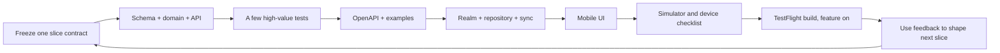
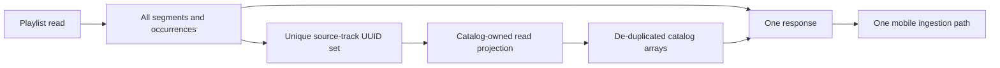
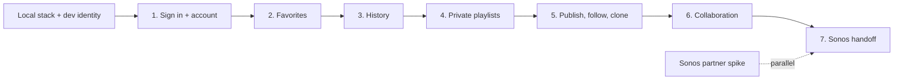
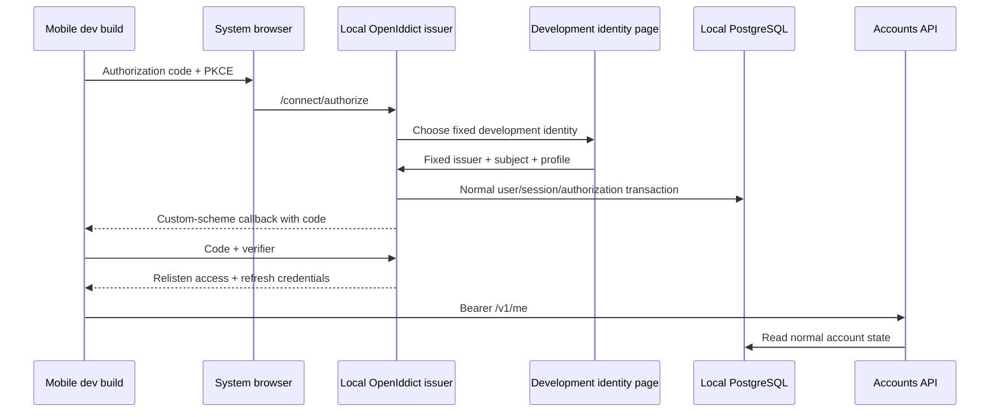

# Deliver Relisten accounts from API to TestFlight

This is the execution source of truth for account work that crosses `RelistenApi` and `relisten-mobile`. The architecture documents define the long-lived boundaries and data model. This plan defines what gets built together, what waits, and how a slice earns a TestFlight build.

## Decision

Build one complete mobile-first slice at a time:

1. implement the smallest server schema, domain behavior, and API needed by the slice;
2. prove the important invariants against real PostgreSQL;
3. publish the OpenAPI contract and a small set of examples;
4. implement mobile persistence and synchronization;
5. add the user interface;
6. exercise the real local stack manually;
7. ship a TestFlight build with the completed behavior on by default.

Do not build every server domain first and integrate mobile at the end. Do not ship future Realm models, disabled converters, or a remote-flag matrix in anticipation of later slices.

The first public account release does not need every capability in the architecture. Authentication, favorites, history, and private playlists must become useful before public sharing, collaboration, or Sonos can delay them.



## Complexity budget

The system should be reliable because its invariants are clear, not because every possible future failure has machinery on day one.

| Capability | Build now | Keep as a seam | Defer until it has a consumer |
| --- | --- | --- | --- |
| Authentication | OpenIddict, Apple/Google upstreams, development identities, code + PKCE, refresh rotation, `/me`, username, sign-out, account-scope fence | Provider table supports another method | Passkeys, passwords, account directory |
| Account lifecycle | Recent-auth deletion request, session revocation, Temporal purge, device data cleanup | Durable deletion job and append-only restore tombstone | Self-service export, session-management UI, provider linking UI, additional recovery hardening if the threat model grows |
| Favorites | Explicit UUIDv7 row IDs, desired-state mutation, scoped sync, anonymous import choice | Typed catalog references | General collection/tag model |
| History | Playback-instance UUID, 240-second-or-50-percent qualification, dedupe, generation fence, list/clear, and legacy rows through the same batch API | Timescale facts can feed rollups | Queue V2, a separate import workflow, Wrapped UI, recommendations, automatic playlists, elaborate rollup policy |
| Private playlists | Explicit segments, UUIDv7 occurrences, fractional ranks, archive/unarchive, primitive offline single-user commands, server-hydrated snapshot | IDs and commands are collaboration-compatible | Dedicated split/merge commands, revision browser/restore, generalized sync framework |
| Public playlists | Stable public code, public read, follow, clone | Stable playlist UUID and library feed | Discovery, search, profiles, moderation |
| Collaboration | Viewer/editor/manager invitations and offline operation convergence | Same playlist/segment/occurrence IDs | Build only after single-user playlists are proven |
| Sonos | Partner spike in parallel; mobile-only queue handoff and control last | Adapter boundary and immutable snapshot | Sonos listening history, universal Relisten queue, web remote, cross-client queue sync |
| Temporal | One namespace, dispatcher, worker, PostgreSQL persistence in the existing cluster, business outbox authority | Add workers/workflows deliberately | Importer migration, complex worker routing, archival, advanced workflow migration/recovery controls |

Two simplifications matter most:

- History gets a stable `playback_instance_uuid`; it does not wait for a full queue-storage rewrite.
- Each mobile slice adds only its own Realm models. Queue V2 is introduced when playlist playback or Sonos proves it is needed, not as an invisible foundation release.
- Playlist APIs return one normalized hydrated response; mobile does not own resolver batches or revision-pinned assembly.
- There is no generic synced-settings resource, provider-management UI, multi-phase credential recovery, or client-side canonical hashing in the launch slices.

### Highest remaining implementation cost

Some launch capabilities are still expensive. The plan contains their cost instead of pretending they are small:

| Area | Why it is expensive | How this plan contains it |
| --- | --- | --- |
| Offline collaboration | Concurrent ordered edits, role changes, revocation, and invitation continuation cross API, Realm, and UI | Prove the same IDs and commands with one owner first; add collaboration only in Slice 6; omit live presence and CRDT infrastructure |
| Sonos | Partner approval and protocol behavior are external uncertainties; a simulator cannot prove a household handoff | Run the capability spike now, build the product last, send one immutable queue snapshot, defer remote history, and require one real-speaker release check |
| Account deletion and restore | Credentials, owned collaborative data, and backup resurrection make deletion more than one SQL cascade | Use one accepted command, one durable job, one Temporal workflow, and one append-only tombstone; run a focused deletion replay before external beta and leave full disaster recovery for broad rollout |
| Temporal operations | Temporal has a fixed deployment and upgrade cost even for one workflow | Share the existing CloudNativePG cluster, use one namespace and one trusted worker boundary, and add no importer or history workflow until it has a user-facing consumer |
| Playlist editing | Explicit segments, duplicate occurrences, fractional ranks, and offline retries are real domain complexity | Keep Slice 4 owner-only, use only primitive create/move/delete operations, defer dedicated split/merge, and return one server-hydrated snapshot so mobile owns no catalog-hydration protocol |
| Production provider and database setup | Apple registrations, certificates, production roles, backups, and admission controls are operational work, not product feedback | Make daily development zero-secret and one-role; require preview/production setup only at the release gates that use it |

Do not simplify away UUIDv7 row identities, explicit segments, fractional ordering, authorization checks, idempotency receipts, or history-generation fences. Those mechanisms protect data that must survive offline use. The scope reductions above remove surrounding orchestration and UI, not the invariants at the center of each feature.

### Work that is intentionally not a TestFlight prerequisite

The following work still matters before a broad public release, but it must not block early account feedback:

- production Apple configuration and release-signed universal-link proof before external TestFlight;
- disaster-recovery rehearsal for account deletion;
- final production roles, grants, NetworkPolicies, backups, and alerts;
- account export, if product or regulatory needs justify it;
- provider linking, session inventory, and logout-all UI;
- collaboration, public web polish, and Sonos partner approval.

## Playlist hydration contract

Playlist APIs hydrate automatically. Mobile should not collect UUIDs, split them into resolver batches, pin availability revisions across requests, or manage playlist-specific hydration retries.

`GET /v1/playlists/{playlist_uuid}/snapshot` and `GET /v1/public-playlists/{public_code}` each return one normalized response. The authenticated owner/member snapshot contains the full authored structure with typed availability so editors can sync offline. The anonymous public snapshot contains only the active structure plus unavailable counts; it does not expose removed UUIDs or editing tombstones. Both use the same `catalog` sidecar shape. Playlist list endpoints remain summary-only.

```json
{
  "playlist": {
    "playlist_uuid": "...",
    "name": "Europe '72 favorites",
    "description": null,
    "role": "owner",
    "revision": 18,
    "availability_revision": 42,
    "projection_revision": "18:42:01J...",
    "active_occurrence_count": 87,
    "unavailable_occurrence_count": 1
  },
  "segments": [
    {
      "segment_uuid": "...",
      "kind": "source_run",
      "rank": "a0",
      "occurrences": [
        {
          "occurrence_uuid": "...",
          "source_track_uuid": "...",
          "rank": "a0",
          "availability": "playable"
        }
      ]
    }
  ],
  "catalog": {
    "source_tracks": [],
    "sources": [],
    "shows": [],
    "artists": [],
    "venues": []
  }
}
```

The `catalog` arrays are shallow, UUID-only, and de-duplicated. They include only fields required to render and play the selected source tracks. They do not repeat a show or venue per occurrence and do not expand every alternate recording for a show. Add songs, tours, or source sets only when a current screen or player needs them.



The User Service and catalog share the `app` database, so the initial implementation should use a narrow catalog-owned SQL projection or view and set-based reads inside one PostgreSQL repeatable-read transaction. That is less failure-prone than an internal HTTP call. Keep the projection behind an `ICatalogPlaylistProjectionReader`-style interface so storage can split later without changing the client contract.

Preserve every user-authored occurrence in the authenticated structure. An unavailable occurrence carries `removed`, `upstream_missing`, or `not_found`; it is excluded from active counts, new queues, clone, Cast, and Sonos. Public reads omit those occurrences and disclose only the unavailable count. A file already downloaded to a device remains independent and playable from Offline Library.

Start with the existing 5,000-occurrence limit, response compression, and one response. Measure a worst-case fixture on representative iOS and Android devices. Add server-driven pages or a structure-only mode only if compressed size, parse memory, Realm transaction time, or first-useful-render latency is actually unacceptable.

Tradeoff: a cold open may transfer metadata the device already has. In return, every client gets one consistency boundary, one retry, and one implementation. At Relisten's scale, that is the better default. Normalization avoids the expensive kind of bloat—repeating the same graph thousands of times—without exporting orchestration complexity to mobile.

The anonymous catalog resolver remains useful for standalone favorites and other typed catalog references. It is not part of playlist reads.

## Delivery slices

There is local setup work before Slice 1, but there is no user-invisible “foundation TestFlight.” A build earns TestFlight when it contains useful behavior.



### Local setup: real protocol, development identity

Before Slice 1, add the User Service project, local database bootstrap, OpenIddict issuer, development clients, and mobile environment configuration. This setup is infrastructure for local work, not a released feature.

### Slice 1: sign in and account shell

Server scope: users, external identities, usernames, native sessions, OpenIddict records, `/v1/me`, refresh, revoke, and sign-out. Mobile scope: system-browser login, SecureStore refresh credential, active account/generation, username review, account screen, sign-out, and account switch. Add only account/scope Realm state.

The first internal TestFlight may focus on sign-in, sign-out, switch, and username behavior. It uses the isolated preview issuer described below, never a developer laptop. Account deletion must work before accounts reach an external beta or public store build. Provider linking, a session list, logout-all UI, and export do not block the first feedback loop.

### Slice 2: favorites

Server scope: explicit UUIDv7 favorite rows, desired-state mutation receipts, library snapshot/change cursor, and typed catalog validation. Mobile scope: scoped favorite rows, anonymous-import choice, My Library, and CarPlay account scoping. Add only favorite and favorite-outbox Realm models.

### Slice 3: qualified history

Server scope: history state/generation, qualified-listen receipt and Timescale fact, list, clear, and a bounded `legacy_import` origin on the same batch endpoint. Mobile scope: one persistent playback-instance qualification record, local history/outbox, the typed cloud-history control, Recently Played, and CarPlay history. Per-event receipts resume an interrupted legacy upload; do not create a second import resource. Do not migrate the whole queue. Introduce Queue V2 later if playlist playback or Sonos needs stable queue occurrences beyond the current player model.

### Slice 4: private single-user playlists

Server scope: playlist, explicit segment, occurrence, fractional ranks, archive state, idempotent commands, snapshot/change feed, and automatic catalog hydration. Mobile scope: list/detail/editor/archived screens, offline command outbox, normalized snapshot ingestion, and queue loading. Start owner-only. Use the same UUID and command shapes intended for collaboration, but do not implement invitation, membership, or multi-user conflict UI here.

### Slice 5: publish, follow, and clone

Add stable public codes, anonymous reads, follow/unfollow, clone, and the minimum web fallback for a public link. There is no discovery or search. A TestFlight build proves cold and warm public links and stable republishing.

### Slice 6: collaboration

Add viewer/editor/manager membership, private invitations, revocation behavior, and multi-device offline operation convergence. Design the exact invitation continuation when this slice starts, using the now-proven auth and deep-link code. Do not make early slices carry a pending-grant state machine they cannot exercise.

### Slice 7: Sonos

Replace or evolve the existing Sonos adapter after the partner/API contract is confirmed. Mobile sends one immutable active queue snapshot and current occurrence to Sonos. Later mobile edits do not mutate the remote queue. The first Sonos slice records no remote listening history. Mocked protocol tests support development; a release claim requires a real household and speaker.

## The cross-repository loop

For every slice, create one short tracking issue or checklist with owners in both repositories. Work in this order.

### 1. Freeze the behavior and wire contract

- Write the user-visible happy path, offline behavior, and the few terminal errors.
- Update the architecture only when a durable decision changes.
- Add the endpoint to OpenAPI with one representative success example and one representative error example.
- Generate or update mobile transport types. Keep wire types out of Realm and UI components.

### 2. Implement and prove the API

- Add only the tables and indexes the slice uses.
- Put invariants in a domain service and database constraints, not controllers.
- Run the migration against the local Timescale/PostgreSQL container.
- Add two to five tests that would catch data loss, cross-account exposure, authorization bypass, duplicate application, or a broken domain invariant.
- Exercise the endpoint with the real local service and database. Save a small checked-in request/example, not a large generated transcript.

### 3. Implement mobile data before UI

- Add only this slice's Realm models and migration.
- Add one repository/coordinator for the domain.
- Prove account switching and restart with a focused unit/integration test when the behavior is difficult to inspect manually.
- Use the checked-in API example while server work is in flight, then switch to the real local endpoint before UI acceptance.

### 4. Build the UI and manually exercise it

- Implement loading, empty, offline/pending, success, and actionable error states.
- Test on a simulator first, then at least one physical device when browser handoff, background audio, links, CarPlay, Cast, or Sonos is involved.
- Manually run the slice checklist with airplane mode, restart, and two accounts where relevant.
- Fix confusing copy and state transitions before TestFlight. Telemetry is not a substitute for watching the flow.

### 5. Ship and learn

- Run TypeScript, lint, targeted .NET tests, builds, and `git diff --check`.
- Run the changed-code simplification and writing passes described below.
- Cut a TestFlight build. Everything complete in that build is on by default.
- Record the server commit, mobile commit, environment, and short manual checklist result.
- Use tester feedback before widening the next slice.

## Local environment

Daily development must exercise the real Relisten OIDC boundary without requiring an Apple Developer membership, a Google Cloud project, or maintainer secrets.



### Daily zero-secret mode

Run the real User Service, OpenIddict authorization-code flow, PKCE, PostgreSQL persistence, token rotation, system-browser surface, mobile callback, and Accounts API. Replace only upstream Apple/Google identity proof with a development-only page containing fixed personas.

The development page must enter the same external-identity completion service as Apple and Google. It must never mint a token directly, bypass `/connect/authorize` or `/connect/token`, or accept arbitrary subjects from query parameters. Include fixed cases for two people, same email with different subjects, a private-relay address, and no email. Register it only when both the environment is `Development` and an explicit local setting is enabled; production startup must fail if it is enabled.

Use a loopback issuer such as `http://localhost:5443` for simulator/emulator work. HTTP is permitted only for a loopback issuer in Development. Seed separate public iOS and Android development clients with authorization code, PKCE, refresh, no client secret, and platform-specific custom-scheme callbacks. Android uses `adb reverse tcp:5443 tcp:5443`; a physical iPhone uses preview or an optional trusted tunnel because its `localhost` is the phone.

The local database topology is one Timescale/PostgreSQL container, one `relisten` login role, and the `relisten_db`, `temporal`, and `temporal_visibility` databases. Local development does not reproduce production grants. Temporal may remain stopped for auth, favorites, history ingestion, and playlist CRUD; start it when testing a workflow such as account purge.

### Optional real Google

A contributor may create a Google **Web application** OAuth client with the exact local User Service callback, for example `http://localhost:5443/callback/login/google`. Store its client ID and secret in .NET user-secrets or environment variables. Nothing goes into the repository or mobile bundle. Google permits HTTP callback URLs for localhost development and requires an exact redirect match.

### Real Apple and release callbacks

Apple web sign-in requires a registered HTTPS domain and does not accept localhost or an IP address. Maintainers test Apple through a stable preview issuer and database, such as `https://auth-preview.relisten.net`. Apple keys remain server-side. A local mobile build may point to preview and return through its registered development custom scheme. Release-signed TestFlight builds prove the production claimed-HTTPS callback, Associated Domains/AASA, Android App Links, provider consent, cancellation, and first-login/private-relay behavior.

The mobile bundle contains public configuration only: issuer, Accounts API base URL, client ID, and redirect URI. It never contains an Apple key, Google client secret, or provider access token.

### Internal TestFlight preview lane

An internal TestFlight build points at the stable preview issuer and preview database and uses real Google. Fixed development personas remain localhost-only; do not add a second preview-only identity mode merely to accelerate the first build. Add real Apple and prove both release callbacks before external TestFlight. This keeps the daily zero-secret path simple while ensuring every distributed build exercises a real upstream provider.

### Setup the implementation must add

Local accounts should become a short, documented path rather than a list of hand-created resources:

| Repository | Checked-in setup |
| --- | --- |
| `RelistenApi` | A repeatable script that starts the existing PostgreSQL container and ensures `relisten_db`, `temporal`, and `temporal_visibility` exist under the one `relisten` role; a User Service launch profile; fixed development identities; seeded native development clients; an optional Compose profile for Temporal |
| `relisten-mobile` | `expo-auth-session` over the existing WebBrowser/Linking/SecureStore pieces; an example local environment file containing only public issuer/API/client/callback values; a local build profile; documented `adb reverse` command; no Apple/Google secret files |
| Maintainer preview | Stable preview DNS/TLS, separate database, Apple and Google registrations, server-side secrets, and release callback association files |

The existing `./start-local-databases.sh`, `dotnet run`, and `yarn ios`/`yarn android` workflows should remain recognizable. Add one thin account bootstrap around them instead of introducing Kubernetes, production roles, or a second PostgreSQL container locally. The local README must show zero-secret login first and optional provider setup second.

## Rollout controls

Do not build account features around Statsig or another paid remote-flag service.

- A completed feature included in a TestFlight or store build is on by default.
- An unfinished screen is kept on its branch or omitted from navigation; it is not shipped behind a permanent flag.
- A temporary local developer toggle may help while a slice is under construction. Remove it when the slice merges.
- Keep only narrow server configuration switches for emergency containment: account registration, history writes, and Sonos handoff. They default on after their production launch and stop new writes without deleting local or server data.
- Do not implement per-user cohorts, percentage rollout, or parallel flag matrices for these slices.

Existing Statsig event logging elsewhere in the app is a separate concern; this plan does not require replacing unrelated analytics.

## Implementation quality

Code should make the next maintainer's mental model cheaper to build.

### Single responsibility and file size

- Organize by feature. A controller translates HTTP, a domain service owns invariants, a repository owns persistence, a coordinator sequences local sync, and a screen renders state and sends user intent.
- Do not let a controller, React screen, or Realm model become a second domain service.
- A handwritten source file crossing roughly 300 lines triggers an explicit decomposition review. A file over 500 lines must be split unless it is generated code, a migration, a declarative fixture, or has a short written reason that splitting would make the code harder to understand.
- Prefer a few cohesive types over bags of unrelated helper functions. Do not create an interface or abstraction until it protects a real boundary or enables a real test.
- Keep transport, domain, persistence, and presentation models distinct when their responsibilities differ; do not duplicate shapes merely to satisfy a pattern.

### Comments with a reader in mind

Comments explain information the code cannot reveal on its own:

- why an ordering or transaction boundary must not change;
- which retry or privacy invariant a strange-looking branch protects;
- why a provider/platform workaround exists and when it can be removed;
- why an apparently simpler implementation is unsafe.

Do not narrate syntax or restate a method name. Write for a capable contributor opening this file six months later without the architecture document in their head. Put the explanation beside the decision it protects and link a design section only when the local explanation would otherwise become long.

### Required finishing passes

After a nontrivial slice works and focused checks pass:

1. run a behavior-preserving `code-simplifier` review over only the changed code and tests;
2. rerun the focused checks;
3. run `deslop` over changed documentation, UI copy, error text, and important comments;
4. review the diff for duplicated logic, speculative layers, stale flags, and comments that explain what rather than why.

These are execution steps, not aspirations. Record them in the slice checklist.

## Testing policy

Tests must earn their maintenance cost. Relisten has a small contributor group and relies on hands-on product testing; a broad mocked suite or mobile UI automation program would make changes harder without providing proportional confidence.

Prefer:

- real PostgreSQL integration tests at transaction, constraint, and authorization boundaries;
- pure unit tests for fractional ranking, playback qualification, and small state machines;
- one generated-client/fixture check for important wire contracts;
- manual simulator, physical-device, and TestFlight scenarios for UI, browser/provider behavior, audio, deep links, CarPlay, Cast, and Sonos.

Avoid:

- mocking internal repositories to prove that one layer called another;
- exhaustive controller tests for framework behavior;
- snapshot tests for ordinary mobile screens;
- an automated Detox/Maestro-style mobile end-to-end suite for this project;
- tests for every error string or trivial getter;
- crash injection at every line of a workflow.

Keep an automated test when failure could cause one of these outcomes:

| Risk | High-value proof |
| --- | --- |
| Account takeover or merge | Same provider subject returns the same user; same email with another subject never merges; PKCE/replay checks fail closed |
| Cross-account data exposure | A stale generation cannot write after account switch |
| Duplicate or lost offline writes | An exact mutation retry has one effect and a changed reuse conflicts |
| Broken playlist order | Fractional insertion/move preserves duplicates and explicit segment order |
| False or duplicate history | Qualification boundary, one event per playback instance, stale generation rejection, and clear behavior |
| Deletion failure | Sessions revoke and the asynchronous purge is idempotent |
| Secret exposure | Development provider is absent in production and representative logs redact credentials/capabilities |

The normal slice should add two to five focused automated cases, not a test catalog. Add more only when a real bug or subtle invariant justifies them.

### Manual proof per slice

Each TestFlight checklist should fit on one screen. It records device/OS/build and checks only the relevant cases:

- happy path;
- offline or interrupted path;
- app restart;
- account switch when the feature is scoped;
- one representative error;
- accessibility/copy sanity;
- the feature's special surface, such as physical-provider login, CarPlay, Cast, or Sonos.

Screenshots and videos are useful for a confusing interaction or release review, not a mandatory artifact for every state.

## Definition of done

A slice is done when:

- the API behavior and OpenAPI examples match;
- migrations run on a fresh local database and an upgraded representative database;
- the small invariant test set passes;
- mobile uses the real local API, not only fixtures;
- local pending work survives the expected offline/restart case;
- account switching cannot expose the prior scope;
- UI copy and states have been manually reviewed;
- the changed code passed the simplification review and focused checks;
- the completed feature is on by default in the TestFlight build;
- the checklist records what was tested and any known limitation.

The next slice may start contract discussion while testers use the current build, but implementation should not build on an unproven lower slice.

## Related documents

- [Server architecture](../../architecture/2026-07-18-relisten-identity-user-data-and-sonos-architecture.md)
- [Server implementation detail](2026-07-18-relisten-identity-user-data-and-sonos-implementation.md)
- [Mobile architecture](../../../../relisten-mobile/docs/architecture/2026-07-18-relisten-mobile-accounts-library-sync-and-sonos-architecture.md)
- [Mobile implementation detail](../../../../relisten-mobile/docs/plans/active/2026-07-18-relisten-mobile-accounts-library-sync-and-sonos-implementation.md)
- [Mobile UX rollout](../../../../relisten-mobile/docs/plans/active/2026-07-18-relisten-mobile-account-library-ux-rollout.md)

## Authentication references

- [OpenIddict ASP.NET Core integration and development-only HTTP mode](https://documentation.openiddict.com/integrations/aspnet-core)
- [OpenIddict signing and encryption credentials](https://documentation.openiddict.com/configuration/encryption-and-signing-credentials.html)
- [OpenIddict maintained web-provider integrations](https://documentation.openiddict.com/integrations/web-providers)
- [Google OAuth web-server applications and localhost redirects](https://developers.google.com/identity/protocols/oauth2/web-server)
- [Google OpenID Connect](https://developers.google.com/identity/openid-connect/openid-connect)
- [Apple web Sign in configuration](https://developer.apple.com/documentation/signinwithapple/configuring-your-webpage-for-sign-in-with-apple)
- [Expo AuthSession](https://docs.expo.dev/versions/latest/sdk/auth-session/)
